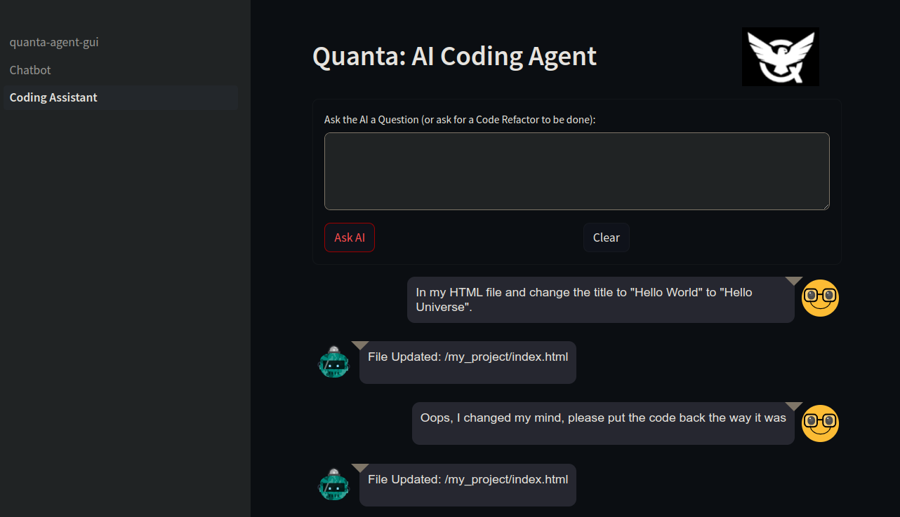

# About Quanta Agent 

This is a standalone Streamlit app. To run it you only need this folder (QuantaAgent), as well as the `common` folder that's adjacent to it. The rest of the folders in the Quantizr monorepo can be omitted. 

Quant Agent is a tool to automate querying AIs (LLMs) about your codebase, which can also automatically refactor your actual project files, from high level human language instructions of what changes you'd like to make. You can ask the tool anything about your project, ask for any kind of refactoring you'd like to do in your project, or even ask the tool to create entirely new projects all on it's own.

You're probably a developer if you're even reading this so be sure to check out the [Developer Notes](./docs/developer-notes.md)




# Tool Features

* Answers questions about software projects
* Refactor files or entire projects 
* Answers questions specifically about named blocks, or specific files and folders of your code
* Create new Software Projects based on a description/prompt.
* Answers questions in your code by putting the answers directly in the code. See "Ok Hal" section, below.

# Project Summary

* Streamlit GUI
* Written 100% in Python
* Open Source Python (MIT License)
* Uses Python Langchain giving you flexibility in which LLM you use, including either locally hosted LLMs or Cloud AI Services.

*Note: Current codebase only includes OpenAI ChatGPT, and Anthropic Claud connectivity, but with Langchain it's easy to add support for the other Cloud AIs or Local LLMS.*

If you're a software developer and you want to be able to ask AI (like OpenAI's ChatGPT for example) questions about your code, this tool helps do that. This tool can also implement entire complex features in your code base, by updating existing entire files, or by updating only specific labeled `Named Blocks` to add code to specific locations in specific files as directed by you. 

The `Block Syntax` as well as `File and Folder Syntax` in the following document are describing features of Quanta, in the following link, but those syntaxes also apply to this Streamlit app, so read this for more info:

https://github.com/Clay-Ferguson/quantizr/blob/main/docs/user-guide/index.md#using-the-coding-agent


# To Run the App

    ./run_streamlit.sh

## Configuration

To use this tool, follow these steps:

1) Edit the `config.yaml` to make it point to a software project folder you want to analyze.
2) Put your `OpenAI API Key` in the `config.yaml` (or command line, or env var)
3) Create an empty `data` folder where your output files will go (also in `config.yaml`)
4) Run the Streamlit-based Web interface with this command: `streamlit run Quanta_Agent.py`, and just use the app like a chatbot or and agent which can do code refactoring just like an expert software developer!

*Tip: When requesting project refactorings, it's best to be in a clean project version, so that if you don't like the changes the tool made to your code you can roll them back easily, using `git`.


# Comparison to other AI Coding Assistants

* Q: How does `Quanta Agent` compare to other `AI Coding Assistants` like Devin, Pythagora (GPT Pilot), and MetaGPT?
* A: `Quanta Agent` allows a more targeted and specific analysis on your software project than the other tools, which results in less API token consumption and therefore lowers Cloud API costs. This is because `Quanta Agent` will only be able to see the parts of your code that you're referencing in your prompt, and it will only try to make modifications in those areas of the code. So not only is `Quanta Agent` very cheap due to using fewer API tokens, but you will also get the best possible results from LLMs by keeping your prompts down to where they contain only the relevant parts of your codebase. That is, smaller shorter prompts always give the best results. 

# Output Log Files

Every time you run an LLM query the full prompt, system prompt, and answer will be automatically saved into a new log file in the `data` folder.

Example log files can be found in this project's [Data Folder](/data)


# Background and Inspiration

There are other coding assistants like Github's Copilot for example, which let you ask arbitrary questions about your codebase, and those tools are very useful. However `Quanta Agent` lets you ask AI questions (i.e. build prompts) in a more flexible, targeted, specific, and repeatable way. `Quanta Agent` can solve more complex and difficult questions, in a repeatable way that doesn't require lots of developer time spent in building the same (or similar) prompts over and over again, by cutting and pasting code into prompts.

For example, let's say you have some SQL in your project and some Java Entity beans that go along with your database tables. You might want to alter or add SQL tables and/or automatically create the associated Java Entity beans. To get the tool to do this for you, in a way that "fits into" your specific application's architecture perfectly, you would want to create prompts that show examples of how you're doing each of these types of artifacts (the SQL and the Java), by wrapping an example in a `Named Block`, and then ask the AI to generate new code following that pattern. 

`Quanta Agent` helps you build these kinds of complex prompts, and keeps developers from having to construct these prompts manually, because you can simply surround the relevant pieces and parts of code related to a specific type of application artifact (like your Java Beans, your SQL, etc), and then write prompts that reference those sections by name. This is what `Named Blocks` are for.

Also since Quanta Agent is based on Langchain, it keeps you from being tied to or dependent upon any specific Cloud AI provider, and gives you the option to run local LLMs for it's use as well.


# Use Cases

## Code Generation

You can use `Named Blocks` to give specific examples of how your software project architecture does various different things, and then ask the AI to create new objects, code, features, SQL, or anything else that follows the examples from your own app, so it's much easier to get AI to generate code for you that's fine tuned just for your specific code base.

## Finding Bugs or Getting Recommendations

You can specify `Named Blocks` or entire files, in your prompt, and then ask the AI to simply make recommendations of improvements or find bugs.

## New Employee Training

If you annotate specific sections (or blocks) of your company's codebase with these kinds of named blocks, then you can write prompts that are constructed to ask questions about a set of `blocks` that will be super informative to new employees learning the codebase, and be able to get answers to questions about that code.

## Adding new Features or Refactoring Code

One very hard part about adding new features to most codebases is remembering all the different locations in the codebase that might need to be altered in order to get the new feature working. Because every app is a little bit different, a tool like this is really the only way to have prompts that are good enough to make complex changes, that would otherwise require a true AGI. 

For example, if you need to add a new feature, it might require a new Button on the GUI, new POJOs, new SQL, new API calls, etc. With a tool like `Quanta Agent` you can package up a prompt that grabs from all these various parts of a codebase to show the AI an example of how one feature is done, just including precisely only the relevant chunks of code, and then do a prompt like `"Using all the example code as your architectural example to follow, create a new feature that does ${feature_description}."` So the context for all the aforementioned example code would just be built using the code chunks from various snippets all around the codebase.

## Code Reviews

Developer teams can theoretically use a standard where (perhaps only temporarily) specific block names are required to be put in the code around all changes or specific types of changes. Then you can use AI to run various kinds of automated code reviews, security audits, code correctness audits; or even just get AI suggestions for improvement that specifically look at all the parts of the code involved in any bug fix or new feature that has been implemented and identified using `Named Blocks`.

# `Ok Hal` Feature

You can ask questions anywhere in your code using `ok hal...[prompt]...?` pattern. This is best demonstrated with a simple example. Let's say somewhere in your project files you have the following lines of text:

```txt
ok hal
Show in Python how to get current time and print it as a string.
?
```
Note that the `ok hal` is above the prompt and `?` is below the prompt. This is how the AI will find and answer the question in your code, by injecting the answer directly into the code below the question itself. Once you've saved the file you can click `Run HAL` button in the Coding Agent panel, and the AI will edit your file automatically and inject the answer directly below the question, so you'll end up with this:

```txt
ok hal
Show in Python how to get current time and print it as a string.
-?
import datetime

current_time = datetime.datetime.now().strftime("%Y-%m-%d %H:%M:%S")
print(current_time)
```

*Note that a dash was inserted in front of `?` after the edit. This is so that once the answer is inserted if you accidentally run Hal again nothing will happen the second time.*

The prompt you put between `ok hal...?` can be as long as you want, with any number of lines of text.

Caveat: The `Ok Hal` feature currently doesn't understand what kind of file you're editing so if you say something like "Show me an example of a `for loop`" and you're in Java file, it won't know you want a Java for loop unless you tell it. This limitation will be fixed soon. (todo-0)


# Technical Documentation

Be sure to check the  [Docs Folder](/docs) for technical information about this project and how to run it.

