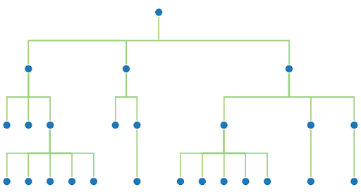
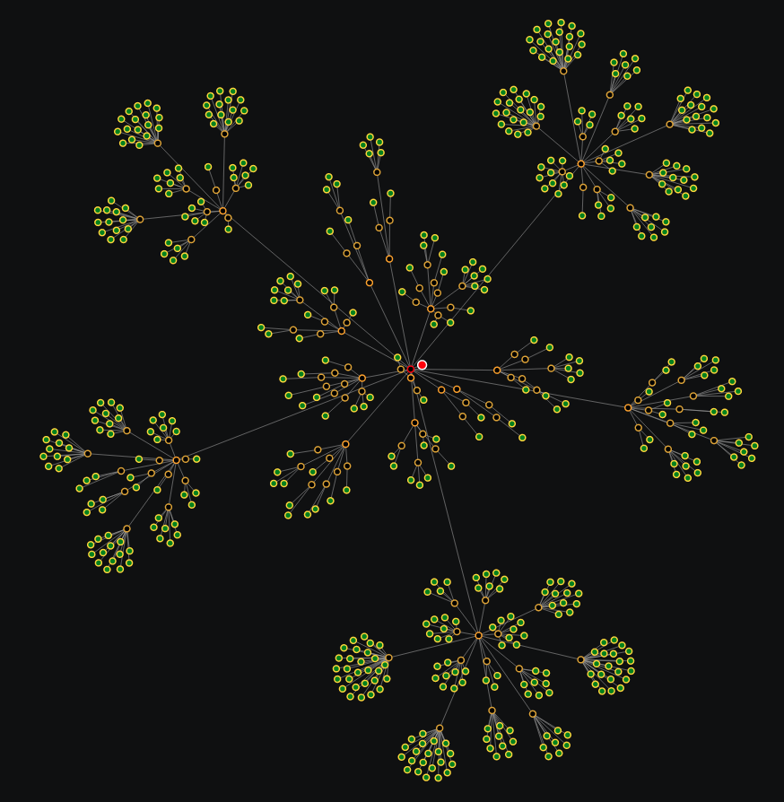

**[Quanta](/docs/index.md)**

* [Quanta Features](#quanta-features)
    * [Hierarchial CMS](#hierarchial-cms)
    * [Quantized](#quantized)
    * [AI via ChatGPT](#ai-via-chatgpt)
    * [AI via Perplexity](#ai-via-perplexity)
    * [Secure Messaging](#secure-messaging)
    * [Blogs - Notes - Wikis ](#blogs---notes---wikis-)
    * [Advanced Editing](#advanced-editing)
    * [File Sharing](#file-sharing)
    * [Powerful Search](#powerful-search)
    * [RSS and Podcasts](#rss-and-podcasts)
    * [Access Controls](#access-controls)
    * [Text-to-Speech](#text-to-speech)
    * [Speech-to-Text](#speech-to-text)
    * [PDF Creator](#pdf-creator)
    * [Timelines](#timelines)
    * [Audio and Video Recording](#audio-and-video-recording)
    * [Interactive Node Graphs](#interactive-node-graphs)
    * [Import and Export](#import-and-export)
    * [Mobile Support](#mobile-support)
    * [Semantic Web](#semantic-web)
    * [IPFS and Web 3](#ipfs-and-web-3)
    * [Docker Installation](#docker-installation)
    * [White-Label](#white-label)
    * [Open Source](#open-source)

# Quanta Features

# Hierarchial CMS

When you create an account, you get a root node (i.e. your personal branch of the global tree), and under this account root you create and organize your own content however you want. 

You can let any node and all its subnodes represent a wiki, document, photo album, blog, etc. It's just a tree of content, so it's all up to you. For example you could create a node and share it with several people, and then the "Timeline View" of that node would be like a private chat room, or discussion thread.

# Quantized

The name "quanta" comes from how the platform lets you "quantize" content so it's stored in small `chunks or blocks (called Nodes)`. This means you can attach comments underneath individual sentences, or paragraphs (similar to X/Twitter replies hierarchy).

Every node automatically has it's own URL, so they're easy to link to across the web. Platforms using block editors, similar to Quanta, are becoming very popular, and include for example: [Notion](https://notion.so), [Jupyter Notebooks](https://jupyter.org), and [WordPress Gutenberg](https://wordpress.org/gutenberg).

# AI via ChatGPT

Interact with OpenAI's ChatGPT AI, by asking questions on the Quanta Tree and getting answers automatically saved into the tree. The AI can assist you with almost any kind of task, and it retains a memory of the conversation, by using the tree location as a "context" for discussion. Quanta is perhaps the first AI Assistant with a `hierarchical context` (i.e. memory). We support AI chat, question answering, image understanding (asking questions about images), and image generation. You can choose to keep your conversations private or share by sharing branches of your tree.

# AI via Perplexity

In addition to supporting OpenAI, you also have the option of selecting `Perplexity` as your AI provider, via a simple selection in your account settings panel.

# Secure Messaging

Supports encryption and secure messaging, where only the owner of a node (or others they've granted access) can read the content. Quanta uses the browser's built-in Crypto API and PKE (Public Key Encryption) in a scheme where neither the private key nor the unencrypted text is ever sent over the network. This is commonly called "End to End" (E2E) encryption, and it means even the back-end server doesn't have the ability to decrypt any user data.

# Blogs - Notes - Wikis 

Create blogs or wikis with markdown, images, videos, links, code blocks, etc. or host your own instance as corporate documentation portal. The sharing settings on each node allow you to share content with the public at large, or with specific users of your choice.

# Advanced Editing

Create content containing markdown. Similar to a file-system, you can cut, paste, delete nodes on a hierarchical tree. Use many advanced features like "Search and Replace" over entire sub-graphs, merging/splitting of nodes, arranging ordering of nodes, etc.

# File Sharing

Since nodes can have file attachments, and be shared with any person, or group of people, the platform can function as a general-purpose file sharing app.

# Powerful Search

Using of the MongoDB database back end, we have an extremely fast, powerful, and state-of-the-art full-text search capability. Since MongoDB uses Lucene internally, it can leverage all those advanced search features available from Lucene like quoted multi-word strings, word exclusions, etc.

# RSS and Podcasts

Consume RSS news feeds or podcasts right inside the app. You can create a subscription node that displays a single RSS feed, or create an aggregate feed that's composed of multiple RSS feed URLs.

# Access Controls

You can define, for any node, who is allowed to see that node and/or create replies under it. You can also set any node to "public" which makes it visible to everyone. Whoever creates a node always owns that node unless they transfer ownership to someone else.

# Text-to-Speech

Listen to a spoken narration of any website simply by dragging a highlighted block of text over the TTS Panel. You can also read the content of your clipboard with a single click, or have any node narrated aloud to you by clicking the speaker icon on the node. You can select which voice is used for the speech, as well as your preferred rate/speed of the speech.

# Speech-to-Text

The editor dialog lets you dictate content. There's a microphone icon above the text editor which activates and deactivates "listening" mode. Every sentence you speak gets typed into your editor, wherever you've positioned the cursor, when you have listening mode activated.

# PDF Creator

PDF documents can be exported for any branch of the tree. The PDF generation uses the markdown headings (i.e. '#', '##', '###') to allow an optional 'Table of Contents' in the generated PDF document. 

You can also optionally save your PDF to IPFS and it's CID will automatically get `IPFS Pinned` to your account.

# Timelines

A Timeline is a reverse-chronological listing of all subnodes (including descendants) under a given node. This means, for example, if you're doing team collaboration on some document, you can view the timeline of any document branch (i.e. any node) to see everyone's latest contributions to that section of the document, sorted conveniently into a rev-chron list.

# Audio and Video Recording

When you attach an audio or video file to a node, the platform automatically provides a "player" for watching the video or playing the audio. You can also record Audio or Video directly thru your browser (WebCam/Microphone), and it automatically saves as a node attachment, for later playback or downloading as a file.

# Interactive Node Graphs

Work with interactive Graphs of any branch of the tree, or any custom search query, using the search dialog. The Graphs use a physics engine (with Gravitational forces) to position things in the screen space. You can drag nodes in the graph around with the mouse, pan, zoom, hover the mouse for an info popup, or click any element in a graph to jump to that node on the main content tree.

# Import and Export

Content can be exported to ZIP, TAR, TAR.GZ formats as Markdown, PDF, JSON, or HTML. The archive file formats (ZIP/TAR) are also browse-able offline after unzipping, because they contain internal links to allow navigation as a tree. 

The JSON-type exports can be imported back into the DB, which means the JSON export/import can be used as a 'backup and restore' feature, for anything you want to backup.

# Mobile Support

Quanta is better as a desktop experience, but mobile devices are also supported with a decent user experience, and should run on all modern mobile browsers.

# Semantic Web

Create 'Typed' content using any of the `Schema.org` defined types. Use a system config file to easily configure a custom editing layout for any Semantic Web class defined by Schema.org.

# IPFS and Web 3

Files (images, video, audio, etc.) can be uploaded and saved to IPFS. Files are automatically `IPFS Pinned` when uploaded and unpinned when deleted, so the platform functions like a pinning service.

You can also publish content to IPFS using the Export feature which can generate a PDF, HTML, or Markdown file to save to IPFS.

# Docker Installation

A docker image is available thru the Public Docker Repository so the only requirement to run your own instance is a Linux OS with 'docker-compose' installed, and running swarm mode.

# White-Label

The platform is re-brandable by your organization so its name, logo images, and landing page can be customized. This means no references to the word "Quanta" will appear, once customized.

# Open Source

Tech Stack: `Java` SpringBoot (back end), `TypeScript` (front end), SPA WebApp, React JS, SCSS, Vite front end build, NodeJS, with MongoDB and IPFS as primary storage. OpenAI HTTP API is used for all AI features. 

[GitHub Project (MIT License)](https://github.com/Clay-Ferguson/quantizr)

----
**[Next: Quanta User Guide](/docs/user-guide/index.md)**
