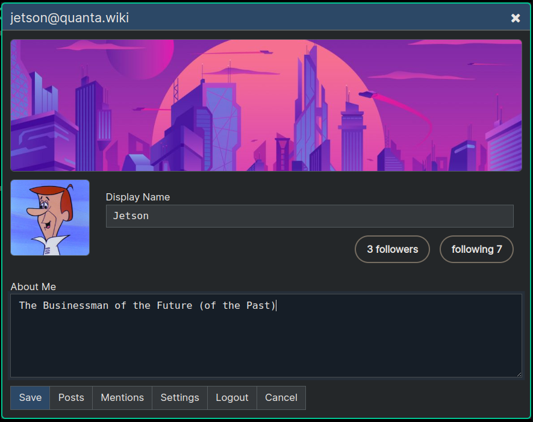
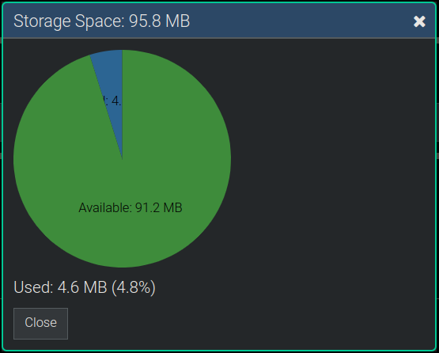

**[Quanta](/docs/index.md) / [Quanta User Guide](/docs/user-guide/index.md)**

* [Account Profile and Settings](#account-profile-and-settings)
    * [User Profile](#user-profile)
    * [Account Settings](#account-settings)
    * [Settings](#settings)
        * [Manage Hashtags](#manage-hashtags)
        * [Blocked Words](#blocked-words)
        * [Comments](#comments)
        * [Properties](#properties)
        * [Content Width](#content-width)
        * [Bulk Delete](#bulk-delete)
    * [Storage Space](#storage-space)
    * [Manage Keys](#manage-keys)

# Account Profile and Settings

# User Profile

Edit your user profile using `Menu -> Account -> Profile`. This is how you setup your display name, bio text, avatar image, and heading image. Here's how it looks:

# Account Settings

The Account Settings Tab can be accessed by `Menu -> Account -> Settings` as shown here:

# Settings

## Manage Hashtags

Opens a Dialog where you can input any number of custom hashtags that you use frequently. The Node Editor has a way of letting you select these from a list.

## Blocked Words

Lets you specify which words you'd like to never see in your feed. Any posts containing any words in your blocked words list will be excluded from your feed.

## Comments

This option lets you control whether to include `Comment`-Type nodes or not. The main use case for this would be if you have a large document that you've opened up for commentary where other users can create subnodes in this document for the purposes of collaboration or feedback.

Unselecting this option will therefore only show the main body of the content excluding all the commentary. This is a useful feature, because if a lot of discussion has happened in the document the amount of comments can easily be much larger than the document itself.

## Properties

Turns on the display of internal properties for nodes. Users can create their own custom properties on nodes, although this is a niche and not often used feature.

## Content Width

Lets you control how wide the center app panel is.

## Bulk Delete

Running this will delete all nodes that you own which are not directly stored under your own account node. Any places you've created content under other people shared nodes for example, will be deleted.

If you want to delete your account and all content you've ever created you should run `Bulk Delete` before `Close Account` because close account will only remove your account tree root and it's entire set of sub-branches (subgraph).

# Storage Space

Shows how much of your allotted space on the server you've consumed:

# Manage Keys

Opens the `Security Keys` dialog where you can reset, republish, export/import your security keys. These are the keys used for setting Digital Signatures on nodes (currently an admin-only feature), and for Encryption of data. 

None of the private keys on your browser are ever sent to the server, and it's up to you to back them up in a safe location to be sure you have the ability to always decrypt any of your encrypted messages.

Currently the only way to backup keys is to copy the text out of this dialog box, and then they can be reimported back in using this dialog box also.

There are two types of keys you will have: 1) The `Signature Key` and 2) the `Asymmetric Key`. The Signature Key is used for cryptographically signing nodes, and the Asymmetric Key is used for sharing encrypted data.

The `Publish Public Key` button let's you ensure the server has the current key from the browser, which it will need in order to let you securely share content, but this is normally not needed and should happen automatically without you clicking the button.

The `Import Key` lets you update the Selected Key type, from text content that you can paste in. This text content will be something you had previously gotten just by selecting the key JSON shown in the dialog. So there's no `Export Key` feature currently and you have to just cut-and-paste the JSON yourself. This process will be made easier in a future version of the app.

----
**[Next: Semantic Web](/docs/user-guide/semantic-web/index.md)**
