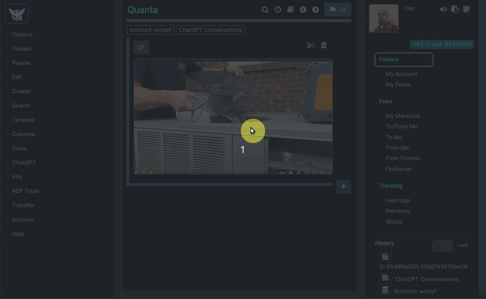
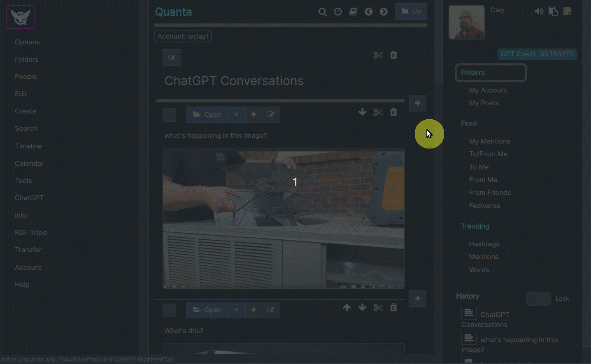
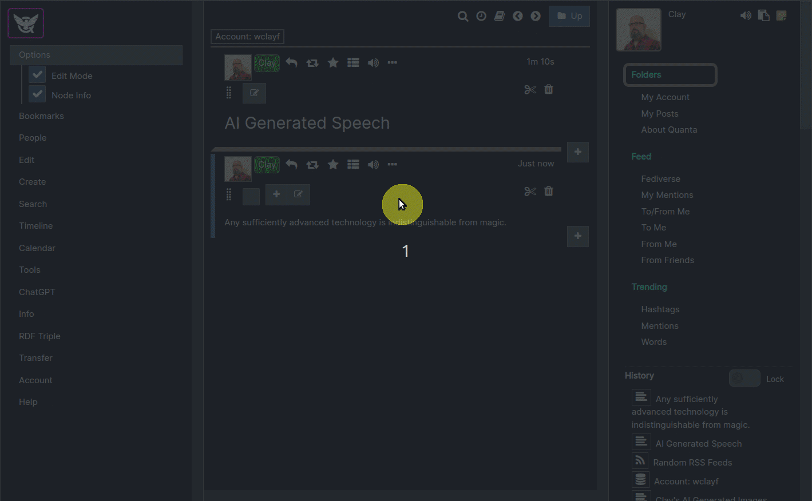

**[Quanta](/docs/index.md) / [Quanta User Guide](/docs/user-guide/index.md)**

* [AI - Artificial Intelligence](#ai---artificial-intelligence)
    * [ChatGPT - Powered by OpenAI](#chatgpt---powered-by-openai)
    * [AI Conversations](#ai-conversations)
    * [A Node that Asks a Question to AI](#a-node-that-asks-a-question-to-ai)
    * [Asking Questions to the AI](#asking-questions-to-the-ai)
    * [Question about Content](#question-about-content)
    * [Configure GPT](#configure-gpt)
        * [System Prompt Examples](#system-prompt-examples)
    * [Image Understanding](#image-understanding)
    * [Image Generation](#image-generation)
    * [Image Generation Examples](#image-generation-examples)
    * [Speech Generation](#speech-generation)
    * [Practical Use Case - Writing a Scientific Paper](#practical-use-case---writing-a-scientific-paper)

# AI - Artificial Intelligence

Converse with AI, generate images, ask questions about images.

# ChatGPT - Powered by OpenAI
----

Interact with AI by asking questions and getting answers automatically saved into your tree. The AI can assist you with almost any kind of task, or help you improve your written content, and it retains a contextual memory of all conversations, by using the tree location as "context". *Note: Quanta uses OpenAI to power all it's AI capabilities.*

**Use Quanta AI to...**

* Get answers to general questions about anything
* Have conversations with the AI, that you can either keep private or share publicly
* Ask questions about the content of any Quanta tree branch
* Generate images via text prompt
* Ask questions about images
* Generate Speech from text, and save as MP3 attachment

# AI Conversations

The screenshot below shows how to ask a question to the AI, and get it's answer back. `Answers` are always inserted as a new node directly under the `question` node. This means AI conversations are actually a tree and not a top-to-bottom list.

# A Node that Asks a Question to AI

The screenshot below shows the easiest way to ask the AI a question. You just type your question and click the `Ask GPT` button. The answer to the node content will be inserted as a subnode directly under the node containing the question.

# Asking Questions to the AI

You can ask questions to ChatGPT, and it's answer will be saved as a subnode under the question node. This means you can have a more `hierarchical` way of chatting with the AI, than what most chat systems provide, where any location in this hierarchy has it's own unique "context". 

By "context" we simply mean the AI knows exactly what has been previously said during any conversation, and will resume talking to you at any point starting with that specific set of "memories" in it's "mind".

In other words, if you're having a conversation (i.e. asking questions) and go back up the tree to a higher location in the conversation thread, and ask a new question under one of those 'nodes', that's like rolling back the mind of the AI to the exact state it had at that point in the conversation; and it will answer the new question based on that state of mind.

Once you've gotten an answer back from the AI, you can then select the answer node, and create another question node under it using the same process, to continue with the conversation (i.e. asking more questions).

You can keep asking more follow-up questions as long as you want, and that will just extend the length of that "conversation branch" under the tree. You can of course go back to any location in the tree and ask a different follow-up question and you will get an answer equivalent to if you had rolled-back the "memory" of the AI back to that point in time. 

This memory of the conversation state is called Hierarchical Contextual Memory (HCM). Stated another way, we could say that the "context" (the AI's memory and understanding of the conversation) for any question always includes all "parent nodes" at higher levels up in the tree, going back to when you asked your original question.

# Question about Content

This option will open a text entry box where you can enter a question about the content under the selected branch of the tree. In other words you can select a node that is at the top level of whatever you want to ask questions about, and then click this menu item.

*Currently (Until Quanta is available as a commercial service) you are severely limited on the size of the data that you can do this query on. Soon there will be a paid-version of Quanta where you can submit questions about larger amounts of data.*

# Configure GPT

You can use the `Configure GPT` function on a node, so that all questions anywhere on the tree under that node will have the GPT prompt settings you specify. These two prompt settings let you define what the role of the AI will be in answering questions.

So we would first click a node on the tree, and then choose `Menu -> ChatGPT -> Configure GPT` to open the dialog above. After clicking "Save" in the dialog it will store these settings onto the selected node, so that all future questions asked below that section of the tree (anywhere under that branch of the tree) will `cause GPT to answer as a pirate`. Pirates are a fun role to let the GPT play, because they start sentences with `"Hey matey, how arrrr ye."` etc.

*Tip: When you use a prompt that start with "You will...", or "You are..." or some sentence starting with "you", or when you use the word "you" in any sentence at all in this prompt the AI knows you're talking to it. You speak to it (the AI) basically the same way you would speak to a person.

## System Prompt Examples

Here are some other examples to give you an idea of just how flexible and intelligent the AI is at assuming various roles. The `System Prompt` is where you tell the AI what role it is going to play in the discussion. Here are some more examples:

* You are a helpful assistant. *(This is the default System Prompt if one is not specified)*

* Summarize content you are provided with for a second-grade student.

* You will be provided with a piece of code, and your task is to explain it in a concise way.

* You will be provided with a block of text, and your task is to extract a list of keywords from it.

* Create a Python function from a specification.

* You will be provided with a sentence in English, and your task is to translate it into French.

* Convert natural language into SQL queries.

# Image Understanding

To use GPT-4 Vision, simply upload an image onto the node, then paste a question into the node and click the AI Button (Robot Icon).

Here's an example asking questions about an image of an air conditioner unit. When you ask a question in a node that has an image attached the AI automatically assumes you're asking a question about the image itself.

# Image Generation

To generate images with DALL-E 3, click the upload button, then specify that you want an AI Generated image, and then type a description.

# Image Generation Examples

* https://quanta.wiki/u/wclayf/ai-images?view=doc

# Speech Generation

To convert a body of text to an MP3 file of a person narrating the text, you can do that using the "Attach" button, to attach the MP3.

In the screen recording below we generate an MP3 file and attaching it to the node. The GIF is silent or else you would be able to hear the sentence being read when the created MP3 was played right.

# Practical Use Case - Writing a Scientific Paper
----

Let's say you are writing a research paper, and you want to get assistance with every paragraph you write. 

In this scenario you would first create the top level "root" of your document on the content tree. You would call it something like `"A Unification Theory: Schrodinger Black Holes"` or whatever. So all your sections, and paragraphs and content will go under that node as a large subgraph representing your document.

You would then select that document root node and apply the "Configure GPT Prompting" settings to instruct the GPT with something like the following: 

**System Prompt:**

`"You are a theoretical physics researcher and scientist helping me write a research paper. You will take the text I provide, and rewrite it to make it better."`

Once you've done this, you can just run `Ask Content as Question` on each paragraph you create in the document, and a proposed rewrite will automatically get inserted as a child node.

Then if you wanted to keep the entire rewrite of your paragraph, that ChatGPT created, and use that in your document you would use the `Menu -> Edit -> Append to Parent` feature. That function takes the content of the selected node, and appends it to the end of it's parent node's content, and then deletes it. 

However more frequently you'll probably just look at how ChatGPT worded the text, and then get better ideas of your own, and type them in yourself. Or you might realize that since ChatGPT said something you didn't really mean that indicates perhaps a human would likely misunderstand the text as well, and therefore you know you probably need to rephrase it to make it more clear.

**[ChatGPT Example Q&A](/docs/user-guide/addendum/index.md)**

----
**[Next: Content Layout](/docs/user-guide/page-layout/index.md)**
