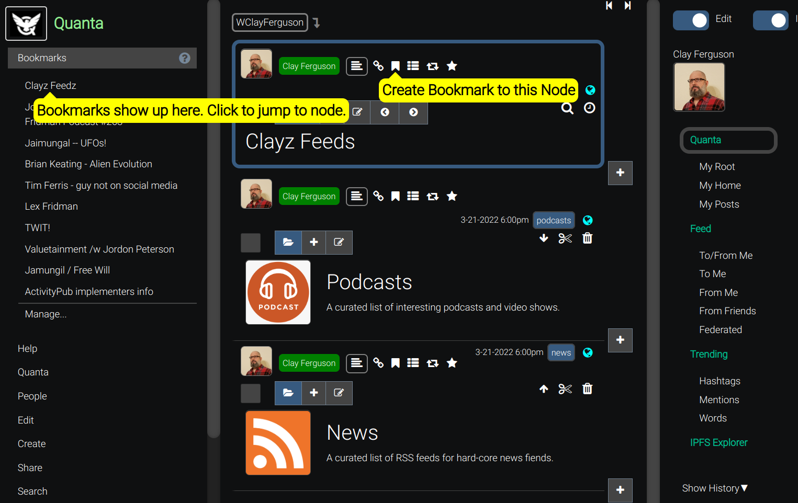

**[Quanta](/docs/index.md) / [Quanta-User-Guide](/docs/user-guide/index.md)**

# Bookmarks

To bookmark a node open the popup menu for the node and select "Bookmark". This will add a shortcut to that node on the Bookmarks Menu, that will take you to the node when clicked. The Bookmarks menu is displayed near top of the Menu on the left-hand side of the page.

At the bottom of the Bookmarks menu there's a "Manage..." menu item that takes you to the place where your bookmarks are all stored. Bookmarks are stored in your account as Nodes themselve. This means you can arrange ordering, edit, or delete your collection of bookmarks using normal Tree Editing features.

todo: This screenshot is obsolete now because the "Boomark" option has been moved to the node popup menu.

----
**[Next: Account-Profile-and-Settings](/docs/user-guide/account-settings/index.md)**
