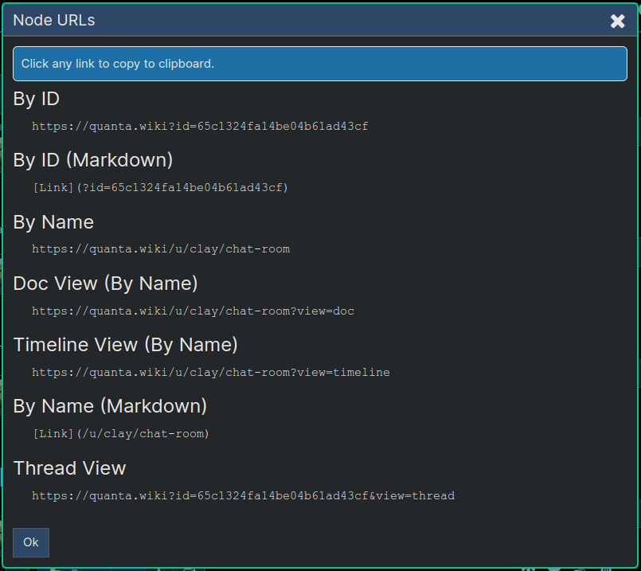

**[Quanta](/docs/index.md) / [Quanta-User-Guide](/docs/user-guide/index.md)**

# Chat Rooms

Real-time updated chronological view of content under any node.

# Chat Rooms are Timelines

Because Quanta supports a real-time (i.e. Live) updates to timeline views, this is what we use to create a `Chat Room` experience. In other words, now that recent versions of Quanta have a `Live` option and a `Chronological` option (as opposed to only Rev-Chron), we can have an identical experience to a Chat Room simply by selecting the Live option and the Chronological ordering of posts.

Rather than having a `Chat Room` feature that behaves identically to the `Timeline` feature, Quanta lets users select the Live option and the node ordering (Chronological or not) independently to customize their experience much better than what most Chat Apps offer. In other words we don't need a specific "Chat Room" feature, because the Timeline feature can already do everything Chat Rooms do, but in a *much* more powerful and flexible way.

For example if you like to see all the newest content at the top of the page (i.e. view everything in rev-chron order) you can do that, even though it's not possible in most Chat Apps. Also if you don't want the chat window to update in real-time while you're trying to read posts, you can un-check the "Live" checkbox.

So we have this terminology called a "Chat Room" in Quanta, but that's really just a Timeline view, and the app will show "Timeline" at the top of the page.

Another advantage Quanta gets from this "Timeline-based" chat capability is that **any node** can operate as a "Chat Room" simply because of the fact that anyone who has access to a node can open a "Timeline View" of that node.

# Create a Chat Room

There are two steps required to create a Chat Room experience where you can share the room to other users. First of all remember since a chat room is ultimately a timeline of a node, that node will be the 'root' node for all content in the chat room. In other words, the chat room is composed of an ordered (by time) view of the entire sub-graph under the root node.

Here are the two steps:

1) Share the node publicly (or to the specific users you want to allow)
2) Give the node a `Name`, so you have a user friendly URL to share.

Since both of those steps are described in other sections of this document we won't explain those features here.

# Share your Chat Room

Once you've created a node, given it a name, and shared it, you can then share the link with others and they can start adding content under that node (i.e. a Chat Room experience) if you share the URL with them.

To find the URL for the `Chat Room` that you can share with other users, first select the node itself (by clicking on it) and then click "Links" from the node menu for that node (visible of you've set `Menu -> Options -> NodeInfo`) and then you can see the link as shown in the image below. It will be the one below `Timeline View (By Name)`. 

If you look at the URL itself you can also see all it's really doing is appending `view=timeline` to the URL, so that when users go to that node they're immediately presented with it's Timeline View.

----
**[Next: Playing-Audio-or-Video](/docs/user-guide/audio-video/index.md)**
