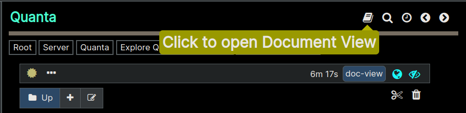
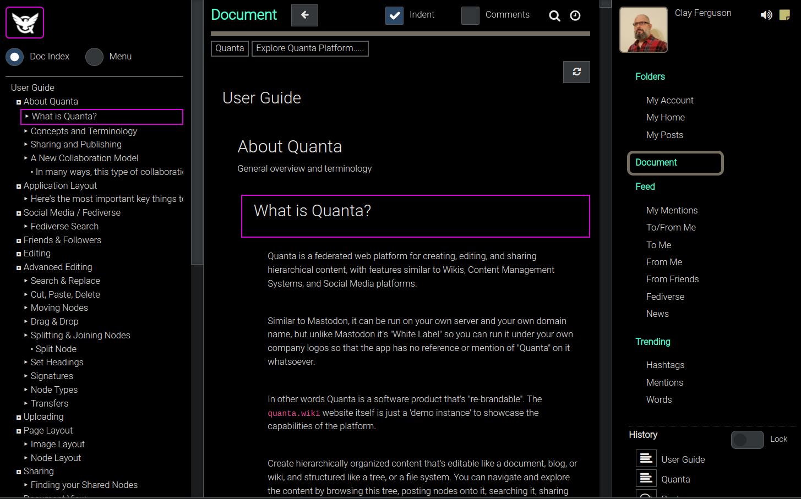
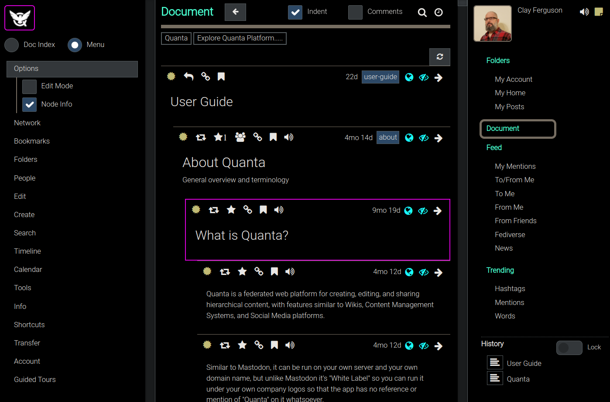

**[Quanta](/docs/index.md) / [Quanta-User-Guide](/docs/user-guide/index.md)**

# Document View

Viewing tree content as a top-to-bottom linear document.

Most of the time you'll find it easier to browse the content tree using the `Folders Tab` where you can only see one section (or subbranch) of the tree at a time. However sometimes it's more convenient to view a branch of the tree as if it were actually a single-page document, and that's what the "Document View" does.

[Here is a screencast](/docs/user-guide/app-layout/index.md) demonstrating the Document View

Use the Document Icon at the upper right of the page to display whatever you're viewing in Folders Tab as a Document View.

You can also use a URL parameter that will open a "Document View" of a node automatically, like this one:

* https://quanta.wiki/n/war-and-peace-bk1?view=doc

Notice that the above link is just the link to the named node, with `?view=doc` on the URL to specify that it should be presented like a document.

As shown in the image below, the `Document View` lets you read and scroll thru the content as if it were a monolithic single-page document, and with a `Table of Contents` type of index on the left hand side of the app. Notice the `Menu` option you'll have if you need to switch the left hand side of the page back to the Menu.

As you can see in the image above, the `Document Tab` is being displayed, and we can now scroll down thru the entire User Guide as if it were a normal single-page document.

If we want to have more interactivity with each node, other than to just read the content like a document, we can also turn on the `Menu -> Options -> Node Info` Option, and then we'll see the full information and functionality for each node in the document, so we can bookmark things, read any paragraph aloud (TTS), jump directly to the node on the Tree View (Folders Tab), edit the node directly from here (if we own it), and do most of the other things you could also do from the Folders Tab.

Note that in the screenshot above we had switched back to the "Menu" (via radio button at upper left) and so now although the `Table of Contents` is no longer visible you can still get back to it. The `Doc Index` radio button will stay available always, during your session, so you can navigate around in that document at any time.

----
**[Next: Thread-View](/docs/user-guide/thread-view/index.md)**
