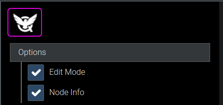
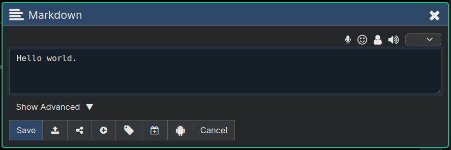
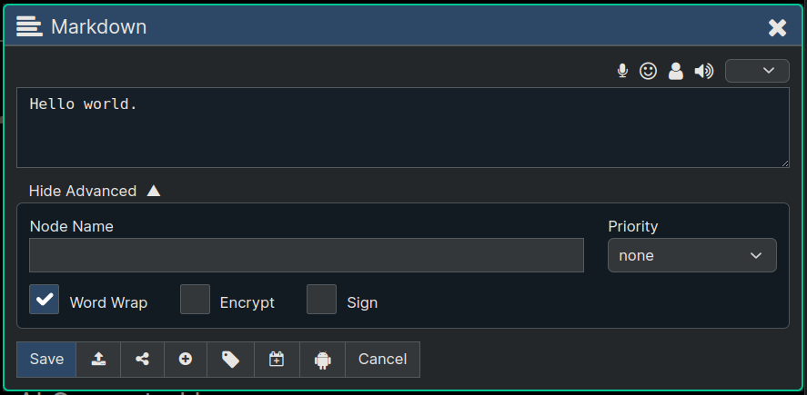

**[Quanta](/docs/index.md) / [Quanta-User-Guide](/docs/user-guide/index.md)**

* [Content Editing](#content-editing)
    * [Edit Mode](#edit-mode)
    * [Edit Dialog](#edit-dialog)
    * [Advanced Options](#advanced-options)
    * [Tips and Tricks](#tips-and-tricks)
        * [Including URLS](#including-urls)
        * [Automatic Clipboard Attach](#automatic-clipboard-attach)

# Content Editing

How to create and edit content.

# Edit Mode

To start editing first enable "Edit Mode" via the menu.





When edit mode is enabled you'll see a toolbar at the top of each row, with icon buttons to create new content, edit content, move nodes around, cut/paste, delete, etc. 

Tip: The `Node Info` option turns on the display of even more metadata on each node.

Just like the file system on your computer has a single root folder, your account node on Quanta is a single root node, containing all your content. Whatever content you create under your root node is up to you. You can create Social Media posts, blogs, collaborative documents, or anything else. 

Tip: Click `Folders -> My Account` to go to your root node.

# Edit Dialog

Here's a screenshot of the Editor Dialog, which is where all editing is done. You can edit one node at a time.




The icon buttons across the top (of the above image) do the following (from left to right):

* Enables Speech-to-Text using your mic, so that it will enter whatever you speak at the position of your cursor in the text.

* Inserts an Emoji, by letting you pick one graphically.

* Lets you insert *Mentions* (peoples user names) by letting you pick from your Friends List.

* Reads the current editor text to you aloud (using Text-to-Speech)

Buttons at bottom of the editor do the following (from left to right):

* Save and close the editor

* Upload from a File

* Share the node to specific users or to public

* Add custom properties

* Add Tags

* Convert to a Calendar Entry

* Ask Content as a Question to AI/LLM

* Close editor without saving

# Advanced Options

The "Advanced" section contains more features/capabilities, like entering a node name, priority, word wrap, encryption, signature setting, etc.




# Tips and Tricks

## Including URLS

When you put a url in any node the system will by default display it using a small image and snippet of text from the website if the website supports that kind of thing. For example if you put a youtube url in some content the GUI will display the image and title and description of that video at the bottom of the node.

If you want to display the URL all by itself without that preview content just prefix the url with an asterisk followed by a space on a separate line like this:

```md
 * https://somesite.com
```

If you want to display just the preview image and text and not the URL itself use this:

```md
 - https://somesite.com
```

Or this, to show the preview image but neither a long description nor the URL.

```md
 -- https://somesite.com
```

## Automatic Clipboard Attach

If you hold down the CTRL key when you click an insert button (the Plus '+' Icon) your clipboard text will be automatically inserted as your node content and immediately saved.


----
**[Next: Tree-Editing](/docs/user-guide/adv-editing/index.md)**
