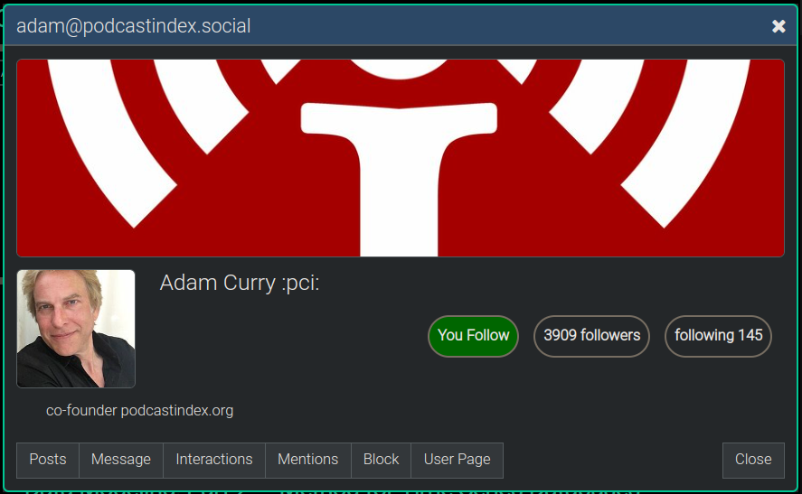
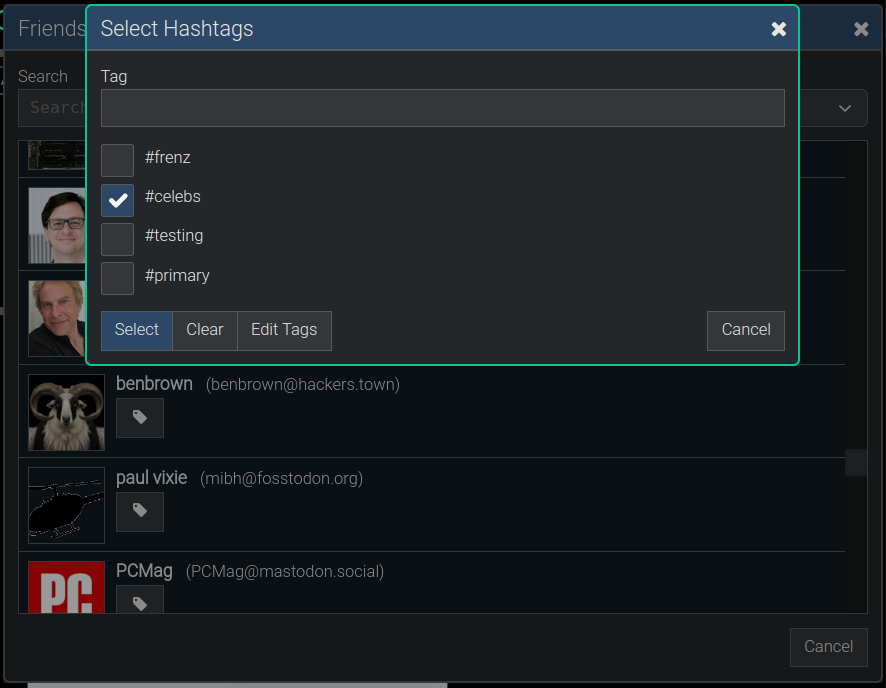
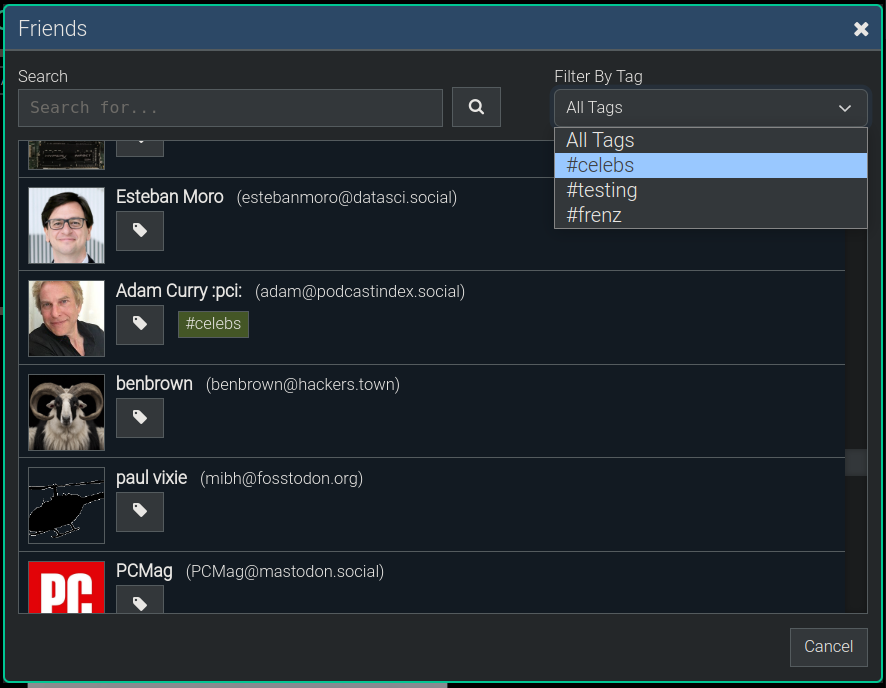

**[Quanta](/index.md) / [Quanta User Guide](/user-guide/index.md)**

# Friends and Followers

How to follow people and view your followers...

# Finding People

To add a new friend (i.e. follow someone), click `Menu -> People -> Search`, and search their user name (i.e. user@instance.com). Once you find the person, click their avatar image to show the person's profile info, and you'll find a "Follow" button there as well, which you can click to follow/unfollow.

The `People` menu is also where you can see who you're following (called your Friends), who's following you (called your Followers), as well as who you've blocked. The menu item `People -> Friends` opens a list of everyone you're following like this example below:

# Viewing Friends and Profiles

Clicking the icon for any Friend (like shown above) will open their User Profile.

# Friend Tags

So that you can follow large numbers of people but be sure not to miss any content from those you care about most, you can assign custom tags to any of your Friends. 

Clicking the "Tags" button on your Friends List allows you to edit the tags as shown in the image below:

The Tags Filter automatically knows what all the tags are that you currently have in use, and will show you a drop-down selection like the following to let you rapidly find users based on tags.

# Feed View - Filtered by Tag

Here's what a filtered view of a Fediverse Feed looks like when you've selected a tag to filter by. As you can see in the image below, with one click, I have selected `#frenz` as the tag to filter on and so it's only showing posts from my Friends that I've labeled with the tag `#frenz`:

----
**[Next:  Content Layout](/user-guide/page-layout/index.md)**
