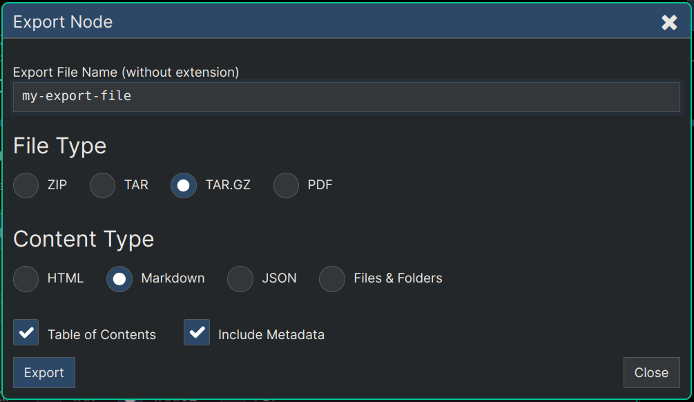

**[Quanta](/docs/index.md) / [Quanta-User-Guide](/docs/user-guide/index.md)**

* [Export and Import](#export-and-import)
    * [Export ](#export-)
    * [File Types](#file-types)
        * [ZIP and TAR](#zip-and-tar)
        * [PDF](#pdf)
    * [Content Types](#content-types)
        * [HTML](#html)
        * [Markdown](#markdown)
            * [Special Markdown Options](#special-markdown-options)
        * [JSON](#json)
        * [Files and Folders](#files-and-folders)
    * [Export Tips](#export-tips)
        * [noexport](#noexport)
    * [Import](#import)

# Export and Import

# Export 

Select `Menu -> Tools -> Export` to export any node (and all its subnodes) into a downloadable archive file, or PDF.

# File Types

## ZIP and TAR

These options control what type of file you'll be packaging the exported files into.

## PDF

Generates a PDF file containing the entire content of the sub-branch of the tree.

If you choose PDF as the export format you'll notice a checkbox you can use that will cause a table of contents to be included at the top of the document, which is generated based on your Markdown headings (#, ##, ### etc). 

Similar to how conventional Word Processors (Document editors) can use headings and heading levels to generate indexes (Tables of Contents), Quanta does the same thing but based on the Markdown headings.

Note: As mentioned above, the `Set Headings` option will ensure the heading levels in your content match the tree structure of the content. This can be used to ensure a consistent Table of Contents in all your exported PDFs.

# Content Types

## HTML

Creates a single HTML file containing the content of the subgraph of the exported node. This HTML file along with all the image files and other attachments are packaged into the archive file so that when you expand the archive file you can then view the HTML file offline in your browser.

## Markdown

Exporting to Markdown exports the content pretty much verbatim as it's stored in the cloud database, because the app uses Markdown as it's primary editing format. Your exported content will be merged into a single markdown file in the exported archive unless you use the `file` and/or `folder` properties of nodes to build up a virtual folder structure which will then determine the actual delineation between files and folders in the exported content.

### Special Markdown Options

When exporting to markdown there's away to control which files and folders get created to hold the content being exported. You can use the `Node Property Editing` in the editor to set a `file` property and/or the `folder` property on any node. 

When you set the `file` property on a node to something like `myfile.md` (you should always use 'md' extension) that will cause the entire content of that node and it's subgraph to end up going into that file. You can give a full path for that file as well (like: `/my/path/myfile.md`), and the exported archive file will create directories as needed and store the file in that subfolder.

However using the `file` and `folder` properties is not necessary and if omitted you'll just get a single file named `index.md` that contains all the exported data.

The folders that are found during the export are also allowed to be used in a hierarchical way so that if you have perhaps a node with folder "docs" set on it, and it has a child node with a folderl prop of `/subfolder/*` then the content of `subfolder` will end up in the exported archive file as `/docs/folder/index.md`. Note that in this example two things happened 1) The folder names were concatenated and the `/*` was automatically assumed as the default abbreviation for `/index.md`.

The export as Markdown will result in a folder structure that's directly usable on `Github Pages` as well. For example the 'docs' folder of the Quantizr project (i.e. Quanta) on github was generated by an export of the top level root node of the Quanta website, as you can see here:

### [Quana Docs on Github](https://github.com/Clay-Ferguson/quantizr/blob/master/docs/index.md)

## JSON

If you want to export content as a way of doing a backup (that can later be restored/imported) select the JSON format. A JSON format will contain all the actual raw data content from the nodes. The other file export types (Markdown and HTML) are primarily for creating browsable offline copies of the data.

## Files and Folders

Exports an archive file that's the best way to browse your tree directly on your file system after extracting the files and folders. You will end up with a folder structure where each node is a folder, and you'll have a `content.md` file in each folder that is the content of the nodes. The folder names are auto-generated as readable text based on the first line of content in each node. The main purpose of this kind of export is so that you can create usable backups that allow you to browse your data completely without the use of the Quanta App.

This export feature also provides a good path of egress if you should decide after using Quanta that you want to stop using Quanta and move all your data out into files and folders.

# Export Tips

## noexport

If there are one or more nodes you don't want included in your export, you can add a property named `noexport` to the node and give it any value like '1'. This will basically truncate that entire branch of the tree from the export and none of the subnodes under that Branch will be exported .

# Import

Select `Menu -> Tools -> Import` to import a file that was previously exported. The only export formats that are supported for re-importing are the ZIP and TAR formats with the JSON content option. 

To import a file, click an empty node (i.e. a node with no subnodes) you want to import under, and then click `Menu -> Tools -> Import`. You're then prompted with a file upload dialog where you can select a file from your computer to upload.

The uploaded file will recreate a copy of the data that was exported, including its content text and attachments.

----
**[Next: Bookmarks](/docs/user-guide/bookmarks/index.md)**
