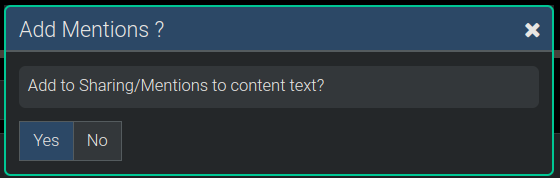
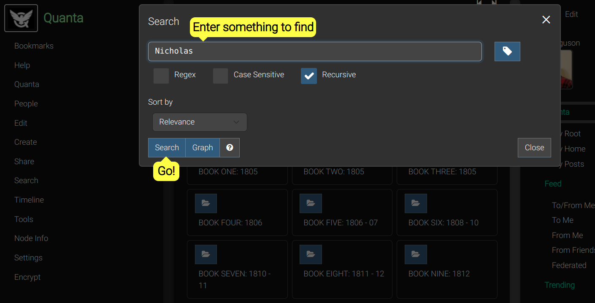
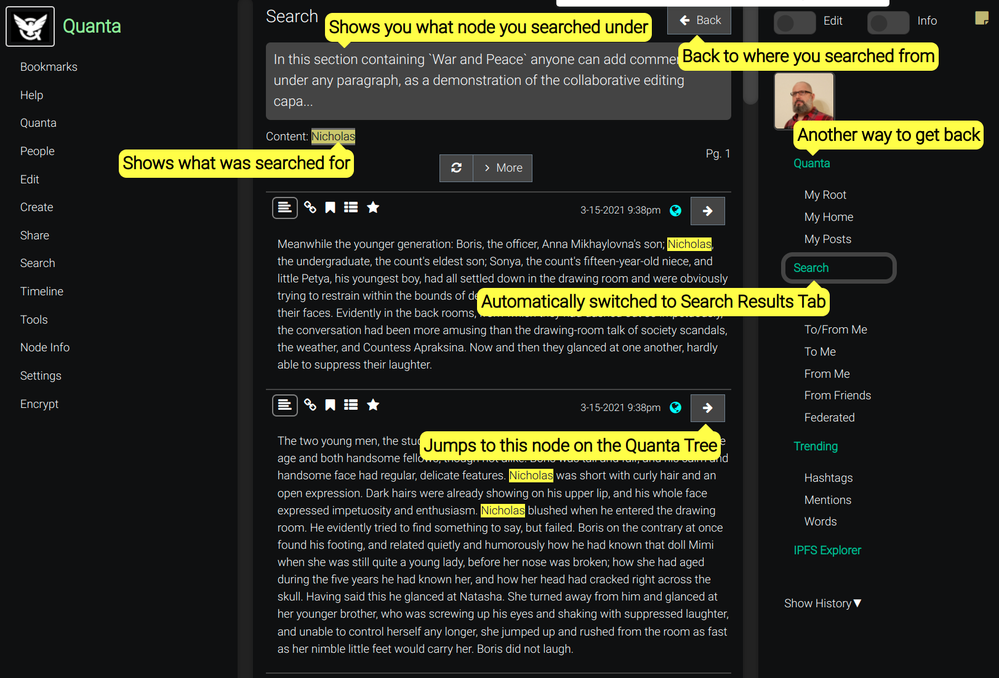
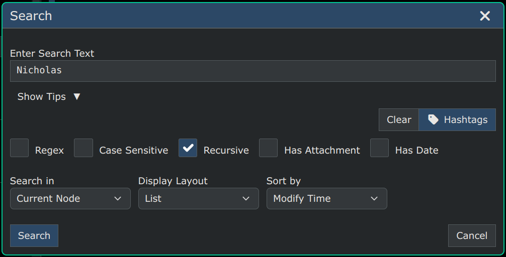
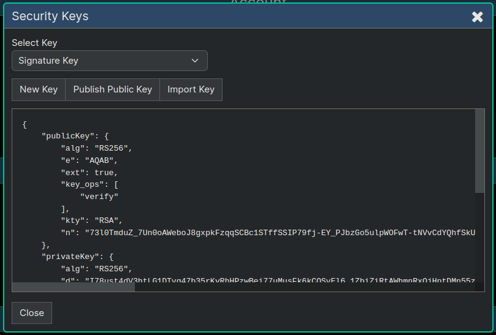

* [Quanta User Guide](#quanta-user-guide)
* [About Quanta](#about-quanta)
    * [What is Quanta](#what-is-quanta)
    * [Concepts and Terminology](#concepts-and-terminology)
    * [Sharing and Publishing](#sharing-and-publishing)
    * [A New Collaboration Model](#a-new-collaboration-model)
* [Application Layout](#application-layout)
    * [Views Menu](#views-menu)
        * [Timeline](#timeline)
        * [Thread History](#thread-history)
        * [Document View](#document-view)
        * [Node Graph](#node-graph)
* [Content Editing](#content-editing)
    * [Edit Mode](#edit-mode)
    * [Edit Dialog](#edit-dialog)
    * [Advanced Options](#advanced-options)
    * [Tips and Tricks](#tips-and-tricks)
        * [Including URLS](#including-urls)
        * [Automatic Clipboard Attach](#automatic-clipboard-attach)
        * [Centering Text](#centering-text)
        * [Adding Empty Vertical Space](#adding-empty-vertical-space)
        * [Expandable Sections](#expandable-sections)
* [Tree Editing](#tree-editing)
    * [Search and Replace](#search-and-replace)
    * [Copy - Cut - Paste - Delete](#copy---cut---paste---delete)
        * [Delete](#delete)
        * [Cut and Paste](#cut-and-paste)
        * [Copy and Paste](#copy-and-paste)
    * [Moving Nodes](#moving-nodes)
        * [Move To Top](#move-to-top)
        * [Move To Bottom](#move-to-bottom)
    * [Drag and Drop](#drag-and-drop)
        * [Drop to Link Nodes](#drop-to-link-nodes)
        * [Drag to Upload Files](#drag-to-upload-files)
        * [Drag To and From History](#drag-to-and-from-history)
    * [Splitting and Joining](#splitting-and-joining)
        * [Split Node](#split-node)
        * [Join Nodes](#join-nodes)
        * [Append To Parent](#append-to-parent)
    * [Set Headings](#set-headings)
    * [Node Signatures](#node-signatures)
        * [Purpose of Signatures](#purpose-of-signatures)
        * [Verify Signatures ](#verify-signatures-)
        * [Remove Signatures ](#remove-signatures-)
    * [Node Types](#node-types)
    * [Transfers](#transfers)
        * [About Admin Transfers](#about-admin-transfers)
    * [Tips](#tips)
* [Uploading](#uploading)
    * [Upload Image](#upload-image)
    * [Upload from Various Sources](#upload-from-various-sources)
    * [Account Quotas](#account-quotas)
    * [Tips](#tips)
* [Sharing](#sharing)
    * [Node Ownership](#node-ownership)
    * [Basic Sharing Example](#basic-sharing-example)
    * [Unpublished Option](#unpublished-option)
    * [Sharing Indicators](#sharing-indicators)
    * [Finding your Shared Nodes](#finding-your-shared-nodes)
        * [Show All Shared Nodes](#show-all-shared-nodes)
        * [Show Public Read-Only](#show-public-read-only)
        * [Show Public Appendable](#show-public-appendable)
* [Artificial Intelligence - LLMs](#artificial-intelligence---llms)
    * [AI Services Supported](#ai-services-supported)
        * [Anthropic](#anthropic)
        * [OpenAI](#openai)
        * [Perplexity](#perplexity)
        * [Google Gemini](#google-gemini)
        * [Meta Llama 3](#meta-llama-3)
    * [AI Conversations](#ai-conversations)
    * [A Node that Asks a Question to AI](#a-node-that-asks-a-question-to-ai)
    * [Questions about a Subgraph](#questions-about-a-subgraph)
    * [Custom AI Agents](#custom-ai-agents)
        * [System Prompt Examples](#system-prompt-examples)
    * [AI Service Selection](#ai-service-selection)
        * [AI Cloud Services Supported](#ai-cloud-services-supported)
    * [Using AI for Writing](#using-ai-for-writing)
        * [Generating Content with AI](#generating-content-with-ai)
            * [Step 1 - Configure Document Root Node to have AI Settings](#step-1---configure-document-root-node-to-have-ai-settings)
            * [Step 2 - Turn on AI Writing Mode](#step-2---turn-on-ai-writing-mode)
            * [Summary](#summary)
        * [Writing an Entire Book with AI](#writing-an-entire-book-with-ai)
            * [Overview of the Writing Process](#overview-of-the-writing-process)
            * [Example - Write a Book on Bicycling](#example---write-a-book-on-bicycling)
                * [Step by Step Screenshots](#step-by-step-screenshots)
            * [Why use Book Writing Features](#why-use-book-writing-features)
    * [AI Agent for Code Refactoring](#ai-agent-for-code-refactoring)
        * [Enabling Coding Agent Features](#enabling-coding-agent-features)
        * [Using the Coding Agent](#using-the-coding-agent)
            * [Block Syntax](#block-syntax)
                * [Block Examples](#block-examples)
            * [File and Folder Syntax](#file-and-folder-syntax)
                * [File Example](#file-example)
        * [Creating Custom Coding Agents](#creating-custom-coding-agents)
        * [Quanta Agent Standalone App](#quanta-agent-standalone-app)
* [Customizing Content Display](#customizing-content-display)
    * [Image Layout](#image-layout)
        * [Example Layout 1 ](#example-layout-1-)
        * [Example Layout 2](#example-layout-2)
        * [Positioning Images](#positioning-images)
    * [Node Layout](#node-layout)
    * [Tips](#tips)
    * [Collapsible Sections](#collapsible-sections)
    * [URL Previews](#url-previews)
* [Document View](#document-view)
* [Thread View](#thread-view)
    * [AI Chat - Use Case for Thread View](#ai-chat---use-case-for-thread-view)
* [Searching](#searching)
    * [Full-Text Search](#full-text-search)
    * [Specialized Searches](#specialized-searches)
        * [By Content](#by-content)
        * [By Node Name](#by-node-name)
        * [By Node ID](#by-node-id)
* [Timelines](#timelines)
    * [Terminology](#terminology)
    * [Powerful Collaboration](#powerful-collaboration)
    * [Practical Use Cases](#practical-use-cases)
    * [Timeline Sort Options](#timeline-sort-options)
        * [Created](#created)
        * [Modified](#modified)
        * [Created non-Recursive](#created-non-recursive)
        * [Modified non-Recursive](#modified-non-recursive)
* [Chat Rooms](#chat-rooms)
    * [Chat Rooms are Timelines](#chat-rooms-are-timelines)
    * [Create a Chat Room](#create-a-chat-room)
    * [Share your Chat Room](#share-your-chat-room)
* [Playing Audio or Video](#playing-audio-or-video)
* [Recording Audio or Video](#recording-audio-or-video)
* [Node Info](#node-info)
    * [Show URLs](#show-urls)
    * [Show Raw Data](#show-raw-data)
    * [Node Stats](#node-stats)
* [RSS and Podcasts](#rss-and-podcasts)
    * [Create an RSS Aggregator](#create-an-rss-aggregator)
        * [Set the Node Type](#set-the-node-type)
        * [Enter RSS URLs](#enter-rss-urls)
        * [Request to View Feeds](#request-to-view-feeds)
        * [Have Fun Reading the News](#have-fun-reading-the-news)
    * [Comment on a Podcast](#comment-on-a-podcast)
* [Encryption](#encryption)
    * [Encrypting a Node](#encrypting-a-node)
    * [Technical Notes](#technical-notes)
    * [Encryption Strategy](#encryption-strategy)
    * [Key Management](#key-management)
* [Interactive Graphs](#interactive-graphs)
* [Text-to-Speech](#text-to-speech)
    * [Text-to-Speech Tab](#text-to-speech-tab)
    * [TTS in the Node Editor Dialog](#tts-in-the-node-editor-dialog)
    * [TTS from any Node](#tts-from-any-node)
    * [TTS Text via Drag-and-Drop](#tts-text-via-drag-and-drop)
    * [TTS for Text you Enter Manually](#tts-for-text-you-enter-manually)
* [Export and Import](#export-and-import)
    * [Export ](#export-)
    * [File Types](#file-types)
        * [ZIP and TAR](#zip-and-tar)
        * [PDF](#pdf)
    * [Content Types](#content-types)
        * [HTML](#html)
        * [Markdown](#markdown)
        * [JSON](#json)
        * [Files and Folders](#files-and-folders)
    * [Export Tips](#export-tips)
        * [noexport](#noexport)
    * [Import](#import)
* [Bookmarks](#bookmarks)
* [Account Profile and Settings](#account-profile-and-settings)
    * [User Profile](#user-profile)
    * [Account Settings](#account-settings)
    * [Settings](#settings)
        * [Manage Hashtags](#manage-hashtags)
        * [Blocked Words](#blocked-words)
        * [Comments](#comments)
        * [Properties](#properties)
        * [Content Width](#content-width)
        * [Bulk Delete](#bulk-delete)
    * [Storage Space](#storage-space)
    * [Manage Keys](#manage-keys)
* [Semantic Web](#semantic-web)
    * [Semantic Web Basics](#semantic-web-basics)
    * [Person Type Example](#person-type-example)
    * [Editing a Person](#editing-a-person)
    * [Object Display](#object-display)
    * [Adding more Properties](#adding-more-properties)
    * [Technical Info](#technical-info)
        * [YAML Config](#yaml-config)
        * [About the YAML](#about-the-yaml)
        * [Full Schema_org Support](#full-schema_org-support)
        * [Non-Schema_org Properties](#non-schema_org-properties)
        * [Default Property Display](#default-property-display)
        * [Semantic Web References](#semantic-web-references)
        * [WordPress and Semantic Web](#wordpress-and-semantic-web)
* [RDF Triples](#rdf-triples)
    * [Node Linking](#node-linking)
    * [How to Link two Nodes](#how-to-link-two-nodes)
        * [Create Triple ](#create-triple-)
    * [Find Subjects](#find-subjects)
    * [Link Nodes by Drag and Drop](#link-nodes-by-drag-and-drop)
    * [RDF Links on Node Graphs](#rdf-links-on-node-graphs)
* [Addendum](#addendum)
    * [Example ChatGPT Q and A](#example-chatgpt-q-and-a)


# Quanta User Guide

[View on GitHub](https://github.com/Clay-Ferguson/quantizr/blob/main/docs/user-guide/index.md)

## About Quanta

General overview and terminology

### What is Quanta

Quanta is a web platform for creating, editing, and sharing hierarchical content, with features similar to Wikis, Content Management Systems, and Social Media platforms.

Create hierarchically organized content that's editable like a document, blog, or wiki, and structured like a tree, or a file system. You can navigate and explore the content by browsing this tree, posting nodes onto it, searching it, sharing branches of it, viewing timelines, etc.

Quanta is `re-brandable` so it can be run with your own custom logos and branding images and text. The `quanta.wiki` website itself is just a 'demo instance' to showcase the capabilities of the platform.

### Concepts and Terminology

To allow a fine-grained hierarchical approach to content organization, the platform `"quantizes"` each piece of information into `Tree Nodes` (thus the name `"Quanta"`). 

Node content can be as small as one sentence (like a tweet), or as large as you want, having multiple paragraphs of text. Each node can also have file attachments (images, videos, etc.) Depending on context, sometimes the word `Folder` is used and sometimes the word `Node` is used, but the important thing to know is that each Node (piece of content) can contain other Nodes, so in this way content nodes are similar to file system `Folders`, and are also Tree-like.

With these small chunks of content you can create nodes that are Social Media posts (free-standing content without any prior context); but you can also organize content into larger structures to compose a document, blog, or other long-form content, with different sections, chapters, headings, etc. containing the individual sentences and paragraphs of the document.

Since everyone is familiar with files and folders in the context of a computer operating system, the main thing to remember is that Quanta uses the terms tree, branch, or even subgraph to refer to what you already know as "Folders". 

So if you simply realize a folder structure on computers is a "Tree" then everything else about the Quanta terminology should be intuitive and obvious to you. The term "Node" just means "something on the tree".

All nodes can contain any number of subnodes (which is what makes Quanta a `tree`). This means Quanta is "browsable" like a file system, but instead of seeing file names and folder names (like a file-manager), you see the actual content text and images, displayed inline on the page.

Similar to how Twitter has `Tweets`, Facebook has `Posts`, Jupyter Notebooks has `cells`, etc., Quanta has a fundamental piece of content called a `Node`. These nodes make up hierarchies of content so, to repeat the above, they can represent Documents (a tree structure of paragraphs), Wikis, Social Media posts, blogs, or anything else. There's no distinction between those use cases. 

Each user owns one branch of the tree (their account root node, and whatever you've created under it).

The final important thing to realize about `Nodes` is that in general the way you reply to a piece of content is by creating a `subnode under the node you're replying to`. So this means when multiple people are creating content collaboratively it automatically becomes the logical equivalent of a "Social Media Thread", and in Quanta these threads are therefore hierarchical. However, unlike a `chat room` there's never any confusion about what any post is a reply to because the parent node is understood to be that.

### Sharing and Publishing

Each node automatically has its own unique URL, and can be shared with others or kept private. You can also (optionally) enter a name on any node to make it available by a more user-friendly URL, that uses the name you give it instead of the default numerical identifier (Record ID).

For example, below is an example URL for a node owned by user 'bob' that's named 'blog'. Simply by naming the node 'blog' (done in the Node Editor) and making the node 'public' this URL is automatically accessible by everyone, as a web page at the following URL:

* https://quanta.wiki/u/bob/blog

### A New Collaboration Model

The hierarchical structure is powerful for organizing data and documents, but is also what enables ad-hoc discussion threads to form under any node in the content. When collaborating on a document, for example, any piece of content can have arbitrarily large discussion threads branching off underneath it.

In many ways, this type of collaboration architecture (i.e. tree-based) is preferable to the old-school 'revision marks' used by conventional monolithic document editors (like Microsoft Office 365). 

Not only can multiple people suggest revisions to any given sentence, but there can be an entire team discussion happening under any sentence or paragraph in a document, without interrupting the flow of the document itself.

This method of collaboration also eliminates the need for sending emails back and forth when some specifics of a document need to be discussed. Document changes can be discussed right inside the document itself, right at the location of the proposed change!

To expand on this `hierarchical threading model` a bit more: A branch of the tree *is considered* a conversation thread (by definition), if it contains a chain of replies to nodes.

In other words, the way you `reply` to a post (or node) is by creating a subnode directly under it. The general understanding is simply that if you create a node under someone else's node, then you're saying something in reference to the parent node. 

So there's no need for a concept like "creating a new thread" (like the awkward way Discord and many other platforms have attempted to solve what is undeniably a need for hierarchical content), because everything in Quanta is always essentially a thread already, because everything is a branch of a tree.
 
The key point here: `All Conversation Threads are Trees`

You may have also used the "Quote in Reply" feature of Discord or other platforms where you're in a large chat room, wanting to reply to some specific post. Have you noticed how that's very awkward in a room with multiple simultaneous conversations happening at the same time? When everyone has to re-quote what they're replying to, the whole chat room becomes chaotic and cluttered. Also you have to constantly enter someone's name in every reply or else your message won't have proper context, and no one can tell who you're even replying to, without all this additional effort and duplication of text.

`Quanta elegantly solves *all* of this chaos`, simply by being a tree at the fundamental level: There's never any question about what a node is a `reply to` because that is always its `parent` node! 

The more conventional Timeline view is still always just one click away to display the Rev-Chron view of any tree branch whenever you *do* want a merged list of everything said by everyone (under some subgraph of the tree), all merged together into a single list.

If you're thinking it sounds awkward to have to expand any node to see what's under it, that's because you do need to know *how* to use `Timelines` and also the `Document View`.

The "Timeline" button (clock icon, at top of Folders Tab) can be used to instantly see the more 'standard' reverse-chronological view under that node (like how Twitter or Mastodon would display it).

Knowing how to seamlessly jump back and forth between the `Folders Tab` (a Tree View) and the `Timeline Tab` (a Rev-Chron View) is the key to being able to use the platform effectively and is a necessary learning curve to unlock the real power and convenience of the platform.

As remote work (i.e. "Working from Home") becomes the norm for many tech companies, Quanta offers a uniquely powerful way to collaborate on `Deep Documents` uniquely better and easier than what other team collaboration systems provide.

`Deep Documents` is a term that means documents which are structured content of arbitrary tree-depth, and are hierarchical, and can therefore potentially contain discussion threads like described above.

Importantly, these kinds of Deep Documents can also be powerful for their ability to preserve the thought processes, and discussions from all contributors, that led up to the final version of a document. This is obviously great for better accountability of decision making and for future reference regarding why a collaborative document ended up as it did.

## Application Layout

Main application sections described

The Folders tab is where you can view all the content nodes. As shown in the animated GIF below you can explore the tree by expanding sections one at a time, or you can also request a Document View at any time for a more document-centric experience if you prefer that.


The most important things to learn first:

* The blue buttons with `Folder Icons` (labelled 'Open' and 'Up') let you go deeper into the tree or come back out.

* Below the `Page Root Node` (Top of page when you're on the `Folders Tab`) are the children of that node, which makes up what your page will display, when you're on the Folders Tab.

* Turn `Menu -> Options -> Edit Mode and/or Node Info` options on only when you need them, so the page is cleaner looking. The page will render with lots more info and buttons when you enable those.


* The top-level sections on the right of the page are called `"Tabs" (or Views)`, and you can only be viewing one at a time. Whatever tab you're on determines what you see in the center panel of the app.

In the screenshot below the `Folders Tab` is selected. `Think of the "Folders Tab" as your "Tree View" of the database.` All Quanta data is stored hierarchically like a file system, and the Folders Tab is how you can interact with that hierarchy.


### Views Menu

Under `Menu -> View` here are several very commonly used views you can use to work with nodes in a particular order, or in a particular way. The View Menu looks like this:


#### Timeline

For the currently selected node, this will display all the contents under that node sorted chronologically.

#### Thread History

This will show all the parent nodes, of the selected node, going all the way up on the tree and display them all in order of creation. For example if this node is part of a conversation, it will show the entire "context" of the discussion which will consist of every part of the discussion that led up to the node itself.

#### Document View

The normal behavior of Quanta (i.e. the Folders view) is to display one level of the tree at a time, and requires you to expand nodes to navigate to various pieces of content. So the Document View is a way to display everything under a node all at once. It's called "Document" view because you're essentially displaying a tree branch formatted as a conventional monolithic document.

#### Node Graph

Displays a Graphical representation of the current node, and all it's child nodes.

## Content Editing

How to create and edit content.

### Edit Mode

To start editing first enable "Edit Mode" via the menu.


When edit mode is enabled you'll see a toolbar at the top of each row, with icon buttons to create new content, edit content, move nodes around, cut/paste, delete, etc. 

Tip: The `Node Info` option turns on the display of even more metadata on each node.

Just like the file system on your computer has a single root folder, your account node on Quanta is a single root node, containing all your content. Whatever content you create under your root node is up to you. You can create Social Media posts, blogs, collaborative documents, or anything else. 

Tip: Click `Folders -> My Account` to go to your root node.

### Edit Dialog

Here's a screenshot of the Editor Dialog, which is where all editing is done. You can edit one node at a time.


The icon buttons across the top (of the above image) do the following (from left to right):

* Enables Speech-to-Text using your mic, so that it will enter whatever you speak at the position of your cursor in the text.

* Inserts an Emoji, by letting you pick one graphically.

* Lets you insert *Mentions* (peoples user names) by letting you pick from your Friends List.

* Reads the current editor text to you aloud (using Text-to-Speech)

Buttons at bottom of the editor do the following (from left to right):

* Save and close the editor

* Upload from a File

* Share the node to specific users or to public

* Add custom properties

* Add Tags

* Convert to a Calendar Entry

* Ask Content as a Question to AI/LLM

* Close editor without saving

### Advanced Options

The "Advanced" section contains more features/capabilities, like entering a node name, priority, word wrap, encryption, signature setting, etc.


### Tips and Tricks

#### Including URLS

When you put a url in any node the system will by default display it using a small image and snippet of text from the website if the website supports that kind of thing. For example if you put a youtube url in some content the GUI will display the image and title and description of that video at the bottom of the node.

If you want to display the URL all by itself without that preview content just prefix the url with an asterisk followed by a space on a separate line like this:

```md
 * https://somesite.com
```

If you want to display just the preview image and text and not the URL itself use this:

```md
 - https://somesite.com
```

Or this, to show the preview image but neither a long description nor the URL.

```md
 -- https://somesite.com
```

#### Automatic Clipboard Attach

If you hold down the CTRL key when you click an insert button (the Plus '+' Icon) your clipboard text will be automatically inserted as your node content and immediately saved.

#### Centering Text

If you want to center some text, simply wrap the line with `->` and `<-` as follows:

```
-> Text will be Centered Horizontally <--
```

You can also use markdown headers or other markdown but the centering can only be done on a single line.

#### Adding Empty Vertical Space

You can add more vertical spacing between paragraphs or between anything at all just by putting a single dash (`-`) character on a line all by itself. Each line that contains just a dash will turn into vertical space.

#### Expandable Sections

You can add an expandable section of markdown that will display as a link the user can expand and collapse and defaults to 'collapsed', using the following syntax:

```
-**Collapsible Heading**-

This is the text that was hidden until you clicked the Collapsible Heading
```
-

Here's what the above example is like you can see how it works:

-**Collapsible Heading**-

This is the text that was hidden until you clicked the Collapsible Heading


-
-

To designate the end of the collapsible section put two blank lines in the text, to separate your collapsible section from any content that may come below it.

## Tree Editing

Features for editing structured documents

### Search and Replace

Under `Menu -> Edit -> Search and Replace` you'll find the same kind of "Search and Replace" feature that exists in most text editors. You can replace text under all nodes in the subgraph of the selected node.


### Copy - Cut - Paste - Delete

You can Cut, Paste, and Delete nodes in a hierarchical way similar to how you do it in your computer's file system.

When `Edit Mode` is enabled you'll see a checkbox to the left of each node that you can use to select to Cut-and-Paste or Delete.

If you want to rapidly un-check all checkbox selections, use `Menu -> Edit -> Clear Selections`

#### Delete

To delete nodes use the `Trash Can Icon` on the node, and that will delete all the nodes you've selected, or if you haven't selected multiple nodes it will just delete the node where you clicked the icon.

#### Cut and Paste

To move nodes to some other location (on the Tree), select the nodes to move, and click the `Scissors Icon` on one of the nodes. Then use the "Paste Here" buttons that start appearing on the page to paste the nodes elsewhere.

If you decide you don't want to paste the nodes, click `Menu -> Edit -> Undo Cut` before you paste anywhere. Nothing actually changes in the database until you actually Paste the nodes.

#### Copy and Paste

Copy and Paste works just like Cut and Paste described above except since the "Copy/Paste" is a function used much less frequently, the Copy option is only available on the menu at `Menu -> Edit -> Copy`.

### Moving Nodes

Use the up and down arrow icons on each node to move nodes up or down one position. Child nodes are ordered and maintain their position, unless you move them.

#### Move To Top

`Menu -> Edit -> Move to Top` moves the selected node to the top position (above all other nodes) in its parent.

#### Move To Bottom

`Menu -> Edit -> Move to Bottom` moves the selected node to the bottom position below all other nodes at its level under the parent.

### Drag and Drop

When `Edit Mode` is enabled, you can generally drag any node to any other location on the tree, by using the mouse to click the dragable icon that looks like this vertical bar of dots: 


After you drag and drop a node you'll be prompted about what to do as your "Drop Action" with a dialog like the following:


In the dialog above you can choose to Paste the node `Inside` (meaning as a child) the node you dragged it over or as another sibling under its same parent which is the `Inline` option.

#### Drop to Link Nodes

You can also use the `Drag Gesture` to make the node you dragged have a "Link To" the node you dropped it on, and to do that you enter a "Link Name" of your choice, then click "Link". 

After you've done this nothing will have moved in the database but your "Source Node" (the one dragged) will always have a link on it that you can click to jump to the "Target Node".

#### Drag to Upload Files

Files or URLs can be dragged over the app to immediately upload directly into Quanta's DB.

* Upload a file by dragging it over the editor dialog.
* Upload a file into a new node by dragging it over any of the '+' (Plus Buttons) that you see on the page when you have "Edit Mode" turned on.

#### Drag To and From History

You can also drag nodes to and from the History Panel (right-hand-side of page, at the bottom). Each History item displayed there is the chronological display of what nodes you've visited. This is the quickest way to move nodes from one part of the tree too some other perhaps distant part of the tree without using Cut-and-Paste.

### Splitting and Joining

The split and join functions are located at `Menu -> Edit -> ...` and below you can see how to use these features.


#### Split Node

When editing a node it's common to end up with multiple paragraphs of text on a single node that you end up deciding you want saved as multiple *individual* nodes instead. This is easy to fix using the 'Split Node' feature.

Here's the dialog you'll see pop up when you save some text that has double spaced content, which does this for you:


Nodes can be automatically split apart, in two ways:

##### Split Inline

Splits up the selected node into multiple nodes at the same level (under same parent) by using places where text is double-spaced as the delimiter (or divider) where things should be broken apart. 

##### Split into Children

Performs the same kind of transformation as 'Split Inline' except it leaves the first chunk of text where it is, and then makes all the other chunks become children under that.

To split a node, first select the node (by clicking on it) and then choose `Menu -> Edit -> Split Node`. You'll see a dialog like in the image below. 

In the dialog you specify what the delimiter to split on is, as well is whether you want to keep all the nodes at the same level of the tree (inline) or whether you want the nodes split up and appended as **children** of the node you're splitting.


#### Join Nodes

This does the reverse of `Split Node`. This function combines multiple nodes into one node, by merging the content of all selected nodes into one block of text in one node. 

To join nodes first select (via check boxes) all the nodes you want to join, and then click `Menu -> Edit -> Join Nodes`. This will append to the first node the content from all the other nodes, and then delete those other nodes. So this means all the selected nodes get merged into the first selected node.

NOTE: If any of the nodes being joined have attachments those attachments will also end up being added to the 'joined' node.

#### Append To Parent

This is similar to the `Join Nodes` function but instead of joining a set of nodes to the first one in the set, this function will append all the content of the selected nodes to their parent node.

One nice way to use this feature is when authoring documents using ChatGPT to help you write content, and GPT has answered your questions by inserting subnodes, and then you need to take the GPT-generated content and move it into the parent node.

For example if you've asked GPT something like "Rewrite this content to make it better." and you want to accept the content, this gives you a way to append it's reply content up to the parent node where you probably are wanting it inserted. So this `Append to Parent` feature saves you a bit of "Cut-and-Paste" effort in this case.

### Set Headings

Using `Menu -> Edit -> Set Headings` you can automatically update the markdown heading levels in all content under the selected node.

For example, if your selected node starts with `## My Heading` that would be a markdown heading level of "2" (two hash marks), so running `Set Headings` (when you have that node selected) would update the entire content tree heading levels below that, so direct children's headings would be level 3 (###), and below them level 4 (####) etc. for all contained hierarchical levels of content.

### Node Signatures

How to add digital signatures to nodes.

*Note: Use of signatures is currently an admin-only function. Only the admin can sign nodes.*

To add a digital signature to a node (signed using your browser's signature keys), click the "Sign" checkbox that's available in the 'advanced' section of the editor dialog.


To sign all the nodes (that you own) under an entire branch of the tree, first select the node by clicking it, and then click `Menu -> Signature -> Sign`.

#### Purpose of Signatures

There are many different uses for signed nodes (to prove authenticity of nodes), but the following is how it's currently used in Quanta:

Whenever the server is generating a page of content it checks to see if the node has a signature, and if there is a signature on any given node, the server will also cryptographically verify that signature. Only if the signature is valid (meaning the content text on the node is provably guaranteed to come from the user), will the yellow certification icon show up on the node.

Also for admin-owned content, if a signature fails, that node won't be displayed to the user at all, as an additional safety against database hacks. In other words, if a hacker gets all the way inside the Quanta database where they can alter data at will, they still will not be able to cause any of their hacked content to appear on the actual web page, because the only person in possession of the signature key is the admin's actual browser itself, and the admin signature key is not even stored on the server.

#### Verify Signatures 

You can (as the admin) request a verification of all signatures on an entire branch of the tree, by selecting that branch of the tree, and then `Menu -> Signature -> Verify`

#### Remove Signatures 

You can (as the admin) remove all signatures on an entire branch of the tree, by selecting that branch of the tree, and then `Menu -> Signature -> Remove`

*todo: Add more info and/or link to page discussing uploading public keys*

### Node Types

Every node has a 'type', which allows the system to customize the editing and visual presentation. Normally you can just ignore node types, because the 'Markdown Type' is used automatically by default.

The most common exception to this is that the 'reply button' does automatically create a "Reply Type" node, that behaves like a markdown node but that the system can use to filter out or include "reply content" as desired by the user, and to be able to distinguish "main content" from "commentary" on large documents.

[See Also - Semantic Web](#semantic-web)

### Transfers

You can transfer nodes you own to a different user, so they can edit them directly, and then potentially transfer them back to you, or to someone else. A node Transfer doesn't change the location of the nodes, or alter their content in any way other than to change the node's owner.

*Note: Node Transfers is currently an 'admin-only' function*

Every node is by default 'owned' by the person who created it. The Transfer feature allows you to transfer one or more nodes from one user to another. In the Transfer Dialog you're prompted to enter (optionally) a "From" user name, and required to enter the "To" user name.

The transfer will (optionally) scan all the subnodes in the entire subgraph under the selected node and all nodes owned by the "From" user will be transferred to the new "To" user. 

If you leave the "From" field blank, then *all* nodes in the subgraph regardless of current owner, will be transferred to the "To" user.

Quanta uses a collaboration model where content is encouraged to be broken down into small sized chunks like single sentences or paragraphs. So there's  almost never a need for anyone to directly edit any actual content that was authored by someone else.

The way users normally comment on (or suggest changes to) other people's content is by doing a "Reply" directly under the node being commented on. However, you can transfer one or more nodes (that you own) to some other user of your choice, in the event that it is required for them to edit the content directly.

To initiate a transfer, select a node that you own (by clicking it in the Tree View) and then select `Menu -> Transfer -> Transfer`.

This will open a dialog like the one below, where you'll enter the usernames of the two persons involved in the transfer.


In the dialog above you can select `Include Subnodes` if you'd like to transfer *all* subnodes that you own under the subgraph to the other person. If there are also subnodes under that branch of the tree that you don't own, then of course none of those nodes will be transferred. Only nodes owned by the "From" user will get transferred.

#### About Admin Transfers

If you're the admin and you open the Transfer dialog you'll have the option of specifying the "Transfer From" user name as well as the "Transfer To" user name. This means the admin can initiate a transfer from any arbitrary person to any other arbitrary person.

However even if the admin initiates the transfer in this way, the person on the receiving end of the transfer can still reject the transfer, and the nodes will revert back to being owned by previous owner.

### Tips

* Use the post-it note icon (at the upper right of the page) to rapidly insert a node into your "Notes" folder. You can always jump to your Notes folder using 'Menu -> Folders -> Notes'. This is the quickest way to take arbitrary notes, without having to waste time deciding where you want that info initially stored.

* You can also Drag-n-Drop a file onto the post-it icon to save the file onto a Notes node automatically.

## Uploading

Below are the steps to upload an image or other file attachment to a node.

### Upload Image

The `Node Editor Dialog` (shown below) has an upload button that you can use to add any number of attachments to the node. We'll show an example of uploading an image here,.


You'll now be in the `Attach File` dialog, where you can select files to upload. In the example below you can see one image was selected to be uploaded, by clicking in the dotted rectangle area and then selecting a file from the hard drive.


After clicking "Upload" on the dialog above we'll see that the image is now on this node and we can choose a few options for how to display it, a checkbox to select it for delete, etc.


After we save the node we uploaded to it will render displaying the image:


Each node can have any number of file attachments of any kind (i.e. images, video files, audio files, PDFs, etc) uploaded to it.

If a node has one or more images attached, the images are automatically displayed on the page along with the text content. If the attachments are some other type (other than an image) there will be a 'view' and a 'download' link displayed for each one so you can open it in a separate tab or download it.

If the attachment is a media file (audio or video) there will be a "Play Audio" or "Play Video" button that opens an HTML-based streaming player, right in your browser.

### Upload from Various Sources

As you saw in the screenshot above, are several kinds of sources from which you can upload:


* From file system
* From clipboard
* From a URL
* From Text-to-Image AI (Using OpenAI DALL-E Model)
* Live Audio/Video Recording from your device

When uploading from a URL you can leave the checkbox labeled "Store a copy on this server" unchecked and this will save only the URL of the external file, rather than uploading it. This is useful if you don't want to load a file directly into your Quanta storage (consuming some of your quota), but would rather leave it as a link external to your personal storage space.

### Account Quotas

Each user account is allotted a specific amount of storage space (quota) which controls how much data they're allowed to upload. The platform will automatically deduct from your quota any time you upload a file to the DB.

### Tips

* Upload a file by dragging it over the editor dialog.
* Upload a file into a new node by dragging it over any of the '+' (Plus Buttons) that you see on the page when you have "Edit Mode" turned on.

## Sharing

Sharing nodes makes them visible to other people, so they can browse directly to them and see them in their Feeds.

### Node Ownership

When you create a node you're automatically set as the 'owner' of the node, and by default if you don't mention any other usernames in the text (or add shares in the Sharing Dialog) then the node will be private to you and only visible to you. 

However, any node can be shared with specific other users, or made public to everyone by adding Shares to the node.

### Basic Sharing Example

One way to share nodes with people is to 'mention' their username in the text, as is done in most other Social Media apps, including Mastodon.

However, Quanta doesn't necessarily require you to put usernames into the content to share that content with other users. You can use the `Sharing Dialog` to manage the sharing of a node.

In the following we'll walk thru the process of how you'd start with this node below, which starts out un-shared, and make it public as well as share to a couple of other users, which will make it show up in their Social Media feed.


After clicking the `Share` button on the dialog above the following dialog pops up so we can configure the sharing. In this dialog we can add or remove people who are allowed to access this node, and control various aspects of how this node is shared.


After clicking `Make Public` to share this node to the public, we're still on the same dialog and it shows up as follows:


In addition to making this node public, let's share it to a couple of people. After clicking `Add People` in the dialog above we will be presented with our Friends List Dialog, for picking people, as shown below:


After using the checkboxes in the above list of friends to pick Jetson and Adam, and clicking `Ok` (on the dialog above), we end up back at the Sharing Dialog and again it's showing the list of who it's shared to (see below).


After clicking `Done` to exit the Sharing Dialog, if we've shared to people whose usernames are not yet existing in the actual content text we'll be asked if we'd like to have those names "mentioned" in the text, by appending them to the end. We'll click `Yes` to have the mentions added.




After clicking `Yes` to add mentions we'll end up back in the Editor Dialog where we came from, and we can see both the sharing labels below the text editor and also we see the usernames put into the content for us.

Since these are local usernames (local to the current instance we're on, quanta.wiki) we of course have the short names formatted like `@adam` rather than the longer names we'd see if they had been on some foreign server like `@adam@someserver.com`.


The node is now shared with two people, and to the public, but we can still alter the sharing any time we want, by going back into the Sharing Dialog again. So for example if we decide we don't want the node public we can just delete the "Public" entry, and then only adam and jetson would be able to see the node.

### Unpublished Option

This is handy when you're working on a document you've shared as public already and don't want each and every paragraph edit you do to get broadcast out to everyone's feeds.

For nodes that are "Unpublished" they're still visible to people you've shared them to, but they have to specifically navigate to the node to see it.

The 'Unpublished' option doesn't make the node private at all, because as long as you've got sharing set on this node the people shared with *can* still see it; but what the "Unpublished" option will do is to simply stop broadcasting the real-time changes you make going forward.


### Sharing Indicators

You can tell if a node is shared by looking at the upper right corner of the node itself, and if you see a 'world icon' or an 'envelope icon' that means the node is being shared to (i.e. is visible to) other people in addition to its owner.

The `World Icon` indicates the node is public, and the `Envelope Icon` indicates the node is shared to one or more specific users. To see the full list of who the node is shared to, edit the node (you must be its owner) and click the Sharing icon at the bottom of the editor.

*Note: Those two icons won't be displayed unless you've enabled the extra node info via `Menu -> Options -> Node Info`*

### Finding your Shared Nodes

There's a "Search" menu (on the left side of the page) which lets you find which nodes you've shared.

#### Show All Shared Nodes

Select `Menu -> Search -> Shared Nodes` to display all the nodes you own that are shared to other users.

#### Show Public Read-Only

Select `Menu -> Search -> Public Read-only` to display all the nodes you own that you've shared with the public, and which `do not allow replies`.

#### Show Public Appendable

Select `Menu -> Search -> Public Appendable` to display all the nodes you own that you've shared with the public, that `*do* allow replies`.

## Artificial Intelligence - LLMs

Converse with AI, write books or documents collaboratively with the AI. 

In local deployments of Quanta (that you run yourself) Quanta provides an agent that's capable of directly refactoring your code projects, or answering questions about code.

Interact with AI by asking questions and getting answers automatically saved into your tree. The AI can assist you with almost any kind of task, or help you improve your written content, and it retains a contextual memory of all conversations, by using the tree location as "context".

When you ask a question to the AI you'll automatically be switched over to the `Thread View` tab so you can see the current AI conversation thread all in a simple chronological view, and ask follow up questions, in an "AI Chat". See the [Thread View User Guide Section](#thread-view) for more on how the Thread View itself works.

### AI Services Supported

By a selection in your account in `Menu -> Account -> Settings -> AI -> AI Service` you can choose which AI Service to use in your account. You can choose OpenAI, Gemini, or Perplexity.

If you're doing image recognition, image generation, or speech generation, you can only use the "OpenAI" Service, but if you're doing purely conversational AI where you're having a conversation with an AI Chatbot then you can use any of the three services.

#### Anthropic

Including both **Sonnet** (best combination of performance and speed), and **Opus** (most intelligent and advanced model) Chat models.


#### OpenAI

Including Chat Model, Text to Image (Image Generation), Image Understand, Text to Speech (Speech to MP3 Generation)


#### Perplexity

Including models: Sonar, Sonar Online, Meta's Llama 3


#### Google Gemini

Includes google's new chat model, for interactive chats.


#### Meta Llama 3

Meta's best Open Source AI LLM.


Everything in Quanta is offered for free except for AI Capabilities. Since AI is provided by [OpenAI](https://openai.com) and their services cost money, Quanta lets you use your own credit, which you can add to you account, by going to `Menu -> Account -> Settings -> Add Credit` to use your Credit Card to add funds directly to your own account. Add as much credit as you want, but even one $1 buys quite a lot of AI generated content, so add as little or as much funds to your account as you want.

**Use Quanta AI to...**

* Get answers to general questions about anything
* Have conversations with the AI, that you can either keep private or share publicly
* Ask questions about the content of any Quanta tree branch
* Request Code Refactoring via the `Quanta Agent`

### AI Conversations

The screenshot below shows how to ask a question to the AI, and get it's answer back. `Answers` are always inserted as a new node directly under the `question` node. This means AI conversations are actually a tree and not a top-to-bottom list.


### A Node that Asks a Question to AI

The screenshot below shows the easiest way to ask the AI a question. You just type your question and click the `Ask GPT` button. The answer to the node content will be inserted as a subnode directly under the node containing the question.


You can ask questions to ChatGPT, and it's answer will be saved as a subnode under the question node. This means you can have a more `hierarchical` way of chatting with the AI, than what most chat systems provide, where any location in this hierarchy has it's own unique "context".

By "context" we simply mean the AI knows exactly what has been previously said during any conversation, and will resume talking to you at any point starting with that specific set of "memories" in it's "mind".

In other words, if you're having a conversation (i.e. asking questions) and go back up the tree to a higher location in the conversation thread, and ask a new question under one of those 'nodes', that's like rolling back the mind of the AI to the exact state it had at that point in the conversation; and it will answer the new question based on that state of mind.

Once you've gotten an answer back from the AI, you can then select the answer node, and create another question node under it using the same process, to continue with the conversation (i.e. asking more questions).

You can keep asking more follow-up questions as long as you want, and that will just extend the length of that "conversation branch" under the tree. You can of course go back to any location in the tree and ask a different follow-up question and you will get an answer equivalent to if you had rolled-back the "memory" of the AI back to that point in time.

This memory of the conversation state is called Hierarchical Contextual Memory (HCM). Stated another way, we could say that the "context" (the AI's memory and understanding of the conversation) for any question always includes all "parent nodes" at higher levels up in the tree, going back to when you asked your original question.

### Questions about a Subgraph

Use `Menu -> AI -> Ask about Subgraph` to open a text entry box where you can enter a question (to be answered by AI) about the content under the selected branch of the tree. In other words you can select a node that is at the top level of whatever you want to ask questions about, and then click this menu item.

The term *subgraph*, of course means just "everything under that branch". All of the text under that subgraph will be used as the context information fed to the AI for it to be able to answer the question with, in addition to all it's built-in knowledge.

If you only want to ask an AI question about a limited subset of nodes you can use the checkboxes on each node (when `Edit Mode` is enabled) to select one or more nodes and this will cause the subgraph to be filtered to only included your selected nodes as input context to the AI.

### Custom AI Agents

Use `Menu -> AI -> Configure Agent` to configure a node (any node), to act as an AI Agent, so that all questions anywhere on the tree under that node will be answered by the Agent. You define the Agent by putting into a text field a description (i.e. instructions) for the role the AI Agent should play. The technical term for these instructions is called the `System Prompt`. All it really means is that you can describe a `role` for the AI to assume during it's answers. The AI itself is interpreting whatever you type for this role description, so you can pretty much say anything you want, to give the AI instructions on what it's task will be for how it will respond to user prompts.

The image below shows a simple, single sentence, `System Prompt` that tells the Agent being defined there that it's a Physics expert helping out with writing tasks.


#### System Prompt Examples

Here are some other examples to give you an idea of just how flexible and intelligent the AI is at assuming various roles. The `System Prompt` is where you tell the AI what role it is going to play in the discussion. Here are some more examples:

* You are a helpful assistant. *(This is the default System Prompt if one is not specified)*

* You will summarize content you are provided with for a second-grade student.

* You will be provided with a piece of code, and your task is to explain it in a concise way.

* You will be provided with a block of text, and your task is to extract a list of keywords from it.

* You will create a Python function from a specification.

* You will be provided with a sentence in English, and your task is to translate it into French.

* You will convert natural language into SQL queries.

Note that all these start with `You will` or `You are`. This is not required but always makes sense, because what you're doing is describing to the AI how it will be have, and you give those instructions as if you were a person talking to it, instructing it.

### AI Service Selection

Quanta can connect to several different AI APIs on the back end, which is what performs the actual AI services. Any time you ask the AI a question it goes to your currently active Service. You can change what service you want to use any time using the selection in your Account Settings at `Menu -> AI -> AI Settings`, as shown in the following image:


#### AI Cloud Services Supported

No matter what AI service you use, you will be charged only exactly what you consume based on OpenAI and/or Perplexity's pricing models. Quanta doesn't charge extra for use of AI, but merely passes your costs thru without any markup.

----

Here's the list of the available AI Services:

| AI Service Name     | Description                                                                       |
|---------------------|-----------------------------------------------------------------------------------|
| **Anthropic: Claud 3 - Opus** |  Anthropic's most intelligent model, which can handle complex analysis, longer tasks with multiple steps, and higher-order math and coding tasks. |
| **Anthropic: Claud 3 - Sonnet** | Anthropic's best combination of performance and speed for efficient, high-throughput tasks. |
| **OpenAI: ChatGPT-4o**   | ChatGPT-4o, the default chatbot and is widely considered the most intelligent general-purpose AI on the market. |
| **Google: Gemini** | Google's best high-end powerful general-purpose AI.                        |
| **Meta: Llama 3** | Meta's best Open Source general-purpose AI.                        |
| **Perplexity: Sonar** | Perplexity's best high-end powerful general-purpose AI.                    |
| **Perplexity: Sonar Online** | Perplexity's AI which has access to the latest news and content from the web. |

### Using AI for Writing


#### Generating Content with AI

Let's say you're writing a research paper, and you want to get AI assistance with your writing, or even let AI do all your writing for you.

In this scenario you would first create the top level "root" of your document on the content tree. You would call it something like `"A Unification Theory: Schrodinger Black Holes"` or whatever. So all your sections, and paragraphs and content will go under that node as a large subgraph representing your document.

There are only two simple steps to start creating documents using AI assisted writing (or completely AI-Generated) writing, as follows:

##### Step 1 - Configure Document Root Node to have AI Settings

You would then select that document root node and click `Menu -> AI -> Configure AI` settings and enter into that dialog something like the following: 

The above system prompt at the root of the document gives the AI the ability to apply that system prompt across the entire document as you start generating AI content underneath.


##### Step 2 - Turn on AI Writing Mode

In the AI menu simply check the `Writing Mode` checkbox. This will make it so that as long as that check box is enabled every node you insert into your content will have a text field where you describe the content you want to create, and then when you click the `Ask AI` button at the bottom of the editor you get whatever written content you've requested.


After doing step #1 and #2 above you are now ready to start writing content. Any nodes you create that are tree descendants (i.e. contained under) the root node of your document can be answered by the AI playing whatever role you defined for it to play, as your writing assistant. 

So here's what we could to do perhaps create perhaps a node that describes what what Quantum Mechanics is.

Now we can just create a node and ask the AI go generate some content for us as shown in the screenshot below:


That will result in the following being generated and displayed (image below). Notice that for us, as the owners of the node, we can see the prompt that generated the paragraphs of text (as long as `Menu -> Options -> Node Info` checkbox is set), but no other users will be able to see that prompt.


Of course now if we open the node again, we see the content that was generated, and if we want to edit that we can, but if we did another `Ask AI` on the node, rather than just a `Save` button click, then our edits would get replaced with another full response from the AI.


##### Summary

To summarize the above writing process. You can simply check the `Menu -> AI -> Writing Mode` checkbox, and that will put the app in a mode where it always displays an `AI Query` text field at the bottom of the editor where you can tell the AI what content you want it to generate, and it will generate that content for you when you click `Ask AI`.

You can then edit the generated content yourself if you want or update your AI Query and regenerate another version of what you asked for. Just beware that when you click `Ask AI` it will overwrite your current node content with the generated content.

#### Writing an Entire Book with AI

*Note: If you're wondering why in the world you'd be interested in "writing a book" when you're not an even author, scroll down to the last section below, where we discuss the power of what's really going on during the "writing" process and how you can use it even if you have no intentions of sharing your "writing".*

##### Overview of the Writing Process

You can use Quanta to write an entire book, on any topic, for any target audience! Here's the general approach for how the writing and creative process works:

First you'll generate the outline for the book by describing what the book will be about, who the intended readers are, and how long (number of chapters) you want the book to be. Once you provide this very high level information, Quanta will scaffold out a sort of `Table of Contents` and then automatically generate the root level book node, all the chapter nodes, and all the section (chapter sub-parts) as well.

Once this book structure has been created you can add more chapters or chapter sections at any time, to make the book what you want it to be. Note that if you're composing some kind of Fiction book, the chapters and sections given to you will just be created out of thin air and will be totally unpredictable except for the fact that it's responsive to your summary of what you said you want the book to be about. 

However, if you are writing a non-fiction book, about a technical subject, or history, or other factual information, the chapters and subsections that are generated for you will be somewhat predictable because they're coming from facts about the world rather than pure fiction.

After this book scaffolding is created you can then drill down into the hierarchy of any location in the book and simply create a new node there. The system will detect that you're in an AI Generated book (the details about that detection process will be described later) and when you click the "Ask AI" button in the node editor of your new node, the AI will analyze everything it knows about the book, and what chapter, section, etc. you're creating content under and then write that entire section of the book for you into your node, and save the node.

There are numerous reasons we considered it better to generate the book content "on demand" rather than all at once, which we'll skip for now (but explain below), but be aware that you can customize the content creation as necessary, by asking for whatever book content you'd like to create at any location in the book. 

The chapters and sections, and the overall purpose of the book (that you provided when you created the initial scaffolding) will always be taken into account as you auto-generate new paragraphs of content, but you can also customize the content creation instructions, specific to each paragraph, as shown in the actual example steps in the screenshots below.

##### Example - Write a Book on Bicycling

Let's look at the actual steps to create a book about bicycling for adults getting into the sport. The screenshots below show the process of creating this book from scratch and then generating a couple of nodes of content for it, although you could finish the entire book simply by adding content under each section which only takes a single mouse click to do.

###### Step by Step Screenshots

The next 17 screenshots below show you how to create books (i.e. auto-generate content), or other structured texts using AI.

First we create somewhere to hold our book, and in the image below, as you can see, we'll just put the book in a node we created called `My Books`. Once we click on `My Books` to make it the 'selected' node (as you can see by the blue bar on it's left), we can click the menu item called `Generate Book`.


Next we describe the book we're about to create, in as much detail as we want. You should mention in the description that you're indeed creating a book, what it's about, and who the target audience is. Then simply click the `Generate` button.


After the `Generate` button ran a process for a few seconds your book scaffolding (i.e. a book `outline` or `Table of Contents`) will have been created. As you can see in the image below we have the top level node representing the entire book, as well as the chapters. We can't see all the chapters without scrolling down of course), but they're there. Also we can expand any of the chapters and see even a further breakdown of each chapter into `sections', and those are there and already generated for us as well!


So we expand the `Choosing the Right Bicycle` chapter to take a look at the sections. Currently the system doesn't allow you to specify the number of 'sections' in each chapter, but you can set the number of chapters, as you saw above. However you can manually add more `sections` yourself, just by creating a node anywhere you want. Nothing is `fixed` about this tree of content. It's still all editable by you and nothing is permanent. Quanta is just automatically creating nodes of content for you using AI. You can always manually edit anything that got created, add images, move nodes around, etc.


Now we've turned "Edit Mode" back on in the screen shot below, and you can see the screen got a little more cluttered with buttons. We now still have `Types of Bicycles` as the selected node. So we click the `+` (Plus Button) that's right above the chapter text `Types of Bicycles` and that inserts a new node, so we can auto-generate that piece of content for the book, at that location in the book.


Now before we start editing, we need to go to `Menu -> AI -> Writing Mode` and be sure that check box is checked. This puts the app in a mode where it allows you to enter a description of what content you want the AI to create for any node, and then it will populate the text content of the node with that when you click `Ask AI`.

*Note: Notice this node's AI Query was just entered as "Write the content for this section", since there's enough context above it for the AI to know how to generate. However we could have also just put "?" as the AI Query, and that would've also worked the same. The AI knows that when you enter "?" you're just asking it to generate new text for your document based on the location in the document.*


So now we can see the AI has auto-generated content for this location! We can edit this content by hand, if we don't like it. We can also update the specific prompting that generated this text too, and regenerate completely new content to overwrite this content if we want.


Above we generated book content based on the `Book Context` at that location (i.e. simply the Chapter Title, Section Title, etc).

Next let's look at how to generate some very specific content that not only relies on the chapter and section we're in, but is even more specific. In other words we're going to auto-generate content that we describe specifically to the AI, but let the AI actually do the writing for us.

In the image below you can see where we've created a brand new node directly under the `Joy of Bicycling` chapter itself. Note that `AI Query` is where we describe to the AI what we want to be generated as the content for this specific node. As you can see, we're asking for a bit of humor about riding with your cat.

So with that AI Query entered we just click `Ask AI` button, and it will generate the content into this node for us.


We see the screenshot below after we just now generated using the `Ask AI` above.

Just to be clear, in the screen shot below we've turned on "Node Info" again and so we can see the AI's new instructions below (i.e. the text starting with "Write a humorous opening remark...") the content that those instructions created. And again, note that our readers cannot ever see the instructions. Only the author of the content (actually the owner of the node) can see these instructions.

You can then go back into the node and edit the AI instructions again and regenerate if you want, or you could even directly edit what the AI had created as well.


Finally, let's go back and look at the larger scale instructions that are in effect during all of our editing of this book. We do this by going to the root level node (the "Book" node), and opening up the `AI Config` for that root node.

As you can see, the root node (Book Node) has a System Prompt that we never wrote, because it was put there automatically when we first created the Book Scaffolding. This top level (root level) System Prompt is ultimately in control of what happens during all of our `Ask AI` runs we did above, and you can edit these instructions if you want. 

These default instructions were carefully crafted to give the user a good book writing experience, but if you know what you're doing with AI "Prompt Engineering" and you know how "System Prompts" work (primarily using the OpenAI ChatGPT Cloud Service API), then you should be able to edit this content if you need to. Then again, it doesn't really take an engineer either, because you can see it's just giving the AI the larger overall purpose of what it's supposed to be doing so it's fairly obvious how to update that prompt if you think you can improve it, even if you're not an engineer or a rocket scientist.

*todo: This screenshot is out of date because things have slightly changed*


##### Why use Book Writing Features

(If you're not even an author!)

You may be wondering why you even need any Book Writing features if you're not an author? Well first of all you're not really writing a book anyway, you're just creating structured text. The terminology of Book, Chapter, Section, Subsection is just a convenient metaphor to help you interact with the hierarchy and organization of content. In reality, you may be creating a research paper, a document on some subject, or just learning new material, purely for your own private consumption.

If you went thru the screenshots above and followed what was going on you will also realize that what this "Book Authoring" really is doing is walking you thru the process of researching some new thing you may not know about. Think of requesting a book as a very advanced type of Google Search, where the search results that you get back just happens to be a comprehensive outline of some topic, that you can 'fill in' on demand.

For example, as the developer of Quanta myself (a Java developer) the first book I created was one I got with the instructions: `"Create a book on Python programming geared towards expert Java developers who want to learn Python"`. It created a very nice outline for the book. Then I just generated each piece of content on demand (similar to what's shown in the lengthy series of screenshots above). 

When I came up with various pieces of information I wanted to know about, in that Python book example, I would just create a Chapter or Section for that particular sub-topic and request that the AI auto-generate that content right inline in the book. That's just one example of a `book concept` and a `target audience`, but the examples that can be created by LLMs are of course almost infinite.

The fact that you can create your own books is a powerful thing, but what multiplies that power by a factor of 10x or 100x is the fact that you can request any book `for any audience`. For example, you could request a book in Quantum Mechanics for a Junior High level person. That would be quite an interesting book. And the fact that you can customize your own chapters and sections and make the book quite unique to you, albeit hopefully (if LLMs work correctly) a perfectly factual and useful book for everyone else too.

In summary, the reason the Book Writing feature of Quanta is important to authors and non-authors alike is because it's really a powerful research tool, that ends up creating not just answers to your questions about anything in the world, but also helps you organize your information into a hierarchy that you will find useful years into the future, or that you can potentially share with others. 

Remember, there's an "Export to PDF" feature in Quanta too, so if you do want to create something (a book, or document) that's easily shareable outside the Quanta server instance, you can always export it to PDF, and let that be your final product.

### AI Agent for Code Refactoring

*Note: This section is only for developers and technical people, and is not applicable to most users because the `Coding Agent` isn't available on the quanta.wiki website.*

The Coding Agent is only available for local deployments that you run yourself, and is not available on quanta.wiki website because it requires direct access to your code so it can read the code, analyze it, and make changes to it, automatically in real-time.

Note: The Coding Agent is also available as a Streamlit app that's checked into the `quantizr` monorepo on Github in the [QuantaAgent folder](https://github.com/Clay-Ferguson/quantizr/tree/main/QuantaAgent). The [README](https://github.com/Clay-Ferguson/quantizr/blob/main/QuantaAgent/README.md)
 in the Coding Agent project contains all the docs on how to use it.

#### Enabling Coding Agent Features

The docker compose file named `dc-dev.yaml` shows an example of a setup that enables the Coding Agent in the QAI Microservice (which enables the Coding Agent in the Quanta app also). The important parts of that yaml that activate the Coding Agent are 1) the two volumes named `/projects` and `/data` in the QAI service configuration, and 2) the variable `aiAgentEnabled: "true"` that's defined in the Quanta service itself which tells the app to enable the agent. After these two changes the Coding Agent features in the app will become available.

#### Using the Coding Agent

Once you've made these changes to the docker YAML the AI menu in the app will show an `Agent Mode` checkbox (in addition to the `Writing Mode` one), which if checked, will let you submit AI prompts to the Coding Agent using the `Ask AI` button on the Node Editor.

Also once this is activated you'll see a text field in your AI Settings (`Menu -> AI -> Settings`) panel which lets you provide a comma delimited list of file extensions to include from the `/projects` folder scans. These file extensions are how you narrow down what you want the coding agent to see. Normally you would put extensions of code files like py (Python), js (JavaScript), etc.

Once you've enabled these AI settings mentioned above, any questions you ask to the AI will be assumed to be questions about your codebase (i.e. whatever's in `/projects` docker volume, per docker YAML) and you can either ask questions about the code or ask for actual refactoring to be done!

If you ask for refactoring to be done, the Quanta AI agent will actually make those changes directly in your code in real-time, as it answers your questions, or performs what you ask it to do. So the best practice is to be working in a git branch where you can allow the AI to modify your code and then you can use git (or your IDE Git integration/extension, to be more specific) to immediately show you the changes the AI has made which you can then either accept or reject.

When working with the Coding Agent your System Prompt (Agent Definition) and ordinary prompts (Questions on nodes) can have three different types of special syntaxes which allow you to refer directly to specific parts of your code by name. These syntax elements are `block`, `file`, and `folder`, described as follows:

##### Block Syntax

You can define `Named Blocks` in your code to identify specific areas which you'd like to ask questions about by name (name of a block), to save you from having to continually paste those sections of code into AI prompts.

In other words, this tool will scan your project and extract named snippets (or sections of code) called `blocks` (i.e. fragments of files, that you identify using structured comments, described below) which are then automatically injected into your prompts.

Named blocks are defined using this kind syntax to wrap part of your files:

```sql
-- block_begin SQL_Scripts
...some sql scripts...
-- block_end 
```

--or--

```java
// block_begin My_Java
...some source code...
// block_end 
```

In the example above, the text that comes after the `block_begin` is considered the `Block Name` and, so those blocks, anywhere in your code, can now be referred to as `block(SQL_Scripts)` and/or `block(My_Java)` in the text of any prompt, and it will be replaced with the block content (actual source). You can also request for those blocks to be refactored and updates by the AI as well.

Just be aware that wherever you actually put `block(block_name)` in your prompt the entire content of that block will be included right there in the prompt, in it's entirety, but wrapped in a way that the Agent will also understand that it is a named piece of code, and is a "block".

If you want to mention a block in your prompt in a way that the AI Agent will know what you're talking about just omit the parenthesis and talk about the block by name. For example, the following prompt would make sense to the AI: `"What are the names of my SQL tables that are in block SQL_Scripts?"` In that prompt you're just asking a question about a block. You could also request refactoring by mentioning block names like this: `"In block SQL_Scripts add a new table create SQL statement that creates a table named 'people' and has 'first_name' and 'last_name' columns in it."`

In summary: The block syntax lets you create named sections in your codebase, which you can then discuss with the AI, and it will understand exactly what's in the Named Blocks simply by you referring to the blocks by name, and you can also ask for specific refactoring to be done in one or more blocks, simply by telling the AI what you want done and the Block Name for where you want it done.

###### Block Examples

Suppose you have a Java file that contains the following, somewhere (anywhere) in your project:

```java
// block_begin Adding_Numbers
int total = a + b;
// block_end
```

You can run LLM Prompts/Queries like this:

    What is happening in the following code:

    block(Adding_Numbers)

So you're basically labeling (or naming) specific sections of your code (or other text files) in such a way that this tool can find them, answer questions about them, and/or modify them directly. You can go anywhere in your codebase and wrap sections of code with this `block_begin` and `block_end` syntax, to create named blocks which are then template substituded automatically into your prompt. Also once the AI has seen any code with the named block in it, it can also automatically refactor any of that code for you, and in any number of named blocks, simultaneously.

##### File and Folder Syntax

The `file` and `folder` syntax works very similarly to the `block` syntax so you should read the above `Block Syntax` section before you read this. Whenever you want to refer to a specific file when talking to the AI Agent about your code you can simply include something like `file(/my/file/Name.java)` in a prompt or System Prompt, and the entire content of that file will be embedded right into your prompt in a way such that the AI knows which file it is and what it's file name is. 

Similarly, when you include something like `folder(/my/folder/name)` in a prompt, the entire content of that folder and all the content of all the files it contains will be embedded into the prompt in such a way that the AI understands all of it.

So once you refer to files and/or folders in this way the AI will then be able to answer questions about any of it and also perform any kinds of code refactoring you might ask for.

###### File Example

The simplest possible refactoring prompt, using `file()` would be something like this:

```txt
Modify the following Python file, so that it's using a 
class that has a public static `run` method to do what it does.

file(/temperature_convert.py)
```

In the above prompt we're using the `file()` syntax to inject the entire `temperature_convert.py` file into the prompt, and the tool will actually *do* what you're asking for to the actual file when you run the tool! In other words this tool will modify your source files if you ask for a refactor. The default `config.yaml` already points to the `test_project` folder, which contains a `temperature_convert.py` which is not implemented as a class. So running the prompt example above will update the actual python file and make it into a class as the prompt requested.

#### Creating Custom Coding Agents

By simply enabling the `Coding Agent` features (described above) you'll have access to a general purpose Coding Agent which knows how to do simple refactoring of your project. However, for lots of use cases, it's more convenient to define a specific Agent which focuses on a particular area or aspect of your codebase, so that each time you need to work on that area of the code the Agent already will understand the full context.

For example if your project has SQL and a Database there will be specific files and folders that always need to be the focal point of any refactoring discussions related to the SQL and DB. So here's how you'd configure such an Agent:

Here's an example of an AI Agent configured to be an SQL expert for working on a codebase. Note that since we have Coding Agents enabled for the app the additional fields for `Folders to Include` and `File Extensions` appear on the AI config panels, so that any Custom Agents you define can be given not just the specific instructions, but they also can be told which files and extensions to include and will ignore any files not on those folders or not matching the provided file extensions.


To create a `Coding Agent` like the one above, simply create a node and enter into it's content text something like `SQL Coding Agent`. Then select that node and choose `Menu -> AI -> Coding Agent` which will display the `Configure AI Agent` dialog (shown above). Then in this dialog you'll describe an SQL Agent who knows exactly where your SQL-related code is in the project. Once you've done this, your node will be used for all questions asked in sub-branches under it.

You can then start asking questions or requesting refactoring to be done, and the agent will be active for those questions, as long as you have `Menu -> AI -> Agent Mode` checkbox selected. This checkbox makes the app assume all your questions are going to an agent and are related to code refactoring.

The way you submit requests (i.e. prompts) to the agent is to create a subnode anywhere under the `SQL Coding Agent` node (or any node you've configured to be an agent) and enter node content/questions like, for example, "What are the names of our SQL tables?" and then click `Ask AI` button. The system will notice your question is being asked within a part of the tree under the `SQL Coding Agent` and will therefore let that specific Agent handle the question, and give you the answer, or do whatever refactoring you've asked for.

#### Quanta Agent Standalone App

The original form of the Quanta Agent was a Streamlit app, that can run all by itself (outside of the Quanta app) as a pure Python app that you can run locally, and this app is still available, although it's now just sitting in a folder named `QuantaAgent` inside the quantizr monorepo.

To run this standalone Python app, you can just take the `QuantaAgent` and `common` folders out of the root of the monorepo and put them somewhere in some other folder (but as siblings, in same parent folder), and then you can just run the `Quanta_Agent.py` script and it should just work as a Streamlit app.

The `QuantaAgent` folder itself contains only files related to the `Streamlit` app, and all of the actual implementation of the AI Agent is contained in the `common` folder so that it can be shared by both the Quanta AI Microservice (QAI) and the Streamlit app.

Instructions for how to do the prompting in your Coding Agent prompts can be found in the following files, and are the same regardless if whether you're doing Coding Agent prompting from the Quanta app or the standalone Streamlit app.

#### Coding Agent Docs:

* [README](https://github.com/Clay-Ferguson/quantizr/blob/main/QuantaAgent/README.md)

* [Docs Folder](https://github.com/Clay-Ferguson/quantizr/tree/main/QuantaAgent/docs)

**[ChatGPT Example Q&A](#chatgpt-examples)**

## Customizing Content Display

How to organize how images and subnodes are displayed.

### Image Layout

When you upload multiple images onto a node, the images will, by default, be arranged and displayed from left to right, and top to bottom according to the widths of each image.

#### Example Layout 1 

Below you can see we've uploaded 4 images to a node, and set their widths to 100%, 33%, 33%, 33%.


The above width settings display on the page as shown below. The first image is 100% width, and the rest are 33%. They're displayed in the order you have them arranged on the node.

If you wanted a 2 column tabular layout you could set all images to 50%, 3 column label would be 33%, 4 column layout 25%, etc.


#### Example Layout 2

Next we'll edit the Node Attachments and set them all to 50% width.


Here's how the above settings will display the images (below). As expected, we see images displayed from left to right, top to bottom, with each one consuming 50% of the available width before wrapping to the next row.


#### Positioning Images

If you want one or more images to appear at arbitrary locations in the content text of the node you can specify the "Position" option as "File Tag". Here's an example of that on a node with one single image, which we've chosen to insert in the middle of some content text.


This is how that renders (below), with the image being inserted wherever you put it's tag (`{{file-p}}` in this case). Each File will have a unique name when you upload multiple files, so you can insert multiple images wherever you want them to go in your content.


Other positioning options are as shown in the screenshot below (`Center, Top Left, and Top Right`) and they all position images as you would expect.


### Node Layout

You can also configure how subnodes are displayed under any given node, if you want something other than the normal top-to-bottom view of content. 

In the screenshot below you can see the 'admin' user editing the "Platform Features" node on the "Quanta.wiki" website, and you can see that the `Subnode Layout` is set to `2 columns`


That `2 columns` layout then ends up looking like the following image (below), where the subnodes under the "Platform Features" are displayed on 2 columns per row.


You can also click the option for `Inline Subnodes` which is the double down arror in this control bar:


which will expand the subnodes on the page with their parent so that the user can see them without expanding the tree.

### Tips

1) Click on any uploaded image to view it full-screen, or navigate around between all images under the same parent node. 


2) CTRL-Click any image to zoom in/out on the location of the image where you clicked

### Collapsible Sections

Quanta supports a special syntax to make content expandable/collapsible, which looks like the following (in the editor image below), which is how the node you're now reading was created.

-**Click to Expand**-

This content will be hidden until expanded.


The content up until the double spaced area (two blank lines) is assumed to be the content you want in the collapsible section.


As you saw in the example above, the expand/collapse link text will be whatever text is between the `-**` and `**-`, which is a syntax that will render just as a normal bold font, on systems that don't support this non-standard Markdown syntax feature.

### URL Previews

When you include a url/link on a line all by itself in the content, it will be rendered as a clickable markdown link, and will also have the Content Preview Image, Title, and Description for that link (whenever that link provides that content preview info of course, because not all URLs do) displayed on the page.

If you want to display just the link itself and not any Preview, then start the line with the url with an asterisk an asterisk and a space (i.e. `"* "`) before the url. To display *only* the Preview and not the link text itself, start the line with `"- "`. If you want only the Preview Image and Title (without the description) then start the line with `"-- "`.

## Document View

Viewing tree content as a top-to-bottom linear document.

Most of the time you'll find it easier to browse the content tree using the `Folders Tab` where you can only see one section (or subbranch) of the tree at a time. However sometimes it's more convenient to view a branch of the tree as if it were actually a single-page document, and that's what the "Document View" does.

[Here is a screencast](#doc-view-example) demonstrating the Document View

Use the Document Icon at the upper right of the page to display whatever you're viewing in Folders Tab as a Document View.


You can also use a URL parameter that will open a "Document View" of a node automatically, like this one:

* https://quanta.wiki/n/war-and-peace-bk1?view=doc

Notice that the above link is just the link to the named node, with `?view=doc` on the URL to specify that it should be presented like a document.

As shown in the image below, the `Document View` lets you read and scroll thru the content as if it were a monolithic single-page document, and with a `Table of Contents` type of index on the left hand side of the app. Notice the `Menu` option you'll have if you need to switch the left hand side of the page back to the Menu.


As you can see in the image above, the `Document Tab` is being displayed, and we can now scroll down thru the entire User Guide as if it were a normal single-page document.

If we want to have more interactivity with each node, other than to just read the content like a document, we can also turn on the `Menu -> Options -> Node Info` Option, and then we'll see the full information and functionality for each node in the document, so we can bookmark things, read any paragraph aloud (TTS), jump directly to the node on the Tree View (Folders Tab), edit the node directly from here (if we own it), and do most of the other things you could also do from the Folders Tab.


Note that in the screenshot above we had switched back to the "Menu" (via radio button at upper left) and so now although the `Table of Contents` is no longer visible you can still get back to it. The `Doc Index` radio button will stay available always, during your session, so you can navigate around in that document at any time.

## Thread View

Viewing all ancestors (parent) of a node.

Since the platform data (nodes) is a tree structure, and since replies to content (regardless of whether you're talking to an AI or an actual person) are always created as subnodes under the node being replied to, it can sometimes be easier to interact with the content by switching to a more linear, top-to-bottom, chronological view of a specific conversation thread.

This is what the Thread View is designed for. You can switch to the Thread View of any node by clicking the dropdown menu item `Thread History` on the node. This will display the Thread View which always contains a top-down chronological list of all the ancestor nodes.

Here's what the menu looks like, after you click the `"..."` icon:


Since each node has only one parent node, you can envision the process of walking up the tree node by node, always taking the parent and then the parent above that, etc, repeatedly. This process builds up the 'reply chain' above the node (if the node is part of a conversation), going back to the beginning of the conversation. Then the Thread View displays the entire conversation, from top to bottom.

### AI Chat - Use Case for Thread View

One scenario where the Thread View is very useful is when chatting with AI (Large Language Models). For this reason, any time you ask a question to an AI, the app will automatically switch you over to the Thread View so you can see the entire back and forth conversation thread between you and the AI. You can then ask followup questions by clicking a button at the bottom, similar to how most other AI chat interfaces work.

When doing AI chats in this way, it's also important to know that whatever you see in the Thread View will also be the actual and entire "Conversation Context" that's known to the AI. It knows what you've said previously only based on the specific conversation itself.

As mentioned in the AI Section of this User Guide, you can always jump back over to your Content Tree (Folders Tab), and branch off at any prior location in the past conversation, by asking a different question than you had originally asked. When you branch off like this, the entire tree is persisted of course, but the actual "Context" for the AI Conversation will still be just the sum total of all parents above the node where you ask the question at any time.

## Searching

How to run a full-text search under any branch of the tree.

### Full-Text Search

Let's say we want to search the entire book `War and Peace` which is part of the sample data on the Quanta[.wiki] website. Searches are always done only inside the node you're viewing, so we navigate to that node to make it the top node on the page, and click the `Search Icon`.


We'll search for the word "Nicholas"




After the search you're taken to the Search Results tab where you can scroll thru all the results. You can also jump directly to any search result on the Tree, using the `Jump to Node` option under the node's popup menu.

In this way it's easy to jump back and forth between the Search Results Tab and the Folders Tab without losing your place in either one.




The ability to search all subnodes (targeted to specific document sections), or conversation thread sub-branches, is a very useful tool for collaboration. 

For example, if you're working on a team collaboration on a large document you can select the root of that document and search inside it only, to search only within that entire document. Similarly if you only want to search a specific sub-section of a document you can do that as well.

### Specialized Searches

The first node at the top of the page (the 'parent' of the other nodes on the page) will have a Search button (magnifying glass icon), which can be used to search the entire subgraph under said parent node, as you've just seen above. However there are also Search options on the main Menu which are described as follows:

#### By Content

Select `Menu -> Search -> By Content` to find text under any branch of the tree. This does the same kind of search as using the Search button (Magnifying glass icon) at the top of the page. Remember, the search will be performed *only* underneath the selected node (and optionally all its subnodes as well).

Here's what the search dialog looks like. There are various options allowing you to refine your search.

*todo: explain all these options in detail*




#### By Node Name

Select `Menu -> Search -> By Node Name` to search for nodes by looking for the identical matching node name. Each node can optionally have a 'name' set for it (using the 'Advanced Section' of the Node Editor Dialog). The main reason to name a node is to allow the node to have a more friendly URL.


#### By Node ID

Select `Menu -> Search -> By Node ID` to search for the node that has a specific ID. Each node has an auto-generated unique Record ID that can always be used to reference the node.


## Timelines

View a rev-chron listing of the subgraph under any node.

In the context of the Quanta platform, we have a very specific meaning for the term `timeline`. A `timeline` is defined as the reverse-chronological listing of the entire recursive subgraph under any branch of the tree. 

In other words a `timeline` consists of everything (every node) under that branch of the tree presented as a list (not a tree), with the newest on top". A common abbreviation for this is "rev-chron".

### Terminology

Although the term 'timeline' has become associated with Social Media feeds in recent years, the term timeline, as used in Quanta, is a more specific feature and just means some rev-chron list, generated by the user 'on demand' similar to a type of 'search results' view.

So you can "View a Timeline" of any node that just means generating this rev-chron, and displaying it in the "Timeline Tab".

Quanta does have a Social Media Feed, but that's under the 'Feed Tab', and it's not generally referred to as a `timeline` but is referred to as a `feed`.

### Powerful Collaboration

Timelines give you a powerful way to find out what the newest content is under any branch of the tree, with a single click. This is extremely useful for collaborative document editing.

Below is an example showing how we can add a node at some random location on an arbitrarily large tree of content (War and Peace, in this case), and then rapidly find it again just by opening a Timeline View of any ancestor node at any level higher up in the tree.

Below shows our test node I created to demonstrate how we can find it again using a Timeline View. The node that starts with `"I'm adding this node..."` (in the image below) was created at a random location just to prove we can easily find it again.

Since this node is the newest (when these screenshots were taken) the newest node should appear at the top of any timeline which would contain it, as we see below.


Now we go all the way up to the root node of the book `War and Peace` and Click the `Clock Icon (to generate a Timeline)`


As expected, the newest node is always at the top of the rev-chron list, so this has found the most recent content, and it's what we just added of course. You'll also notice the app switched over to the `Timeline Tab`, but we can always go back to the Folders tab any time.


We could have also searched from anywhere else on the tree that's still above the node in question, in the hierarchy. So let's do that. We'll go directly to Book 7 and run a Timeline again on Book 7. Since our latest change was indeed somewhere down inside Book 7 as well, we can use Timeline again to find the node again.


So here is our node again, in a different set of results, but still at the top since it's still the most recent thing under Book 7.


### Practical Use Cases

If you're working collaboratively with a team on a document (with multiple other people), you can view a timeline to see everyone's latest contributions to the document (or even just a sub-section of the doc), as a rev-chron list. With one click you can also jump from the rev-chron listing (aka. Timeline) to the actual node in the main content tree.

The Timeline capability is also useful for reading discussion threads and allows you to quickly find all the latest posts in any large social media thread. 

This is true because the "reply" button on any node will create a subnode under the node you're replying to, and so this builds up a tree structure that organizes the conversation very well. So the Timeline View is a way to view the tree not as a tree but as a rev-chron list.

### Timeline Sort Options

You can generate a timeline based on when nodes were first created, or when nodes were last modified. Usually the "Last Modified" option is what you want so that any recently edited nodes will show up near the top based on the time they were last edited, which is usually more important than the time when the node was first created.

Use `Menu -> Timeline` for the following other sort options.

#### Created

Displays a timeline based on each subnode's creation time.

#### Modified

Displays a timeline based on each subnode's modification time.

#### Created non-Recursive

Displays the timeline (by node create time) just for the direct child nodes of the current node.

#### Modified non-Recursive

Displays the timeline (by node modification time) just for the direct child nodes of the current node.

## Chat Rooms

Real-time updated chronological view of content under any node.

### Chat Rooms are Timelines

Because Quanta supports a real-time (i.e. Live) updates to timeline views, this is what we use to create a `Chat Room` experience. In other words, now that recent versions of Quanta have a `Live` option and a `Chronological` option (as opposed to only Rev-Chron), we can have an identical experience to a Chat Room simply by selecting the Live option and the Chronological ordering of posts.

Rather than having a `Chat Room` feature that behaves identically to the `Timeline` feature, Quanta lets users select the Live option and the node ordering (Chronological or not) independently to customize their experience much better than what most Chat Apps offer. In other words we don't need a specific "Chat Room" feature, because the Timeline feature can already do everything Chat Rooms do, but in a *much* more powerful and flexible way.

For example if you like to see all the newest content at the top of the page (i.e. view everything in rev-chron order) you can do that, even though it's not possible in most Chat Apps. Also if you don't want the chat window to update in real-time while you're trying to read posts, you can un-check the "Live" checkbox.

So we have this terminology called a "Chat Room" in Quanta, but that's really just a Timeline view, and the app will show "Timeline" at the top of the page.

Another advantage Quanta gets from this "Timeline-based" chat capability is that **any node** can operate as a "Chat Room" simply because of the fact that anyone who has access to a node can open a "Timeline View" of that node.

### Create a Chat Room

There are two steps required to create a Chat Room experience where you can share the room to other users. First of all remember since a chat room is ultimately a timeline of a node, that node will be the 'root' node for all content in the chat room. In other words, the chat room is composed of an ordered (by time) view of the entire sub-graph under the root node.

Here are the two steps:

1) Share the node publicly (or to the specific users you want to allow)
2) Give the node a `Name`, so you have a user friendly URL to share.

Since both of those steps are described in other sections of this document we won't explain those features here.

### Share your Chat Room

Once you've created a node, given it a name, and shared it, you can then share the link with others and they can start adding content under that node (i.e. a Chat Room experience) if you share the URL with them.

To find the URL for the `Chat Room` that you can share with other users, first select the node itself (by clicking on it) and then click "Links" from the node menu for that node (visible of you've set `Menu -> Options -> NodeInfo`) and then you can see the link as shown in the image below. It will be the one below `Timeline View (By Name)`. 

If you look at the URL itself you can also see all it's really doing is appending `view=timeline` to the URL, so that when users go to that node they're immediately presented with it's Timeline View.


## Playing Audio or Video

How to play audio or video file attachments.

You can upload an audio or video file to a node, and the platform automatically renders a "player" interface for watching the video or playing the audio.

Screenshot of the Audio Player


Here's an example of the video player:


To see live examples of the Audio and Video players go here:

* https://quanta.wiki/n/demo-data

## Recording Audio or Video

Recording audio or video thru your webcam

You can record Audio or Video directly thru your browser, and automatically have the recording saved as an attachment. 

The A/V recording option is available in the `File Attachment Dialog` accessible from the `Node Editor Dialog`, via the `Mic` (Audio) and `Web Cam` buttons. (see image)


## Node Info

The `Menu -> Info` menu lets you access various information and statistics about the `currently selected node`. First click a node to select it, and then choose one of the following menu options.

### Show URLs

Each node is automatically accessible via its own unique URL. Only the owner of a node and people its owner has shared the node with can access the URL.

To find the URL of a node, click the node, and then choose `Menu -> Tools -> Show URLs`. By default each node will have a URL based on its database record ID. If the node has a custom 'name' there will be an additional URL for this same node based on the name.

There will potentially be various other URLs associated with a node, such as a URL to get its attachments, to view its RSS feed, etc.

Here's an example of that dialog, showing the URLs for a node:


See also: The "Custom URLs" section of this User Guide.

### Show Raw Data

This is a technical feature that displays the content of the node in a human-readable text format called JSON (JavaScript Object Notation). This data is the exact content of the node's "Database Record", in the Quanta MongoDB database.

### Node Stats

Select `Menu -> Tools -> Node Stats` to generate a statistics report for the selected node. Any node subgraph can be analyzed this way to find the top most frequently used words, hashtags, and mentions, under that node.

This opens a dialog showing the top words (and hashtags, and mentions) by frequency of use, under that specific subgraph. Words are listed in descending order based on the number of times the word appears in the node subgraph.

You can click on any word displayed in this dialog to automatically run a search that finds all the places where the word is found.

## RSS and Podcasts

### Create an RSS Aggregator

To aggregate multiple RSS feeds, first create the RSS Feed node, and then enter one or more RSS Feed URLs into it (one per line). The node will then render a "View Feed" button that can be used to display a reverse-chronological view of all the RSS feed content, which will automatically update itself every 30 minutes.

Below are screenshots showing the steps to subscribe to some RSS feeds.

#### Set the Node Type

First click the `Node Type` icon in the editor on a node where you want to host the RSS Subscription from, and then pick `RSS Feed` as the new node type.


#### Enter RSS URLs

After changing a node to `RSS Feed` type it will automatically display a place for you to enter the URLs you want to subscribe to.


#### Request to View Feeds

After saving the node you'll see a `View Feeds` button appearing on the node which you can click to retrieve all the latest RSS content.


#### Have Fun Reading the News

After clicking `View Feed` the app will switch over to the `RSS Feed Tab` to display the RSS. You can always click `Folders Tab` to get back to your tree. The contents of this Feed view will be the merged and sorted (newest on top) aggregate view of all feeds you had listed. 

You can update your list of URLs any time, and everything will just continue to work. There's no need to go thru the process again of creating a new node whenever you want to modify your subscriptions, because you can simply edit the list of URLs any time, using the Node Editor.


### Comment on a Podcast

The Audio Player has a "Post" button, so you can share the article title and link along with a comment/post.

When posting this way the link that gets included points back to the Quanta app, with a URL that will start playing the audio at the time offset that was automatically embedded into the link (or audio podcasts only) 

This means your comment can be specific to what was being said at that specific point in the audio podcast.

Here's a screenshot of the audio player, showing this "Post" button:


## Encryption

### Encrypting a Node

To encrypt a node, open the Node Editor, expand the "Advanced" section, and click the Encrypt checkbox. Once that checkbox is checked, the content will be encrypted, on the server, and only you and others you've shared it to will be able to see it. You can still edit the node, and every time you save the node it gets re-encrypted again.

The padlock icon will show up on the node to let you know it's encrypted.

You can visually verify that your data is being encrypted by selecting the encrypted node and using `Menu -> Info -> Show Raw Data`. The content property of the node will be the unreadable hexadecimal of the encrypted data, and this encrypted data is what's stored on the server. The server never sees the unencrypted text, so even in the event of a server security breach/hack, none of the encrypted data can ever be exposed.

### Technical Notes

The browser's built-in JavaScript Crypto API and RSA PKE (Public Key Encryption) is used. We use the industry-standard PKE scheme where neither the private key nor the un-encrypted text ever leaves the browser. This is commonly called "End-to-End" (E2E) encryption.

### Encryption Strategy

----

The following (below) is how the encryption scheme works. As an end user you don't need to know any of this, but for developers to understand the design we included this explanation.

First of all, this is the standard industry approach. This was not an algorithm invented by or specific to Quanta, but is just the basic PublicKey technique used by most systems that do E2E Secure Messaging.

Example scenario:

Let's say Alice has a secret message to share with two other users, Bob and Cory. All Alice has to do is check the 'Encrypt' checkbox in the editor and then add Bob and Cory using the sharing dialog.

What happens, technically, in the database is the following: When the node is encrypted the system generates a random encryption key (a Symmetric AES Key) just for that node so that only that key can decrypt the data. So then the question becomes how to make it so that ONLY Bob and Cory can ever be able to get that key to the data.

This is where Asymmetric (PublicKey) Encryption comes in. What Quanta automatically does is it encrypts the 'key' with Bob's PublicKey to get 'bobsKey' and then encrypts the key again with Cory's PublicKey to get 'corysKey' and attaches both bobsKey and corysKey onto the node. Both of those can be completely public.

So now when either Cory or Bob view that node, they, and only they, can use each of their Private Keys to decrypt the key to the data. Once they can decrypt the key to the data they can then see the data, but only them and no one else. 

Also this all happens automatically. Both Bob's browser and Cory's browser automatically recognize they have the key to the data, and everything is done automatically to allow them to read the message. None of the parties involved had to do anything "manually" with keys. 

In case that was confusing here's the gist of the tricky parts: When data is encrypted with a PublicKey of a keypair then only the PrivateKey (of that keypair) can decrypt that data. And the inverse is also true. When the PrivateKey encrypts some data then only the matching PublicKey can decrypt the data. Based on this logic people can securely communicate encrypted data without a need to secretly send 'passwords' to each other. This entier strategy is what's commonly referred to as "Public Key Encrytion".

### Key Management

todo: Docs below need to be updated because the new Security Keys Dialog is a slightly different process than what's described below:

As an end user, you don't normally need to worry about security keys. Your browser will automatically generate your PKE security key for you. Your browser always has one single PKE key-pair (created by Quanta) that's for Quanta encryption, decryption, and identifying you.

However if you're dealing with important data, you will want to save your key info out of the browser and into some safe location in case you ever need to reinstall your browser, or reinstall your OS or for whatever other reason. To do this there's an "Encrypt" menu that lets you view your keys, generate new keys, re-publish your public key, or import a saved copy of your keys.

Warning: If you use the `Encrypt -> Generate Keys` that means you want to intentionally throw away your old keys. So, unless you've saved them in a text file yourself (by copying out of the 'Show Keys' dialog), then you'll never be able to decrypt any of the data that you had encrypted with the old keys. 

So don't use the Generate Keys function unless you know what you're doing, or know you don't have any encrypted data you might be about to loose access to because you didn't already export your currently existing keys.

For this reason it's a good idea to save the content of the 'Show Keys' dialog into a text file just in case you do accidentally run "Generate Keys" and overwrite your keys. If you have your keys saved you can put them back in with 'Import Keys' and once again get access to any data encrypted with those keys, at any point in the future. Just remember never to share the "Private Key" section of that text because whoever has that can decrypt your data and/or potentially masquerade as you.

Caveat/Warning: If user 'A' encrypts a node and then shares with user 'B', this will work, and user 'B' can see the decrypted content unless/until user 'B' regenerates his security keys, using `Encrypt -> Generate Keys` menu item. After user 'B' regenerates his keys, user 'A' will have to open the shared (encrypted) node and click 'Save' again, in order for 'B' to continue being able to read the content.

This is a minor limitation, and will be made easier to use in a future release of the app.

## Interactive Graphs

Example of a Node Graph, created by a search for the word "Nicholas" in the book War and Peace.


The nodes that are filled in with green are the actual nodes containing the word "Nicholas" (the search results) and the other nodes are automatically added to show the path to the root of the searched node (i.e. to fill in enough of the tree to make its structure clear).

All graphs contain the node you selected to search under as their center (root). The tree nodes in the graph are color coded based on 'tree level' (depth relative to the root).


Graphs like the one above are also highly interactive. You can use the mouse to click any node to jump to that node on the tree view. The Graphs are automatically positioned using a gravitational "Physics" simulation, so you can drag things around with the mouse and they will render in an attractive non-overlapping way as shown above. 

You can use the mouse wheel to zoom in and out in the graphical viewport. You can also hover the mouse over any node, and a popup will appear containing a snippet of the actual node content.

## Text-to-Speech

### Text-to-Speech Tab

The TTS Tab is shown in the image below and it will open whenever the browser is reading content aloud. The buttons at the top are self-explanatory: They let you Stop, Pause, Restart, etc. 

As the TTS Engine reads content the current sentence of text being spoken will be highlighted in blue as the reading goes along. You can also click anywhere in the text content to make it start reading content from that sentence. You can easily skip around in the content by clicking different areas you want to read.

You can choose your preferred Voice (American Accent, British, etc), and you can also select the speed of the speech, using the dropdown menus at the top.


### TTS in the Node Editor Dialog

Whenever you're editing a node you can listen to the TTS of the content text by clicking the speaker icon at the upper right of the text editor.

Whenever you're listening to TTS Text while in the Node Editor Dialog, the TTS Tab will be active but not visible, but you can, at any time, switch over to the TTS Tab using the "Text-to-Speech" Tab link on the right hand side of the page.

If you don't yet see the "Text-to-Speech" link then activate it by selecting `Menu -> Tools -> Text-to-Speech`


### TTS from any Node

If you have `Node Info` enabled, every node will have a TTS Icon displaying that you can click to have the node content narrated aloud to you.


### TTS Text via Drag-and-Drop

The image at the top of this section shows the TTS Tab, where all the TTS buttons and options are. To read text, for example from a webpage, you can simply open that webpage in a separate browser window, then highlight some text to read, and then use the mouse to "Drag" that selected region of text right over the TTS Tab, and drop it there, and the text will automatically be read aloud.

### TTS for Text you Enter Manually

Another way to TTS text is to enable the input area by clicking the "Text Input" checkbox (see below) and then entering some text to read, and then clicking the "Speaker" icon.


## Export and Import

### Export 

Select `Menu -> Tools -> Export` to export any node (and all its subnodes) into a downloadable archive file, or PDF.


### File Types

#### ZIP and TAR

These options control what type of file you'll be packaging the exported files into.

#### PDF

Generates a PDF file containing the entire content of the sub-branch of the tree.

If you choose PDF as the export format you'll notice a checkbox you can use that will cause a table of contents to be included at the top of the document, which is generated based on your Markdown headings (#, ##, ### etc). 

Similar to how conventional Word Processors (Document editors) can use headings and heading levels to generate indexes (Tables of Contents), Quanta does the same thing but based on the Markdown headings.

Note: As mentioned above, the `Set Headings` option will ensure the heading levels in your content match the tree structure of the content. This can be used to ensure a consistent Table of Contents in all your exported PDFs.

### Content Types

#### HTML

Creates a single HTML file containing the content of the subgraph of the exported node. This HTML file along with all the image files and other attachments are packaged into the archive file so that when you expand the archive file you can then view the HTML file offline in your browser.

#### Markdown

Exporting to Markdown exports the content pretty much verbatim as it's stored in the cloud database, because the app uses Markdown as it's primary editing format. Your exported content will be merged into a single markdown file in the exported archive. Image attachments will all go into a folder named 'attachments' in the archive, and the markdown content will display those images inline.

#### JSON

If you want to export content as a way of doing a backup (that can later be restored/imported) select the JSON format. A JSON format will contain all the actual raw data content from the nodes. The other file export types (Markdown and HTML) are primarily for creating browsable offline copies of the data.

#### Files and Folders

Exports an archive file that's the best way to browse your tree directly on your file system after extracting the files and folders. You will end up with a folder structure where each node is a folder, and you'll have a `content.md` file in each folder that is the content of the nodes. The folder names are auto-generated as readable text based on the first line of content in each node. The main purpose of this kind of export is so that you can create usable backups that allow you to browse your data completely without the use of the Quanta App.

This export feature also provides a good path of egress if you should decide after using Quanta that you want to stop using Quanta and move all your data out into files and folders.

### Export Tips

#### noexport

If there are one or more nodes you don't want included in your export, you can add a property named `noexport` to the node and give it any value like '1'. This will basically truncate that entire branch of the tree from the export and none of the subnodes under that Branch will be exported .

### Import

Select `Menu -> Tools -> Import` to import a file that was previously exported. The only export formats that are supported for re-importing are the ZIP and TAR formats with the JSON content option. 

To import a file, click an empty node (i.e. a node with no subnodes) you want to import under, and then click `Menu -> Tools -> Import`. You're then prompted with a file upload dialog where you can select a file from your computer to upload.

The uploaded file will recreate a copy of the data that was exported, including its content text and attachments.

## Bookmarks

To bookmark a node open the popup menu for the node and select "Bookmark". This will add a shortcut to that node on the Bookmarks Menu, that will take you to the node when clicked. The Bookmarks menu is displayed near top of the Menu on the left-hand side of the page.

At the bottom of the Bookmarks menu there's a "Manage..." menu item that takes you to the place where your bookmarks are all stored. Bookmarks are stored in your account as Nodes themselve. This means you can arrange ordering, edit, or delete your collection of bookmarks using normal Tree Editing features.

todo: This screenshot is obsolete now because the "Boomark" option has been moved to the node popup menu.


## Account Profile and Settings

### User Profile

Edit your user profile using `Menu -> Account -> Profile`. This is how you setup your display name, bio text, avatar image, and heading image. Here's how it looks:


### Account Settings

The Account Settings Tab can be accessed by `Menu -> Account -> Settings` as shown here:


### Settings

#### Manage Hashtags

Opens a Dialog where you can input any number of custom hashtags that you use frequently. The Node Editor has a way of letting you select these from a list.

#### Blocked Words

Lets you specify which words you'd like to never see in your feed. Any posts containing any words in your blocked words list will be excluded from your feed.

#### Comments

This option lets you control whether to include `Comment`-Type nodes or not. The main use case for this would be if you have a large document that you've opened up for commentary where other users can create subnodes in this document for the purposes of collaboration or feedback.

Unselecting this option will therefore only show the main body of the content excluding all the commentary. This is a useful feature, because if a lot of discussion has happened in the document the amount of comments can easily be much larger than the document itself.

#### Properties

Turns on the display of internal properties for nodes. Users can create their own custom properties on nodes, although this is a niche and not often used feature.

#### Content Width

Lets you control how wide the center app panel is.

#### Bulk Delete

Running this will delete all nodes that you own which are not directly stored under your own account node. Any places you've created content under other people shared nodes for example, will be deleted.

If you want to delete your account and all content you've ever created you should run `Bulk Delete` before `Close Account` because close account will only remove your account tree root and it's entire set of sub-branches (subgraph).

### Storage Space

Shows how much of your allotted space on the server you've consumed:


### Manage Keys

Opens the `Security Keys` dialog where you can reset, republish, export/import your security keys. These are the keys used for setting Digital Signatures on nodes (currently an admin-only feature), and for Encryption of data. 

None of the private keys on your browser are ever sent to the server, and it's up to you to back them up in a safe location to be sure you have the ability to always decrypt any of your encrypted messages.

Currently the only way to backup keys is to copy the text out of this dialog box, and then they can be reimported back in using this dialog box also.

There are two types of keys you will have: 1) The `Signature Key` and 2) the `Asymmetric Key`. The Signature Key is used for cryptographically signing nodes, and the Asymmetric Key is used for sharing encrypted data.

The `Publish Public Key` button let's you ensure the server has the current key from the browser, which it will need in order to let you securely share content, but this is normally not needed and should happen automatically without you clicking the button.

The `Import Key` lets you update the Selected Key type, from text content that you can paste in. This text content will be something you had previously gotten just by selecting the key JSON shown in the dialog. So there's no `Export Key` feature currently and you have to just cut-and-paste the JSON yourself. This process will be made easier in a future version of the app.




## Semantic Web

*This section discusses how to use industry standard data types.*

Quanta doesn't require you to know about `Data Types`, because every node is just automatically the "Markdown Type" (i.e. assumed to contain markdown text). However we do fully support the Semantic Web types.

### Semantic Web Basics

The `Semantic Web` is a set of standards that allow data on the web to have specific `Data Types` (i.e. Objects with Properties), so that computers can automatically parse and understand the data. The goal of the `Semantic Web` is to make internet data machine-readable.

A simple example use of a Type would be the `"Person"` Type. In normal non-Semantic Web content, when you have a person's name in some content it might be just a line of text like `"Leonard Nimoy"` and to a computer that just looks like two words. Obviously, excluding AI, of course, the meaning of each word is not understood by machines.

However, with the Semantic Web we have Objects with Properties. So in the Semantic Web version of a person object it would be represented in some way where it's properties are known like this:

`Person:`
```js
{
    familyName: "Nemoy"
    givenName: "Leonard"
}
```


### Person Type Example

Here's an example (below) of how to create a `Person object`, then edit it, and see how it displays. We can select `Menu -> Create -> Choose Type...` which will lead to the following selection list where we can select `Person` as the type of the thing we want to create.


### Editing a Person

We're now editing the Person type we just created (above) and can `enter the properties` as shown in the image below:


### Object Display

After clicking `Save` in the record editor dialog (above) the node will be saved, and will be displayed as shown below:


### Adding more Properties

As shown above, there are only a handful of properties that are assigned to the Person object by default in this experimental feature, but we can add more properties, by going back into the `Node Editor` at any time and clicking the `Plus Icon` to add more properties and pick from the full list of all `Schema.org` Person properties (or any other type of object's properties):


### Technical Info

The rest of this section is for software developers and/or technical readers only:

#### YAML Config

This document is a `User Guide` rather than a `Technical Guide`, but nonetheless it's insightful to show just how easy it was to get the above editor and display working `without writing any special computer code`.

In other words all of the Editor Layouts and Display Formats in the images above were `created automatically` by Quanta just by analyzing the `Schema.org data type info`, plus just one additional block of configuration information, in the form of a simple `YAML Format` as follows:

```yaml
props:
  Person:
    givenName:
      label: "First Name"
      width: 40
    familyName:
      label: "Last Name"
      width: 60
    jobTitle:
      label: "Job Title"
      width: 50
    worksFor:
      label: "Company"
      width: 50
    email:
      label: "Email"
      width: 50
    telephone:
      label: "Telephone"
      width: 50
    address:
      label: "Address"
      width: 100
    birthDate:
      label: "Birthday"
      width: 100
      showTime: false
```

#### About the YAML

As you can see, the above YAML config is simple but it's all Quanta needs to be able to present a `nicely formatted display` of information, as well as an Object editor that works `without a programmer` having to write code for each type.

Here's what's happening, in the YAML above: As you can see the "Person" object must match one of the `Schema.org types`. 

Then we list below it all the `properties` that we want to use, and the `order` we want them displayed and edited in. The display uses that ordering and the `width values (which are percent widths)`, to auto-construct an editor by arranging the display of properties across the view panel `from left to right and top to bottom`. Also the `label` let's us give a more friendly text label to display for each field (i.e. property).

So in summary, once this tiny bit of config YAML is created for any of the Schema.org types we want to use, we `instantly get a GUI that does everything` we're doing in the above images, and as said, it happens automatically without any custom coding!

#### Full Schema_org Support

Even though the above example for the `Person Object` has that specific YAML file we just saw, be aware that it was still optional to write that special YAML. Even if we add none of our own YAML configs for any of the types we can still use `any of the other 100s of other types` that exist in Schema.org, because Quanta supports all of them by default.

So to clarify, the only reason we **did** add a specific YAML object config for the `Person Object` (above) was to get the specific desired `page and editor layout`. Without that specific YAML config the Person Object would still work just fine, but the properties editor and display of the person would've been ugly because the properties would've been in simple alphabetical order and displayed arranged vertically, rather than the nice looking layout form our YAML defined.

#### Non-Schema_org Properties

Arbitrary `Key/Value` pairs can also be added to any node including properties that are not part of schema.org. In the example below we have added `'prop1', 'prop2', and 'prop3'` to demonstrate this. 

Those properties could've been named anything, and they could've been assigned any values we want.


#### Default Property Display

Since those properties are not part of an object that has been configured to display in some special way (referring to the YAML approach talked about earlier), they simply display on the page as a vertical list, as shown in the image below:

*Note: You'll need to select the `Menu -> Account -> Settings -> View Options -> Properties` checkbox to see these properties displayed.*


#### Semantic Web References

**Quanta's copy of Semantic.org Definitions:**

* https://github.com/Clay-Ferguson/quantizr/tree/main/src/main/resources/public/schemaorg

**The Spec:**

* https://schema.org

**New Semantic Web Protocol**

* https://blockprotocol.org

*NOTE: Quanta doesn't currently use `Block Protocol` to edit, display, or embed types because of the simper YAML approach discussed earlier, but we provide the blockprotocol link above just for the sake of completeness.*

#### WordPress and Semantic Web

* https://www.smashingmagazine.com/2022/02/implications-wordpress-joining-block-protocol/

Recommended reading: Search for "Project Gutenberg" in WordPress online information. There's a new Semantic Web ecosystem that's emerging!

## RDF Triples

How to link two nodes together. (i.e. make clickable links from one node to another)

### Node Linking

The term `RDF Triple` is the technical name for a very simple concept, which in the context of Quanta means you're linking two nodes together with a `Predicate`. The simplest (and the default) predicate can just be the word `link` itself, to indicate the relationship between two nodes is that one links to the other. Indeed the way nodes can be `linked` is to use an `RDF Triple`.

The images below show the basic concept of an RDF Tripe. It's called a `triple` because you have a Subject, Predicate, and Object. However in Quanta you can think of these as a `Source Node`, verb, and `Object Node`.


### How to Link two Nodes


Under `Menu -> RDF Triple` menu item is where you will find the RDF Triple options. To link two nodes together, use the following four step process:

1) Click on the node you want to be the `Subject`
2) Click `Menu -> RDF Triple -> Set Subject`
3) Click on the node you want to be the `Object`
4) Click `Menu -> RDF Triple -> Create Triple`

The `Create Triple` function will ask you to enter the `Predicate` but you can just enter `link` for that, if you're just making an arbitrary link between the two nodes, with no particular predate relationship.

That's it! Once you've linked the nodes then the `Subject` node will always display the links (predicates) on the page, that you can click on to jump to the `Object` node.

#### Create Triple 

The `Create Triple` function mentioned above leads to the following dialog where you can enter the Triple Information. The default Predicate is always simply `link` so that your association is simply a link from one node to another, but as stated above you can change that to some other word/relationship.

The `Embed Content` option can be selected if you want to actually also **display** the linked node content right inline on the page just below the node that links to it. You can access `RDF Link` dialog from the Node Editor dialog as well to change the predicate configuration any time, or delete it.


### Find Subjects

In the menu above you saw `Menu -> RDF Triple -> Find Subjects`. This menu can be used to do the reverse of jumping from a Subject to an Object node. When you click a node to highlight it, and it's the Object of one ore more `RDF Triples` you can use the `Find Subjects` function to find all the places that link to that Object node (i.e. all the nodes that are participating in an RDF Triple using the selected node as the subject)

### Link Nodes by Drag and Drop

You can also link nodes using the Drag and Drop feature. Whenever you drag a node over another node, and do the mouse Drop gesture, you will be presented with the `RDF Link` dialog shown above, and in this way you can link two nodes simply by dragging one node over the other.

*Tip: The `History Panel` (lower right section of page) can be used both as a drag gesture source, and drag gesture target, for node linking or any other Drag and Drop initiated function.*

### RDF Links on Node Graphs

You can optionally display `RDF Links` on node graphs using the controls at the top right of the Graph Display window. You have the option to either display the links as an information-only link (green dashed line) or you can choose to have the link apply a gravitational field force like the rest of the nodes in the Graph View.

## Addendum

### Example ChatGPT Q and A

The examples below were created by asking ChatGPT AI all these questions.

**Real Estate Agent**

System Prompt:You are a real estate agent selling waterfront residential properties in Tennessee.

Can you come up with a good sales pitch for a secluded small two story cabin located on Norris lake a couple of miles up from the dam. It has a deck overlooking the trees, and a path down to the dock. It's in a secluded cove.

Are you tired of the hustle and bustle of city life? Craving a peaceful retreat away from it all? Look no further! Introducing a secluded small two-story cabin nestled on the pristine waters of Norris Lake in Tennessee.

Imagine waking up to the sound of birds chirping and the gentle rustle of leaves in the morning breeze. This hidden gem offers a serene escape from the chaos of everyday life. With its prime location just a couple of miles up from the dam, you'll have the perfect balance of tranquility and convenience.

Step onto the deck and be greeted by a breathtaking view of the surrounding trees, creating a private oasis where you can relax and unwind. Savor your morning coffee or sip a glass of wine as you watch the sunset over the shimmering lake.

The cabin's two stories provide ample space for you and your loved ones. Whether you're looking for a weekend getaway or a permanent residence, this cozy haven has it all. The main level features an open floor plan, allowing for seamless entertaining and creating memories with family and friends. The kitchen is well-equipped, making it a joy to cook up delicious meals while enjoying the picturesque scenery.

As you make your way upstairs, you'll find comfortable bedrooms that offer peaceful nights of rest. Wake up to panoramic views of the lake and surrounding nature, setting the tone for a perfect day ahead.

But the true gem of this property lies just a short stroll away. Follow the path down to the private dock, where you can launch your boat, cast a line for some fishing, or simply soak up the sun while listening to the gentle lapping of the water against the shore. This secluded cove ensures your privacy and allows you to create unforgettable moments with loved ones.

Located in the heart of Tennessee, this cabin is surrounded by an abundance of outdoor activities. From hiking and biking trails to water sports and camping, there's something for everyone. Plus, nearby attractions such as Norris Dam State Park and vibrant downtown Knoxville offer a variety of entertainment options for those seeking a change of pace.

Don't miss this rare opportunity to own a piece of paradise on Norris Lake. Secluded, serene, and spectacular, this two-story cabin is calling your name. Contact us today to schedule a private tour and start living the waterfront lifestyle you've always dreamed of!

**Automobile Mechanic**

System Prompt:You are an expert automobile mechanic and will diagnose and trouble shoot problems about cars that you are asked. Assume all questions are about cars.

How do I jump start a dead battery, using jumper cables and a good battery in another car.

To jump-start a dead battery using jumper cables and a good battery in another car, follow these steps:

1. Park the car with the good battery next to the car with the dead battery, ensuring both vehicles are turned off.
2. Locate the positive (+) and negative (-) terminals on both batteries. They are usually labeled with red for positive and black for negative.
3. Take the red jumper cable and attach one end to the positive terminal of the dead battery.
4. Connect the other end of the red cable to the positive terminal of the good battery.
5. Take the black jumper cable and attach one end to the negative terminal of the good battery.
6. Attach the other end of the black cable to an unpainted metal surface on the engine block of the car with the dead battery. This is the grounding point.
7. Start the car with the good battery and let it run for a few minutes to charge the dead battery.
8. Attempt to start the car with the dead battery. If it starts, let it run for a while to allow the battery to recharge.
9. Once the car with the dead battery is running, carefully disconnect the jumper cables in the reverse order: negative from the grounding point, negative from the good battery, positive from the good battery, and finally positive from the dead battery.
10. Drive the car with the previously dead battery for at least 20 minutes to ensure the battery is sufficiently charged.

It's important to note that if the dead battery doesn't hold a charge or the car doesn't start after jump-starting, there may be an underlying issue with the battery or the vehicle's charging system. In such cases, it's advisable to have a professional mechanic inspect the car.

**Software Development**

System Prompt:You are a software developer helping me learn git commands for linux.

how do I create a new branch and switch to that branch?

To create a new branch and switch to it in Git, you can use the following commands:

1. **Creating a new branch:**
   ```
   git branch [branch_name]
   ```
   Replace `[branch_name]` with the desired name for your new branch.

2. **Switching to the new branch:**
   ```
   git checkout [branch_name]
   ```
   Replace `[branch_name]` with the name of the branch you want to switch to.

Alternatively, you can use a single command to create and switch to a new branch:
```
git checkout -b [branch_name]
```
Again, replace `[branch_name]` with the desired name for your new branch.

Here's an example workflow:
```
$ git branch my-new-branch     // Create a new branch called "my-new-branch"
$ git checkout my-new-branch   // Switch to the newly created branch
```

Remember to make sure you are in the correct directory within your Linux system when executing these commands.

create a Java method to call ChatGPT HTTP API using spring RestTemplate

Sure! Here's an example of a Java method that uses Spring's RestTemplate to call the ChatGPT HTTP API:

```java
import org.springframework.http.HttpEntity;
import org.springframework.http.HttpHeaders;
import org.springframework.http.HttpMethod;
import org.springframework.http.MediaType;
import org.springframework.http.ResponseEntity;
import org.springframework.web.client.RestTemplate;

public class ChatGPTAPIClient {

    private static final String API_URL = "https://api.openai.com/v1/chat/completions";
    private static final String API_KEY = "YOUR_API_KEY";

    public String getChatCompletion(String message) {
        RestTemplate restTemplate = new RestTemplate();

        HttpHeaders headers = new HttpHeaders();
        headers.setContentType(MediaType.APPLICATION_JSON);
        headers.set("Authorization", "Bearer " + API_KEY);

        ChatGPTRequest request = new ChatGPTRequest(message);

        HttpEntity<ChatGPTRequest> entity = new HttpEntity<>(request, headers);

        ResponseEntity<ChatGPTResponse> response = restTemplate.exchange(API_URL, HttpMethod.POST, entity, ChatGPTResponse.class);

        if (response.getStatusCode().is2xxSuccessful()) {
            ChatGPTResponse responseBody = response.getBody();
            if (responseBody != null && responseBody.getChoices() != null && !responseBody.getChoices().isEmpty()) {
                return responseBody.getChoices().get(0).getText();
            }
        }

        return null;
    }

    public static void main(String[] args) {
        ChatGPTAPIClient client = new ChatGPTAPIClient();
        String message = "Hello, how are you?";
        String chatCompletion = client.getChatCompletion(message);
        System.out.println(chatCompletion);
    }

    private static class ChatGPTRequest {
        private String prompt;

        public ChatGPTRequest(String prompt) {
            this.prompt = prompt;
        }

        public String getPrompt() {
            return prompt;
        }

        public void setPrompt(String prompt) {
            this.prompt = prompt;
        }
    }

    private static class ChatGPTResponse {
        private List<Choice> choices;

        public List<Choice> getChoices() {
            return choices;
        }

        public void setChoices(List<Choice> choices) {
            this.choices = choices;
        }
    }

    private static class Choice {
        private String text;

        public String getText() {
            return text;
        }

        public void setText(String text) {
            this.text = text;
        }
    }
}
```

Make sure to replace `"YOUR_API_KEY"` with your actual API key. In this example, the `getChatCompletion` method takes a `message` as input and returns the completion generated by the ChatGPT API.

Note: This code is a basic example and may need modifications based on your specific requirements or any specific response structure from the ChatGPT API.

Create a Java function that takes an array of integers as an argument, and returns the average of the numbers in the array.

Sure! Here is a Java function that calculates the average of an array of integers:

```java
public static double calculateAverage(int[] numbers) {
    int sum = 0;
    for (int number : numbers) {
        sum += number;
    }
    return (double) sum / numbers.length;
}
```

In this function, we iterate through the array using a for-each loop and accumulate the sum of all the numbers. Finally, we divide the sum by the length of the array to calculate the average. Note that we cast the sum to a double to ensure the result is a decimal value.

You can call this function by passing an array of integers as an argument, like this:

```java
int[] numbers = { 5, 10, 15, 20 };
double average = calculateAverage(numbers);
System.out.println("The average is: " + average);
```

This will output:

```
The average is: 12.5
```

**Geography**

Can you recommend at least 3 places in the Smokey Mountains where I can go mountain bike riding, and what is the price of admission for each one.

Certainly! Here are three places in the Smoky Mountains where you can go mountain biking:

1. Tsali Recreation Area: Located in North Carolina, Tsali Recreation Area offers four loop trails for mountain biking. The price of admission is $3 per person.

2. Cades Cove Loop Road: Situated in the Great Smoky Mountains National Park, Cades Cove Loop Road is a popular destination for mountain biking. There is no specific admission fee, but entrance to the national park requires a $30 per vehicle pass valid for 7 days.

3. Dupont State Forest: Located in North Carolina, Dupont State Forest offers a variety of trails suitable for mountain biking. There is no admission fee to access the forest.

Please note that prices and availability may vary, so it's always a good idea to check with the respective authorities or websites for any updates or changes before planning your visit.

If I see any bears on the trails should I just walk up and feed them an apple right out of my bare hands. No pun intended.

No, it is not safe to approach bears or attempt to feed them, even with an apple. Bears in the wild should be observed from a safe distance, typically at least 150 feet away. Feeding bears can habituate them to humans and lead to dangerous behaviors. It's important to remember that bears are wild animals and should be respected as such. If you encounter a bear on the trails, it's recommended to back away slowly, make yourself appear larger, speak calmly, and give the bear space to move away. It's always best to follow any guidelines or recommendations provided by park rangers or authorities in the area.

I think that's good advice. By the way did you understand the "pun" I made earlier. Can you explain the pun to me.

Yes, I understood the pun you made earlier. The pun was a play on words, using the term "bare hands" in the context of feeding bears, which sounds similar to "bear hands." It was a clever wordplay, and you mentioned "no pun intended" to indicate that you didn't mean to make the pun, although it was intended humorously. Puns often rely on words with multiple meanings or similar sounds to create a humorous effect.

What is the capital of Texas

The capital of Texas is Austin.

How many people live in that city?

As of 2021, the estimated population of Austin, Texas is around 1 million people.

What are some popular entertainment activities that people do there?

Austin offers a wide range of popular entertainment activities. Some of the most popular include:

1. Live Music: Known as the "Live Music Capital of the World," Austin is famous for its vibrant music scene, with numerous live music venues and festivals throughout the year.
2. Outdoor Recreation: The city has many parks, hiking and biking trails, and outdoor spaces like Lady Bird Lake, where people can enjoy activities such as kayaking, paddleboarding, and hiking.
3. Food and Drink: Austin is renowned for its diverse culinary scene, including food trucks, barbecue joints, Tex-Mex cuisine, and craft breweries. Food and drink enthusiasts can explore various dining and drinking options.
4. Cultural Events: The city hosts various cultural events and festivals, such as South by Southwest (SXSW), Austin City Limits Music Festival, and the Austin Film Festival.
5. Shopping: Austin features a mix of unique boutiques, local shops, and vibrant markets, including the popular South Congress Avenue and the eclectic East Austin area.
6. Museums and Art: Austin has several museums and art galleries, including the Blanton Museum of Art, the Bullock Texas State History Museum, and the Contemporary Austin, showcasing a diverse range of art and history.

These are just a few examples of the many entertainment activities available in Austin. The city offers something for everyone's interests and preferences.

**Mathmatics**

System Prompt:You are a mathematician answering questions by providing the mathematical formula to accomplish what is asked.

Suppose I have a point in 2-dimensional space with coordinates (x1,y1). I would like to rotate that point around another point (x2,y2) by an amount in degrees we will call D. In other words, D is the number of degrees of counter-clockwise rotation. Give me the formulas for that transformation. There should be two formulas, one for the x coordinate and one for the y coordinate.

To rotate a point (x1, y1) around another point (x2, y2) by an angle D degrees counterclockwise, you can use the following formulas:

x' = (x1 - x2) * cos(D) - (y1 - y2) * sin(D) + x2

y' = (x1 - x2) * sin(D) + (y1 - y2) * cos(D) + y2

In these formulas, (x', y') represents the coordinates of the rotated point. The angle D is measured in radians, so make sure to convert it from degrees to radians before using the formulas. The functions cos(D) and sin(D) give you the cosine and sine values of the angle D, respectively.

System Prompt:You are a mathematician and you will take all the numbers I give you and generate the average of them, and then reply back with what their sum is. Please reply back with one word, which is just the answer.

1, 2, 3

6

1 3 10

14
