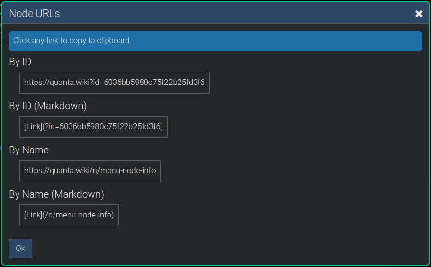

**[Quanta](/docs/index.md) / [Quanta-User-Guide](/docs/user-guide/index.md)**

# Node Info

The `Menu -> Info` menu lets you access various information and statistics about the `currently selected node`. First click a node to select it, and then choose one of the following menu options.

# Show URLs

Each node is automatically accessible via its own unique URL. Only the owner of a node and people its owner has shared the node with can access the URL.

To find the URL of a node, click the node, and then choose `Menu -> Tools -> Show URLs`. By default each node will have a URL based on its database record ID. If the node has a custom 'name' there will be an additional URL for this same node based on the name.

There will potentially be various other URLs associated with a node, such as a URL to get its attachments, to view its RSS feed, etc.

Here's an example of that dialog, showing the URLs for a node:

See also: The "Custom URLs" section of this User Guide.

# Show Raw Data

This is a technical feature that displays the content of the node in a human-readable text format called JSON (JavaScript Object Notation). This data is the exact content of the node's "Database Record", in the Quanta MongoDB database.

# Node Stats

Select `Menu -> Tools -> Node Stats` to generate a statistics report for the selected node. Any node subgraph can be analyzed this way to find the top most frequently used words, hashtags, and mentions, under that node.

This opens a dialog showing the top words (and hashtags, and mentions) by frequency of use, under that specific subgraph. Words are listed in descending order based on the number of times the word appears in the node subgraph.

You can click on any word displayed in this dialog to automatically run a search that finds all the places where the word is found.

----
**[Next: RSS-and-Podcasts](/docs/user-guide/rss/index.md)**
