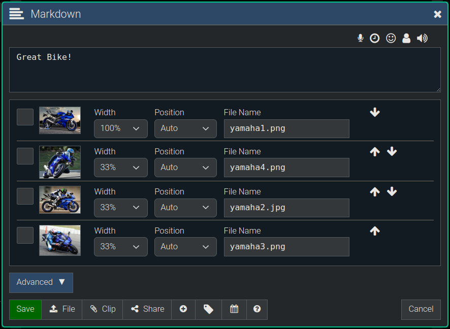
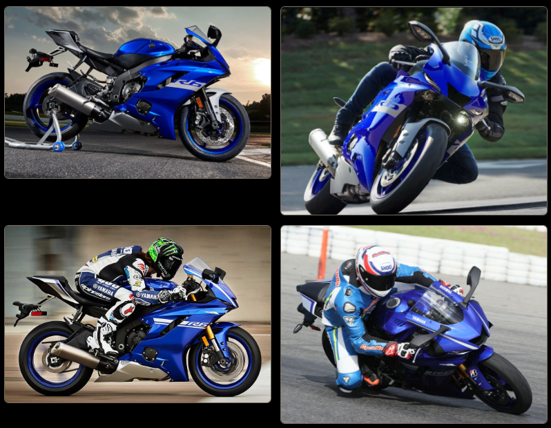
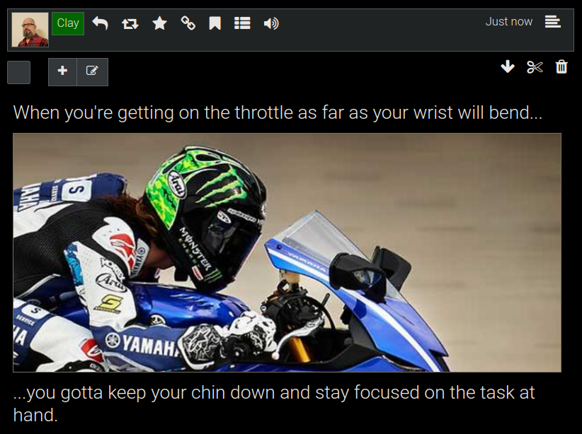
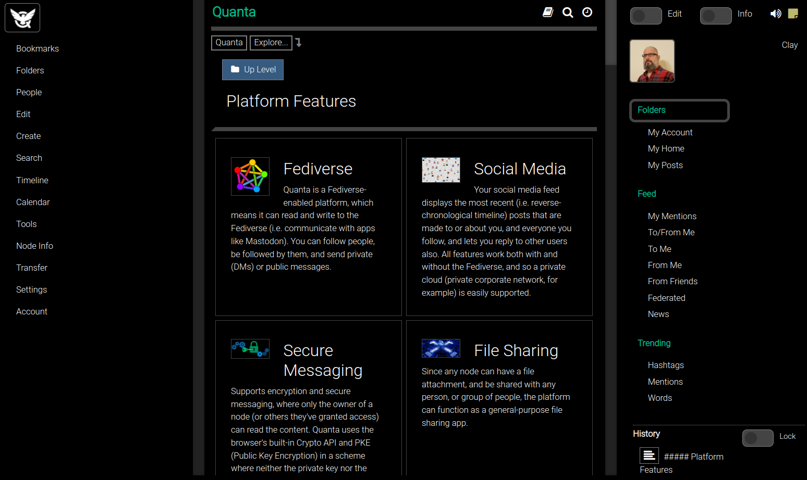
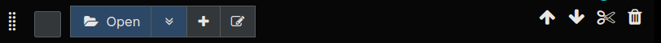
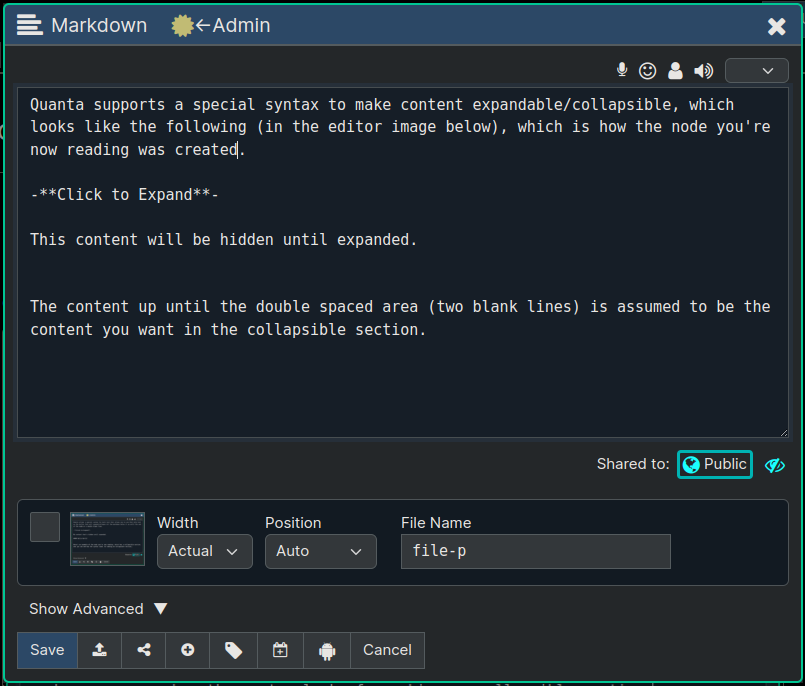

**[Quanta](/docs/index.md) / [Quanta-User-Guide](/docs/user-guide/index.md)**

* [Customizing Content Display](#customizing-content-display)
    * [Image Layout](#image-layout)
        * [Example Layout 1 ](#example-layout-1-)
        * [Example Layout 2](#example-layout-2)
        * [Positioning Images](#positioning-images)
    * [Node Layout](#node-layout)
    * [Tips](#tips)
    * [Collapsible Sections](#collapsible-sections)
    * [URL Previews](#url-previews)

# Customizing Content Display

How to organize how images and subnodes are displayed.

# Image Layout

When you upload multiple images onto a node, the images will, by default, be arranged and displayed from left to right, and top to bottom according to the widths of each image.

## Example Layout 1 

Below you can see we've uploaded 4 images to a node, and set their widths to 100%, 33%, 33%, 33%.

The above width settings display on the page as shown below. The first image is 100% width, and the rest are 33%. They're displayed in the order you have them arranged on the node.

If you wanted a 2 column tabular layout you could set all images to 50%, 3 column label would be 33%, 4 column layout 25%, etc.

## Example Layout 2

Next we'll edit the Node Attachments and set them all to 50% width.

Here's how the above settings will display the images (below). As expected, we see images displayed from left to right, top to bottom, with each one consuming 50% of the available width before wrapping to the next row.

## Positioning Images

If you want one or more images to appear at arbitrary locations in the content text of the node you can specify the "Position" option as "File Tag". Here's an example of that on a node with one single image, which we've chosen to insert in the middle of some content text.

This is how that renders (below), with the image being inserted wherever you put it's tag (`{{file-p}}` in this case). Each File will have a unique name when you upload multiple files, so you can insert multiple images wherever you want them to go in your content.

Other positioning options are as shown in the screenshot below (`Center, Top Left, and Top Right`) and they all position images as you would expect.

# Node Layout

You can also configure how subnodes are displayed under any given node, if you want something other than the normal top-to-bottom view of content. 

In the screenshot below you can see the 'admin' user editing the "Platform Features" node on the "Quanta.wiki" website, and you can see that the `Subnode Layout` is set to `2 columns`

That `2 columns` layout then ends up looking like the following image (below), where the subnodes under the "Platform Features" are displayed on 2 columns per row.

You can also click the option for `Inline Subnodes` which is the double down arror in this control bar:

which will expand the subnodes on the page with their parent so that the user can see them without expanding the tree.

# Tips

1) Click on any uploaded image to view it full-screen, or navigate around between all images under the same parent node. 

2) CTRL-Click any image to zoom in/out on the location of the image where you clicked

# Collapsible Sections

Quanta supports a special syntax to make content expandable/collapsible, which looks like the following (in the editor image below), which is how the node you're now reading was created.

-**Click to Expand**-

This content will be hidden until expanded.

The content up until the double spaced area (two blank lines) is assumed to be the content you want in the collapsible section.

As you saw in the example above, the expand/collapse link text will be whatever text is between the `-**` and `**-`, which is a syntax that will render just as a normal bold font, on systems that don't support this non-standard Markdown syntax feature.

# URL Previews

When you include a url/link on a line all by itself in the content, it will be rendered as a clickable markdown link, and will also have the Content Preview Image, Title, and Description for that link (whenever that link provides that content preview info of course, because not all URLs do) displayed on the page.

If you want to display just the link itself and not any Preview, then start the line with the url with an asterisk an asterisk and a space (i.e. `"* "`) before the url. To display *only* the Preview and not the link text itself, start the line with `"- "`. If you want only the Preview Image and Title (without the description) then start the line with `"-- "`.

----
**[Next: Document-View](/docs/user-guide/document-view/index.md)**
