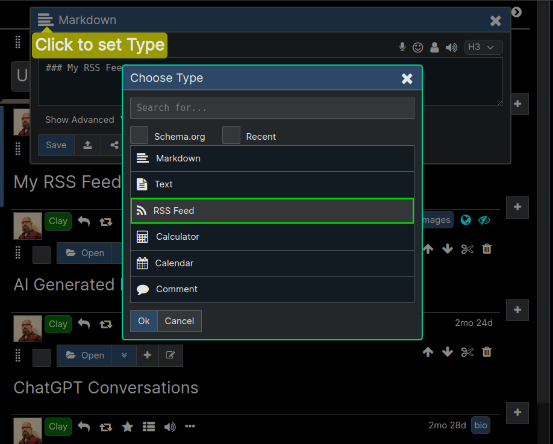
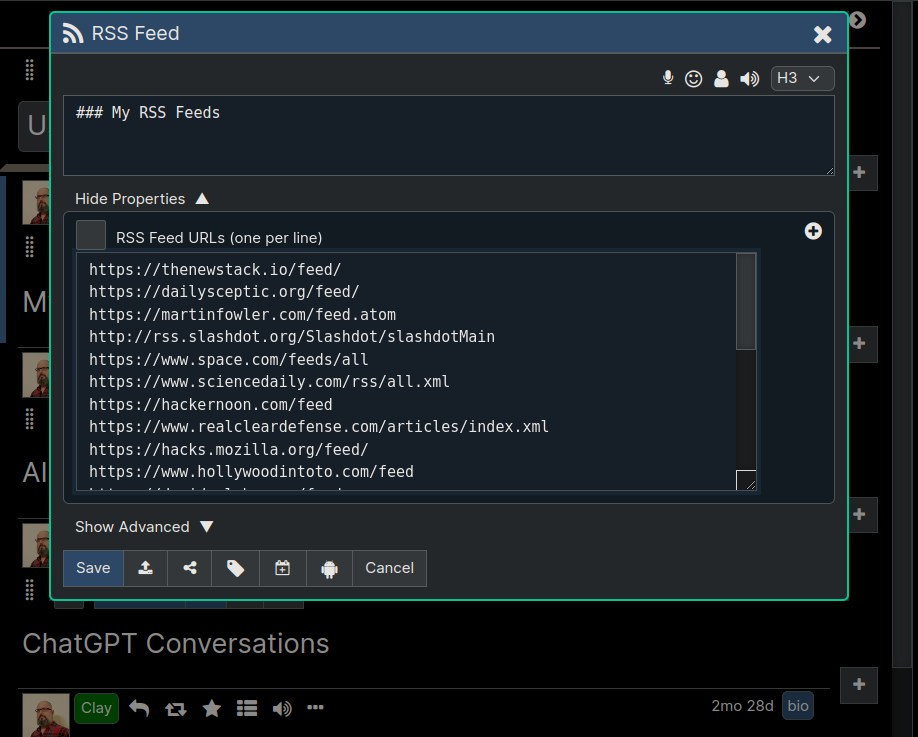
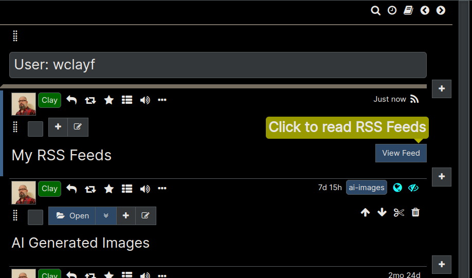
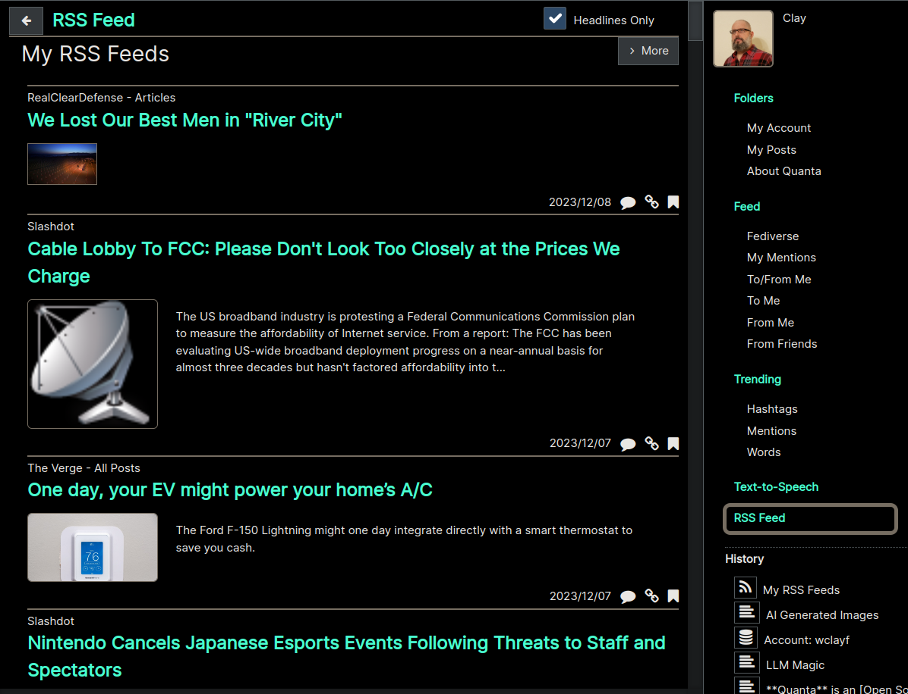
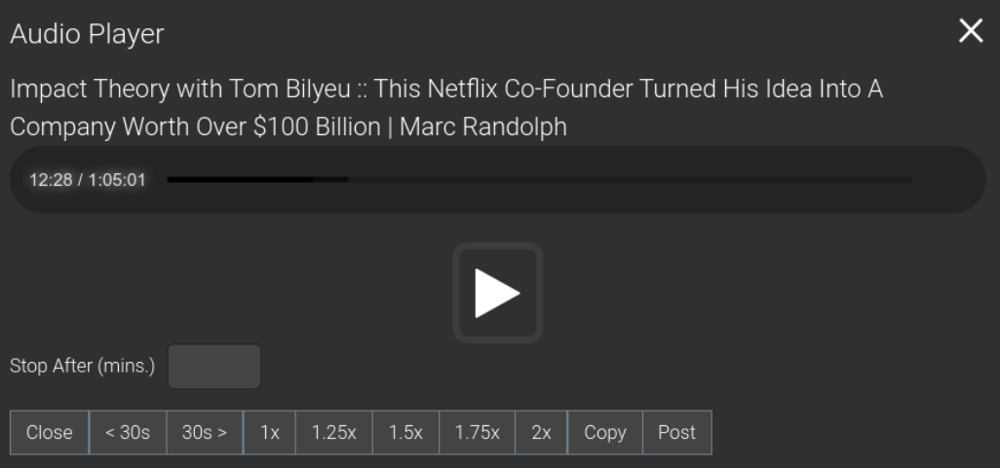

**[Quanta](/docs/index.md) / [Quanta-User-Guide](/docs/user-guide/index.md)**

* [RSS and Podcasts](#rss-and-podcasts)
    * [Create an RSS Aggregator](#create-an-rss-aggregator)
        * [Set the Node Type](#set-the-node-type)
        * [Enter RSS URLs](#enter-rss-urls)
        * [Request to View Feeds](#request-to-view-feeds)
        * [Have Fun Reading the News](#have-fun-reading-the-news)
    * [Comment on a Podcast](#comment-on-a-podcast)

# RSS and Podcasts

# Create an RSS Aggregator

To aggregate multiple RSS feeds, first create the RSS Feed node, and then enter one or more RSS Feed URLs into it (one per line). The node will then render a "View Feed" button that can be used to display a reverse-chronological view of all the RSS feed content, which will automatically update itself every 30 minutes.

Below are screenshots showing the steps to subscribe to some RSS feeds.

## Set the Node Type

First click the `Node Type` icon in the editor on a node where you want to host the RSS Subscription from, and then pick `RSS Feed` as the new node type.

## Enter RSS URLs

After changing a node to `RSS Feed` type it will automatically display a place for you to enter the URLs you want to subscribe to.

## Request to View Feeds

After saving the node you'll see a `View Feeds` button appearing on the node which you can click to retrieve all the latest RSS content.

## Have Fun Reading the News

After clicking `View Feed` the app will switch over to the `RSS Feed Tab` to display the RSS. You can always click `Folders Tab` to get back to your tree. The contents of this Feed view will be the merged and sorted (newest on top) aggregate view of all feeds you had listed. 

You can update your list of URLs any time, and everything will just continue to work. There's no need to go thru the process again of creating a new node whenever you want to modify your subscriptions, because you can simply edit the list of URLs any time, using the Node Editor.

# Comment on a Podcast

The Audio Player has a "Post" button, so you can share the article title and link along with a comment/post.

When posting this way the link that gets included points back to the Quanta app, with a URL that will start playing the audio at the time offset that was automatically embedded into the link (or audio podcasts only) 

This means your comment can be specific to what was being said at that specific point in the audio podcast.

Here's a screenshot of the audio player, showing this "Post" button:

----
**[Next: Encryption](/docs/user-guide/encryption/index.md)**
