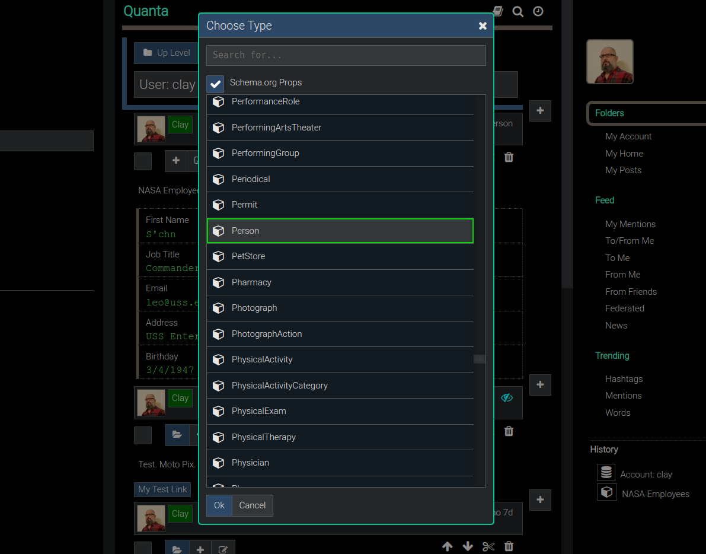
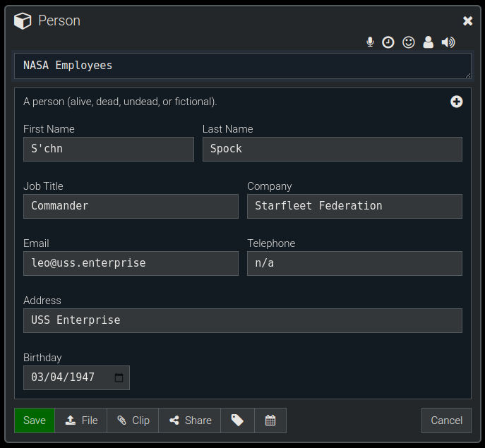
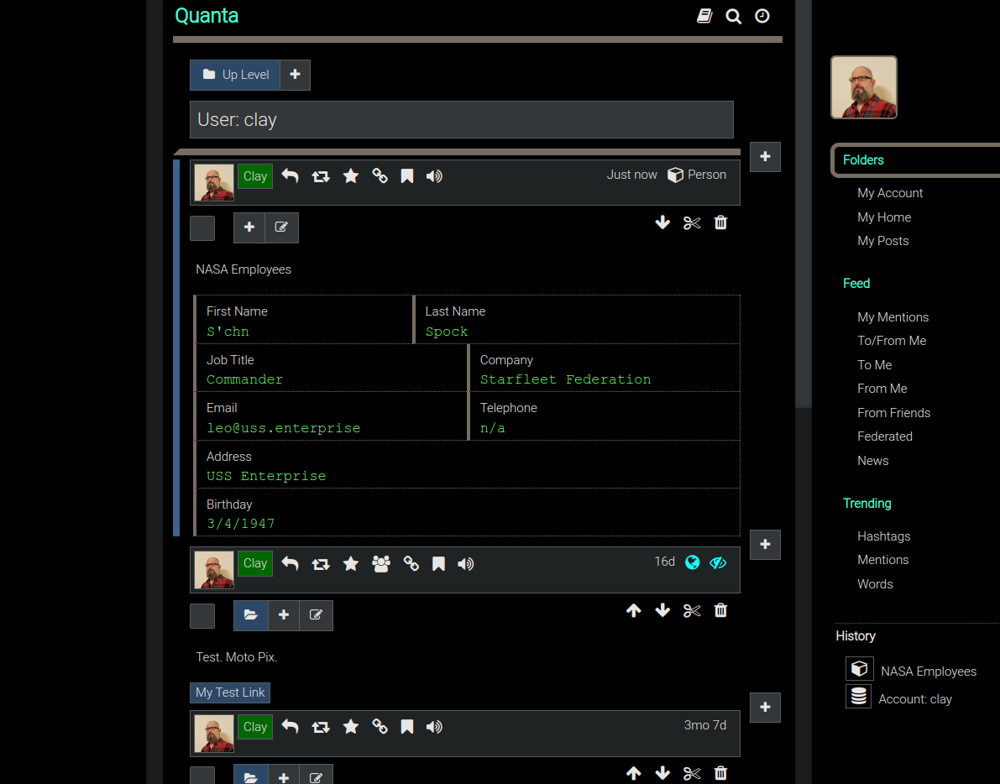
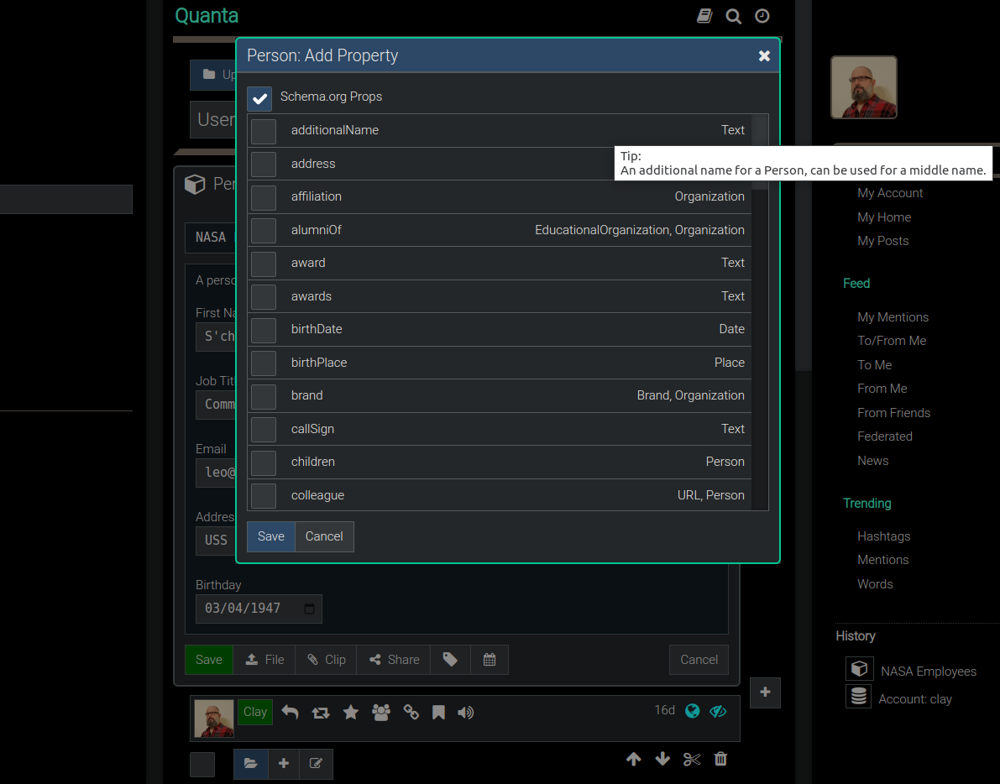
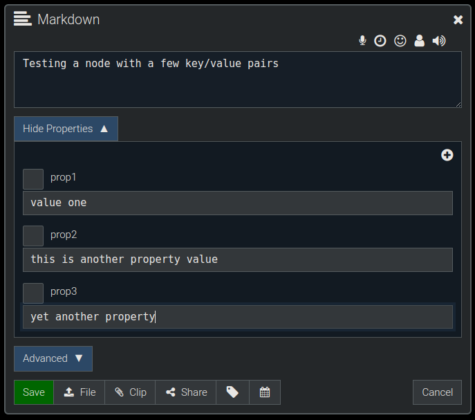
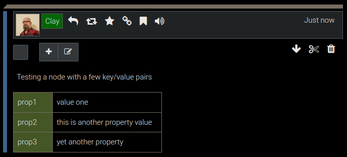

**[Quanta](/index.md) / [Quanta User Guide](/user-guide/index.md)**

* [Semantic Web](#semantic-web)
    * [Semantic Web Basics](#semantic-web-basics)
    * [Person Type Example](#person-type-example)
    * [Editing a Person](#editing-a-person)
    * [Object Display](#object-display)
    * [Adding more Properties](#adding-more-properties)
    * [Technical Info](#technical-info)
        * [YAML Config](#yaml-config)
        * [About the YAML](#about-the-yaml)
        * [Full Schema_org Support](#full-schema_org-support)
        * [Non-Schema_org Properties](#non-schema_org-properties)
        * [Default Property Display](#default-property-display)
        * [Semantic Web References](#semantic-web-references)
        * [WordPress and Semantic Web](#wordpress-and-semantic-web)

# Semantic Web

*This section discusses how Quanta supports the Semantic Web.*

Quanta doesn't require you to know about `Data Types`, because every node is just automatically the "Markdown Type" (i.e. assumed to contain markdown text). However we do fully support the Semantic Web types.

# Semantic Web Basics

The `Semantic Web` is a set of standards that allow data on the web to have specific `Data Types` (i.e. Objects with Properties), so that computers can automatically parse and understand the data. The goal of the `Semantic Web` is to make internet data machine-readable.

A simple example use of a Type would be the `"Person"` Type. In normal non-Semantic Web content, when you have a person's name in some content it might be just a line of text like `"Leonard Nimoy"` and to a computer that just looks like two words. Obviously, excluding AI, of course, the meaning of each word is not understood by machines.

However, with the Semantic Web we have Objects with Properties. So in the Semantic Web version of a person object it would be represented in some way where it's properties are known like this:

`Person:`
```js
{
    familyName: "Nemoy"
    givenName: "Leonard"
}
```


# Person Type Example

Here's an example (below) of how to create a `Person object`, then edit it, and see how it displays. We can select `Menu -> Create -> Choose Type...` which will lead to the following selection list where we can select `Person` as the type of the thing we want to create.




# Editing a Person

We're now editing the Person type we just created (above) and can `enter the properties` as shown in the image below:




# Object Display

After clicking `Save` in the record editor dialog (above) the node will be saved, and will be displayed as shown below:




# Adding more Properties

As shown above, there are only a handful of properties that are assigned to the Person object by default in this experimental feature, but we can add more properties, by going back into the `Node Editor` at any time and clicking the `Plus Icon` to add more properties and pick from the full list of all `Schema.org` Person properties (or any other type of object's properties):




# Technical Info

The rest of this section is for software developers and/or technical readers only:

## YAML Config

This document is a `User Guide` rather than a `Technical Guide`, but nonetheless it's insightful to show just how easy it was to get the above editor and display working `without writing any special computer code`.

In other words all of the Editor Layouts and Display Formats in the images above were `created automatically` by Quanta just by analyzing the `Schema.org data type info`, plus just one additional block of configuration information, in the form of a simple `YAML Format` as follows:

```yaml
props:
  Person:
    givenName:
      label: "First Name"
      width: 40
    familyName:
      label: "Last Name"
      width: 60
    jobTitle:
      label: "Job Title"
      width: 50
    worksFor:
      label: "Company"
      width: 50
    email:
      label: "Email"
      width: 50
    telephone:
      label: "Telephone"
      width: 50
    address:
      label: "Address"
      width: 100
    birthDate:
      label: "Birthday"
      width: 100
      showTime: false
```

## About the YAML

As you can see, the above YAML config is simple but it's all Quanta needs to be able to present a `nicely formatted display` of information, as well as an Object editor that works `without a programmer` having to write code for each type.

Here's what's happening, in the YAML above: As you can see the "Person" object must match one of the `Schema.org types`. 

Then we list below it all the `properties` that we want to use, and the `order` we want them displayed and edited in. The display uses that ordering and the `width values (which are percent widths)`, to auto-construct an editor by arranging the display of properties across the view panel `from left to right and top to bottom`. Also the `label` let's us give a more friendly text label to display for each field (i.e. property).

So in summary, once this tiny bit of config YAML is created for any of the Schema.org types we want to use, we `instantly get a GUI that does everything` we're doing in the above images, and as said, it happens automatically without any custom coding!

## Full Schema_org Support

Even though the above example for the `Person Object` has that specific YAML file we just saw, be aware that it was still optional to write that special YAML. Even if we add none of our own YAML configs for any of the types we can still use `any of the other 100s of other types` that exist in Schema.org, because Quanta supports all of them by default.

So to clarify, the only reason we **did** add a specific YAML object config for the `Person Object` (above) was to get the specific desired `page and editor layout`. Without that specific YAML config the Person Object would still work just fine, but the properties editor and display of the person would've been ugly because the properties would've been in simple alphabetical order and displayed arranged vertically, rather than the nice looking layout form our YAML defined.

## Non-Schema_org Properties

Arbitrary `Key/Value` pairs can also be added to any node including properties that are not part of schema.org. In the example below we have added `'prop1', 'prop2', and 'prop3'` to demonstrate this. 

Those properties could've been named anything, and they could've been assigned any values we want.




## Default Property Display

Since those properties are not part of an object that has been configured to display in some special way (referring to the YAML approach talked about earlier), they simply display on the page as a vertical list, as shown in the image below:

*Note: You'll need to select the `Menu -> Account -> Settings -> View Options -> Properties` checkbox to see these properties displayed.*




## Semantic Web References

**Quanta's copy of Semantic.org Definitions:**

* https://github.com/Clay-Ferguson/quantizr/tree/master/src/main/resources/public/schemaorg

**The Spec:**

* https://schema.org

**New Semantic Web Protocol**

* https://blockprotocol.org

*NOTE: Quanta doesn't currently use `Block Protocol` to edit, display, or embed types because of the simper YAML approach discussed earlier, but we provide the blockprotocol link above just for the sake of completeness.*

## WordPress and Semantic Web

* https://www.smashingmagazine.com/2022/02/implications-wordpress-joining-block-protocol/

Recommended reading: Search for "Project Gutenberg" in WordPress online information. There's a new Semantic Web ecosystem that's emerging!


----
**[Next:  Account Profile and Settings](/user-guide/account-settings/index.md)**
