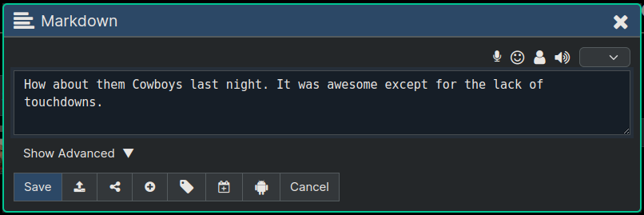
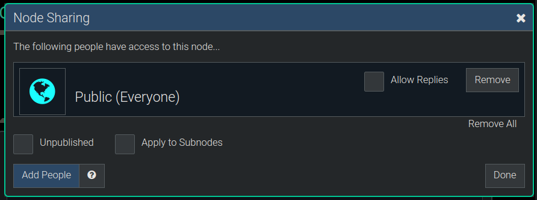
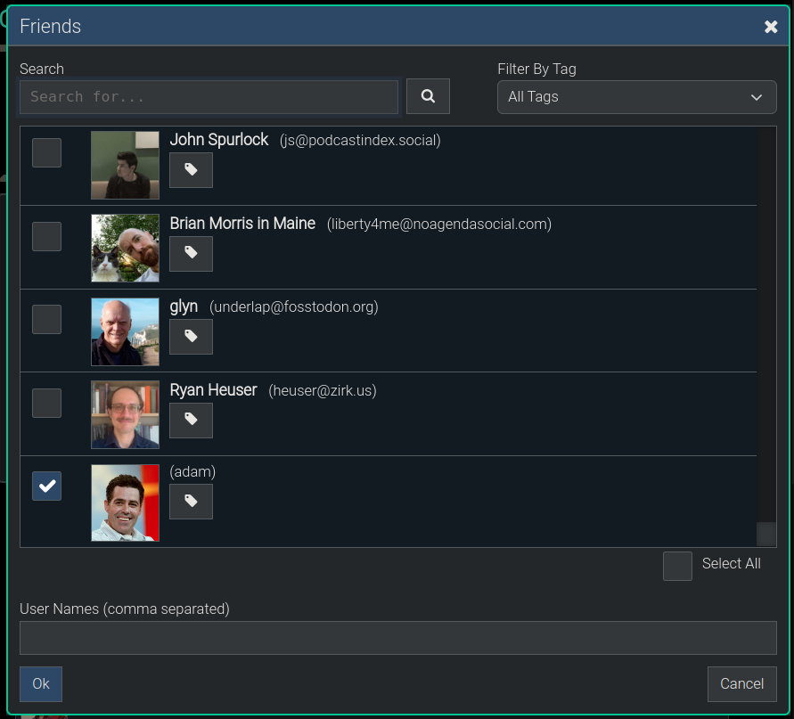
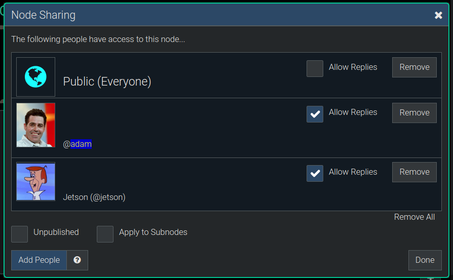
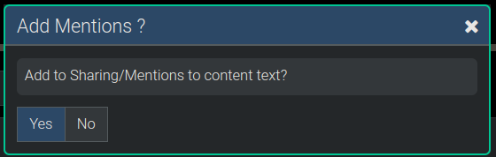

**[Quanta](/docs/index.md) / [Quanta User Guide](/docs/user-guide/index.md)**

* [Sharing](#sharing)
    * [Node Ownership](#node-ownership)
    * [Basic Sharing Example](#basic-sharing-example)
    * [Unpublished Option](#unpublished-option)
    * [Sharing Indicators](#sharing-indicators)
    * [Finding your Shared Nodes](#finding-your-shared-nodes)
        * [Show All Shared Nodes](#show-all-shared-nodes)
        * [Show Public Read-Only](#show-public-read-only)
        * [Show Public Appendable](#show-public-appendable)

# Sharing

Sharing nodes makes them visible to other people, so they can browse directly to them and see them in their Feeds.

# Node Ownership

When you create a node you're automatically set as the 'owner' of the node, and by default if you don't mention any other usernames in the text (or add shares in the Sharing Dialog) then the node will be private to you and only visible to you. 

However, any node can be shared with specific other users, or made public to everyone by adding Shares to the node.

# Basic Sharing Example

One way to share nodes with people is to 'mention' their username in the text, as is done in most other Social Media apps, including Mastodon.

However, Quanta doesn't necessarily require you to put usernames into the content to share that content with other users. You can use the `Sharing Dialog` to manage the sharing of a node.

In the following we'll walk thru the process of how you'd start with this node below, which starts out un-shared, and make it public as well as share to a couple of other users, which will make it show up in their Social Media feed.

After clicking the `Share` button on the dialog above the following dialog pops up so we can configure the sharing. In this dialog we can add or remove people who are allowed to access this node, and control various aspects of how this node is shared.

After clicking `Make Public` to share this node to the public, we're still on the same dialog and it shows up as follows:

In addition to making this node public, let's share it to a couple of people. After clicking `Add People` in the dialog above we will be presented with our Friends List Dialog, for picking people, as shown below:

After using the checkboxes in the above list of friends to pick Jetson and Adam, and clicking `Ok` (on the dialog above), we end up back at the Sharing Dialog and again it's showing the list of who it's shared to (see below).

After clicking `Done` to exit the Sharing Dialog, if we've shared to people whose usernames are not yet existing in the actual content text we'll be asked if we'd like to have those names "mentioned" in the text, by appending them to the end. We'll click `Yes` to have the mentions added.

After clicking `Yes` to add mentions we'll end up back in the Editor Dialog where we came from, and we can see both the sharing labels below the text editor and also we see the usernames put into the content for us.

Since these are local usernames (local to the current instance we're on, quanta.wiki) we of course have the short names formatted like `@adam` rather than the longer names we'd see if they had been on some foreign server like `@adam@someserver.com`.

The node is now shared with two people, and to the public, but we can still alter the sharing any time we want, by going back into the Sharing Dialog again. So for example if we decide we don't want the node public we can just delete the "Public" entry, and then only adam and jetson would be able to see the node.

# Unpublished Option

This is handy when you're working on a document you've shared as public already and don't want each and every paragraph edit you do to get broadcast out to everyone's feeds.

For nodes that are "Unpublished" they're still visible to people you've shared them to, but they have to specifically navigate to the node to see it.

The 'Unpublished' option doesn't make the node private at all, because as long as you've got sharing set on this node the people shared with *can* still see it; but what the "Unpublished" option will do is to simply stop broadcasting the real-time changes you make going forward.

# Sharing Indicators

You can tell if a node is shared by looking at the upper right corner of the node itself, and if you see a 'world icon' or an 'envelope icon' that means the node is being shared to (i.e. is visible to) other people in addition to its owner.

The `World Icon` indicates the node is public, and the `Envelope Icon` indicates the node is shared to one or more specific users. To see the full list of who the node is shared to, edit the node (you must be its owner) and click the Sharing icon at the bottom of the editor.

*Note: Those two icons won't be displayed unless you've enabled the extra node info via `Menu -> Options -> Node Info`*

# Finding your Shared Nodes

There's a "Search" menu (on the left side of the page) which lets you find which nodes you've shared.

## Show All Shared Nodes

Select `Menu -> Search -> Shared Nodes` to display all the nodes you own that are shared to other users.

## Show Public Read-Only

Select `Menu -> Search -> Public Read-only` to display all the nodes you own that you've shared with the public, and which `do not allow replies`.

## Show Public Appendable

Select `Menu -> Search -> Public Appendable` to display all the nodes you own that you've shared with the public, that `*do* allow replies`.

----
**[Next: Social Media and Fediverse](/docs/user-guide/activity-pub/index.md)**
