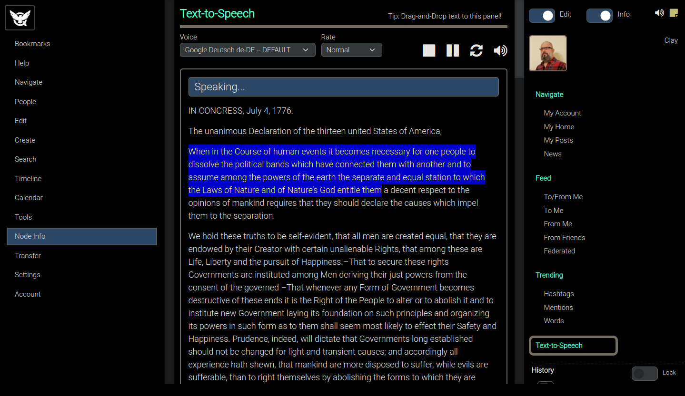
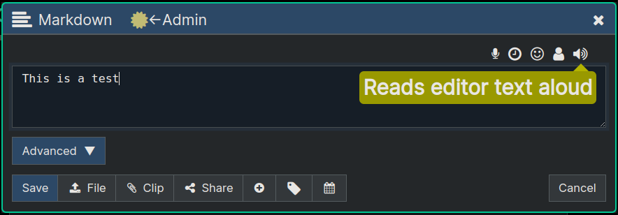
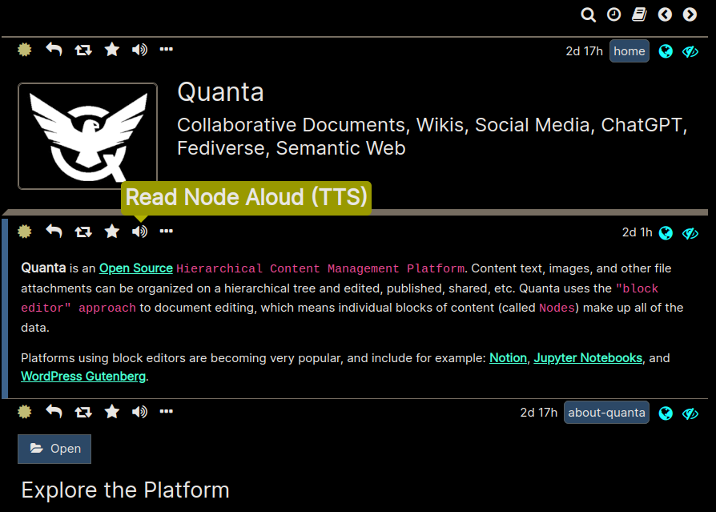
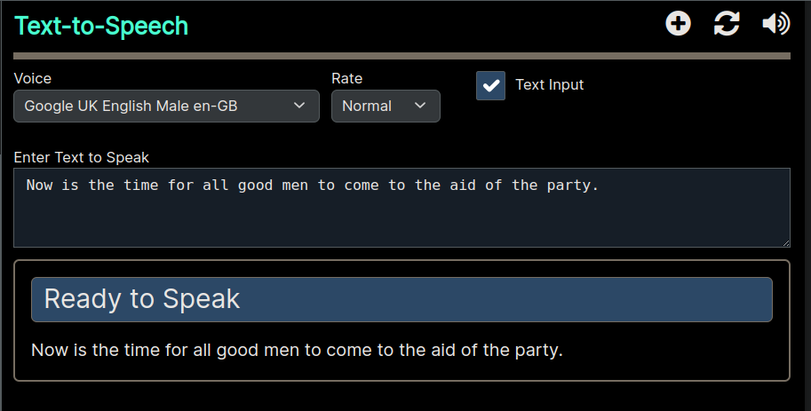

**[Quanta](/docs/index.md) / [Quanta-User-Guide](/docs/user-guide/index.md)**

* [Text-to-Speech](#text-to-speech)
    * [Text-to-Speech Tab](#text-to-speech-tab)
    * [TTS in the Node Editor Dialog](#tts-in-the-node-editor-dialog)
    * [TTS from any Node](#tts-from-any-node)
    * [TTS Text via Drag-and-Drop](#tts-text-via-drag-and-drop)
    * [TTS for Text you Enter Manually](#tts-for-text-you-enter-manually)

# Text-to-Speech

# Text-to-Speech Tab

The TTS Tab is shown in the image below and it will open whenever the browser is reading content aloud. The buttons at the top are self-explanatory: They let you Stop, Pause, Restart, etc. 

As the TTS Engine reads content the current sentence of text being spoken will be highlighted in blue as the reading goes along. You can also click anywhere in the text content to make it start reading content from that sentence. You can easily skip around in the content by clicking different areas you want to read.

You can choose your preferred Voice (American Accent, British, etc), and you can also select the speed of the speech, using the dropdown menus at the top.

# TTS in the Node Editor Dialog

Whenever you're editing a node you can listen to the TTS of the content text by clicking the speaker icon at the upper right of the text editor.

Whenever you're listening to TTS Text while in the Node Editor Dialog, the TTS Tab will be active but not visible, but you can, at any time, switch over to the TTS Tab using the "Text-to-Speech" Tab link on the right hand side of the page.

If you don't yet see the "Text-to-Speech" link then activate it by selecting `Menu -> Tools -> Text-to-Speech`

# TTS from any Node

If you have `Node Info` enabled, every node will have a TTS Icon displaying that you can click to have the node content narrated aloud to you.

# TTS Text via Drag-and-Drop

The image at the top of this section shows the TTS Tab, where all the TTS buttons and options are. To read text, for example from a webpage, you can simply open that webpage in a separate browser window, then highlight some text to read, and then use the mouse to "Drag" that selected region of text right over the TTS Tab, and drop it there, and the text will automatically be read aloud.

# TTS for Text you Enter Manually

Another way to TTS text is to enable the input area by clicking the "Text Input" checkbox (see below) and then entering some text to read, and then clicking the "Speaker" icon.

----
**[Next: Export-and-Import](/docs/user-guide/import-export/index.md)**
