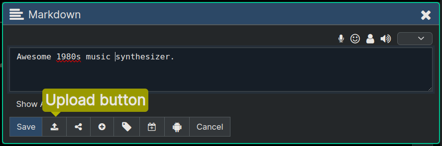
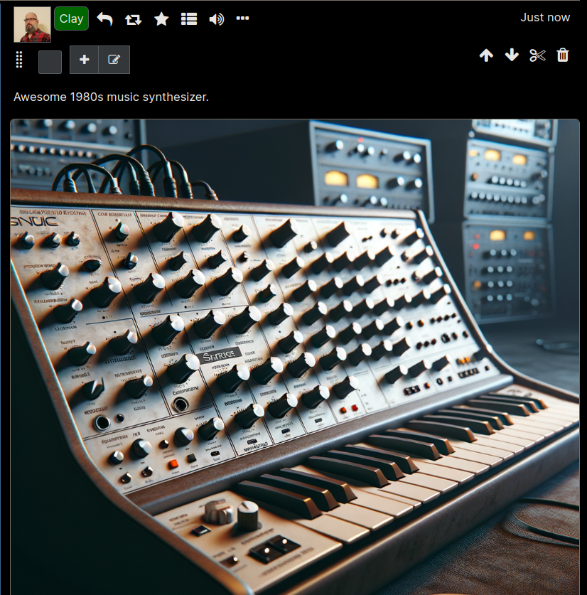

**[Quanta](/index.md) / [Quanta User Guide](/user-guide/index.md)**

# Uploading

Below are the steps to upload an image or other file attachment to a node.

# Upload Image

The `Node Editor Dialog` (shown below) has an upload button that you can use to add any number of attachments to the node. We'll show an example of uploading an image here,.

You'll now be in the `Attach File` dialog, where you can select files to upload. In the example below you can see one image was selected to be uploaded, by clicking in the dotted rectangle area and then selecting a file from the hard drive.

After clicking "Upload" on the dialog above we'll see that the image is now on this node and we can choose a few options for how to display it, a checkbox to select it for delete, etc.

After we save the node we uploaded to it will render displaying the image:

Each node can have any number of file attachments of any kind (i.e. images, video files, audio files, PDFs, etc) uploaded to it.

If a node has one or more images attached, the images are automatically displayed on the page along with the text content. If the attachments are some other type (other than an image) there will be a 'view' and a 'download' link displayed for each one so you can open it in a separate tab or download it.

If the attachment is a media file (audio or video) there will be a "Play Audio" or "Play Video" button that opens an HTML-based streaming player, right in your browser.

# Upload from Various Sources

As you saw in the screenshot above, are several kinds of sources from which you can upload:

* From file system
* From clipboard
* From a URL
* From Text-to-Image AI (Using OpenAI DALL-E Model)
* Live Audio/Video Recording from your device

When uploading from a URL you can leave the checkbox labeled "Store a copy on this server" unchecked and this will save only the URL of the external file, rather than uploading it. This is useful if you don't want to load a file directly into your Quanta storage (consuming some of your quota), but would rather leave it as a link external to your personal storage space.

Files can be uploaded either to the Quanta database or to IPFS. There's a checkbox on the Upload Dialog that lets you specify whether you want the file saved to IPFS or not, and if unchecked files are saved into the Quanta server database.

This is only available when the admin has configured the server to use IPFS, and may not be available on all instances.

# Account Quotas

Each user account is allotted a specific amount of storage space (quota) which controls how much data they're allowed to upload. The platform will automatically deduct from your quota any time you upload a file to the DB, or to IPFS, or "IPFS pin" pre-existing content from IPFS. 

This means Quanta can effectively function as an `IPFS Pinning Service`

# Tips

* Upload a file by dragging it over the editor dialog.
* Upload a file into a new node by dragging it over any of the '+' (Plus Buttons) that you see on the page when you have "Edit Mode" turned on.

----
**[Next:  Sharing](/user-guide/sharing/index.md)**
